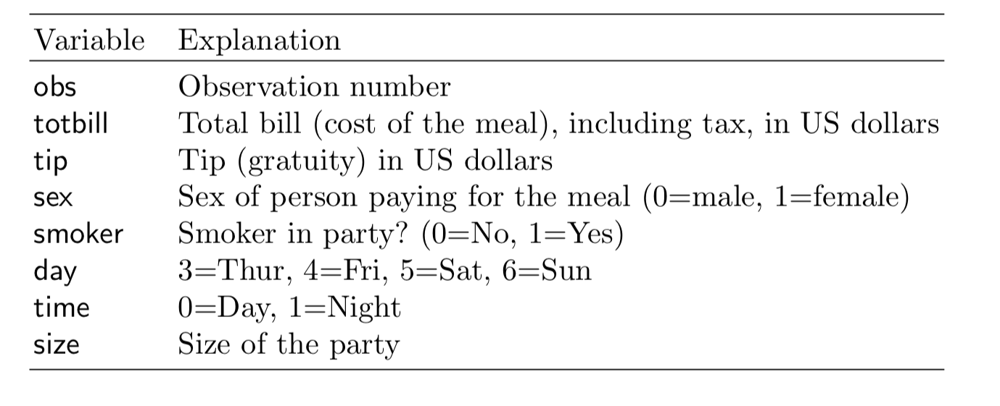

```{r, include = FALSE}
current_file <- knitr::current_input()
```
```{r, include = FALSE, eval = F}
input <- fs::path_ext_set(current_file, "html")
pagedown::chrome_print(input = input, format = "pdf", wait = 20)
```

```{r, include = FALSE}
knitr::opts_chunk$set(
  fig.path = "images/week1/",
  fig.width = 6,
  fig.height = 4,
  fig.align = "center",
  out.width = "100%",
  fig.retina = 3,
  echo = FALSE,
  warning = FALSE,
  message = FALSE,
  cache = FALSE
)
```

```{r titleslide, child="components/titleslide.Rmd"}
```

---
class: transition middle animated slideInLeft

# Why this course?

What's special about exploratory data analysis, and different from traditional data analysis?

Let's look at some common definitions and quotes

---
background-image: \url(https://upload.wikimedia.org/wikipedia/commons/thumb/b/ba/Data_visualization_process_v1.png/800px-Data_visualization_process_v1.png)
background-size: 40%
background-position: 100% 90%
class: motivator

> In statistics, exploratory data analysis (EDA) is an approach to analyzing data sets to summarize their main characteristics, often with visual methods. A statistical model can be used or not, but primarily EDA is for seeing what the data can tell us beyond the formal modeling or hypothesis testing task. 

.footnote[https://en.wikipedia.org/wiki/Exploratory_data_analysis]

---
background-image: \url(https://d33wubrfki0l68.cloudfront.net/b88ef926a004b0fce72b2526b0b5c4413666a4cb/24a30/cover.png)
background-size: 20%
background-position: 100% 90%
class: motivator

> EDA is not a formal process with a strict set of rules. More than anything, EDA is a state of mind. During the initial phases of EDA you should feel free to investigate every idea that occurs to you. Some of these ideas will pan out, and some will be dead ends. 

.footnote[https://r4ds.had.co.nz/exploratory-data-analysis.html]

---
background-image: \url(https://www.itl.nist.gov/div898/handbook/gifs/nvgtbr.gif)
background-size: 40%
background-position: 100% 90%
class: motivator

> Exploratory Data Analysis (EDA) is an approach/philosophy for data analysis that employs a variety of techniques (mostly graphical) to (1) maximize insight into a data set;
(2) uncover underlying structure;
(3) extract important variables;
(4) detect outliers and anomalies;
(5) test underlying assumptions;
(6) develop parsimonious models; and
(7) determine optimal factor settings.

.footnote[https://www.itl.nist.gov/div898/handbook/eda/section1/eda11.htm]

---
background-image: \url(https://www.kaggle.com/static/images/site-logo.png)
background-size: 40%
background-position: 100% 90%
class: motivator

> What is Exploratory Data Analysis (EDA)? (1) How to ensure you are ready to use machine learning algorithms in a project?
(2) How to choose the most suitable algorithms for your data set?
(3) How to define the feature variables that can potentially be used for machine learning?

.footnote[https://www.kaggle.com/pavansanagapati/a-simple-tutorial-on-exploratory-data-analysis]

---
background-image: \url(https://seleritysas.com/wp-content/uploads/2020/05/shutterstock_330005462.jpg)
background-size: 30%
background-position: 90% 90%
class: motivator

> EDA is necessary for the next stage of data research. If there was an analogy to exploratory data analysis, it would be that of a painter examining their tools and available time, before deciding on what best to paint.

.footnote[https://seleritysas.com/blog/2020/05/08/exploratory-data-analysis-and-its-role-in-improving-business-operations/]

---
background-image: \url(https://d3njjcbhbojbot.cloudfront.net/api/utilities/v1/imageproxy/https://coursera-university-assets.s3.amazonaws.com/74/7ae340ec6911e5b395490a2a565172/JHU-Logo-Square-Mini_180px.png?auto=format%2Ccompress&dpr=2&w=120&h=120)
background-size: 30%
background-position: 90% 90%
class: motivator

> These techniques are typically applied before formal modeling commences and can help inform the development of more complex statistical models. Exploratory techniques are also important for eliminating or sharpening potential hypotheses about the world that can be addressed by the data. 

.footnote[https://www.coursera.org/learn/exploratory-data-analysis#syllabus]

---
background-image: \url(https://miro.medium.com/max/1400/1*hjKHnI-ZQxHAjCISzGHfNQ.png)
background-size: 30%
background-position: 90% 90%
class: motivator

> The purpose of doing the Exploratory Data Analysis or EDA is to find new information in data. The understanding of EDA that practitioners may not aware of, is the EDA uses a visually-examined dataset to understand and summarize the main characteristics of the dataset without having a prior hypothesis or relying upon statistical models.

.footnote[https://towardsdatascience.com/if-you-dont-find-anything-new-you-don-t-do-eda-right-d356f9995098]

---
class: middle


---
class: transition middle animated slideInLeft

# This is what "exploratory data analysis" means

---
background-image: \url(https://images-na.ssl-images-amazon.com/images/I/51WO7SYkeQL._SX331_BO1,204,203,200_.jpg)
background-size: 40%
background-position: 10% 10%

.pull-right[

What are the factors that affect tipping behaviour?

.font_small[
In one restaurant, a food server recorded the following data on all customers they served during an interval of two and a half months in early 1990.

Food servers’ tips in restaurants may be influenced by many factors, including the nature of the restaurant, size of the party, and table locations in the restaurant. Restaurant managers need to know which factors matter when they assign tables to food servers.
]

<br>

```{r}
library(tidyverse)
tips <- read_csv("http://ggobi.org/book/data/tips.csv")
```



]

---
class: informative

# What is tipping?

- When you're dining at a full-service restaurant
    - Tip 20 percent of your full bill.
- When you grab a cup of coffee
    - Round up or add a dollar if you’re a regular or ordered a complicated drink.
- When you have lunch at a food truck
    - Drop a few dollars into the tip jar, but a little less than you would at a dine-in spot.
- When you use a gift card
    - Tip on the total value of the meal, not just what you paid out of pocket.


.footnote[[The basic rules of tipping that everyone should know about](https://www.washingtonpost.com/news/going-out-guide/wp/2016/09/15/tipping-can-be-complicated-these-are-the-basic-rules-you-should-know-about/)]

---
# Recommended procedure in the book

- *Step 1*: Develop a model
    - Should the response be `tip` alone and use the total bill as a predictor?
    - Should you create a new variable `tip rate` and use this as the repsonse?
- *Step 2*: Fit the full model with sex, smoker, day, time and size as predictors
- *Step 3*: Refine model: Should some variables should be dropped?
- *Step 4*: Check distribution of residuals
- *Step 5*: Summarise the model, if X=something, what would be the expected tip

---
# Step 1

Calculate tip % as tip/total bill $\times$ 100

<br>
<br>
<br>

.font_small[
```{r echo = TRUE}
tips <- tips %>%
  mutate(tip_pct = tip/totbill * 100) #<<
```
]

---
# Step 2 Fit

Fit the full model with all variables

<br>
<br>
.font_small[
```{r echo = TRUE}
tips_lm <- tips %>%
  select(tip_pct, sex, smoker, day, time, size) %>%
  lm(tip_pct ~ ., data=.) #<<
```
]

---
# Step 2 Model summary

.pull-left[
.font_small[
```{r modela, echo=TRUE, results="hide"}
library(broom)
library(kableExtra)
tidy(tips_lm) %>% #<<
  kable(digits=2) %>% 
  kable_styling() 
```
```{r modelb, echo=TRUE, results="hide"}
glance(tips_lm) %>% #<<
  select(r.squared, statistic, p.value) %>% 
  kable(digits=3)
```
]
]
.pull-right[

```{r ref.label="modela", echo=FALSE}
```
<br>
```{r ref.label="modelb", echo=FALSE}
```

]
---
class: poll middle center font_large

`r emo::ji("thinking")` Which variable(s) would be considered important for predicting tip %?
--

<br>
<br>

*`r emo::ji("wrench")` Complete the zoom poll*

---
# Step 3: Refine model

.pull-left[
.font_small[
```{r model_smalla, echo=TRUE, results='hide'}
tips_lm <- tips %>%
  select(tip_pct, size) %>% #<<
  lm(tip_pct ~ ., data=.) 
tidy(tips_lm) %>% #<<
  kable(digits=2) %>% 
  kable_styling() 
```

```{r model_smallb, echo=TRUE, results='hide'}
glance(tips_lm) %>% #<<
  select(r.squared, statistic, p.value) %>% 
  kable(digits=3)
```
]
]
.pull-right[
<br>
```{r ref.label="model_smalla", echo=FALSE}
```
<br>
```{r ref.label="model_smallb", echo=FALSE}
```

]

---
# Model summary

<br>
<br>

$$\widehat{tip %} = 18.44 - 0.92 \times size$$
--

<br>
<br>

As the size of the dining party increases by one person the tip decreases by approximately 1%.


---
# Model assessment

<br>
<br>
<br>
$R^2 = 0.02$.
--

<br>
<br>
This dropped by half from the full model, even though no other variables contributed significantly to the model. It might be a good step to examine interaction terms. 

---
class: poll middle

What does $R^2 = 0.02$ mean?

---
class: middle

$R^2 = 0.02$ means that size explains just 2% of the variance in tip %. This is a very weak model. 
--
<br>

And $R^2 = 0.04$ is also a very weak model.

---
class: poll middle

What do the $F$ statistic and $p$-value mean?
--

<br>
What do the $t$ statistics and $p$-value associated with model coeficients mean?

---
# Overall model significance

Assume that we have a random sample from a population. Assume that the model for the population is 

$$ \widehat{tip %} = \beta_0 + \beta_1 sexM + ... + \beta_7 size $$
and we have observed

$$ \widehat{tip %} = b_0 + b_1  sexM + ... + b_7 size $$
The $F$ statistic refers to 

$$ H_o: \beta_1 = ... = \beta_7 = 0 ~~ vs ~~ H_a: \text{at least one is not 0}$$
The $p$-value is the probability that we observe the given $F$ value or larger, computed assuming $H_o$ is true.

---
# Term significance

Assume that we have a random sample from a population. Assume that the model for the population is 

$$ \widehat{tip %} = \beta_0 + \beta_1 sexM + ... + \beta_7 size $$
and we have observed

$$ \widehat{tip %} = b_0 + b_1  sexM + ... + b_7 size $$

The $t$ statistics in the coefficient summary refer to 

$$ H_o: \beta_k = 0 ~~ vs ~~ H_a: \beta_k \neq 0 $$
The $p$-value is the probability that we observe the given $t$ value or more extreme, computed assuming $H_o$ is true.

---
# Model checking

Normally, the final model summary would be accompanied diagnostic plots

- observed vs fitted values to check strength and appropriateness of the fit
- univariate plot, and normal probability plot, of residuals to check for normality
- in the simple final model like this, the observed vs predictor, with model overlaid would be advised to assess the model relative to the variability around the model
- when the final model has more terms, using a partial dependence plot to check the relative relationship between the response and predictors would be recommended.

---
# Residual plots

.pull-left[
.font_small[
```{r res_hist, echo=TRUE, fig.show='hide'}
tips_aug <- augment(tips_lm)
ggplot(tips_aug, 
    aes(x=.resid)) + #<<
  geom_histogram() +
  xlab("residuals") 
```
]]
.pull-right[
```{r ref.label="res_hist", echo=FALSE}
```
]

---
# Residual normal probability plots

.pull-left[
.font_small[
```{r res_qq, echo=TRUE, fig.show='hide'}
ggplot(tips_aug, 
    aes(sample=.resid)) + #<<
  stat_qq() +
  stat_qq_line() +
  xlab("residuals") +
  theme(aspect.ratio=1)
```
]]
.pull-right[
```{r ref.label="res_qq", echo=FALSE}
```
]

---
# Fitted vs observed

.pull-left[
.font_small[
```{r obs_fitted, echo=TRUE, fig.show='hide'}
ggplot(tips_aug, 
    aes(x=.fitted, y=tip_pct)) + #<<
  geom_point() +
  geom_smooth(method="lm") +
  xlab("observed") +
  ylab("fitted")
```
]]
.pull-right[
```{r ref.label="obs_fitted", echo=FALSE}
```
]

---
# Model in the data space

.pull-left[
.font_small[
```{r fitted_model, echo=TRUE, fig.show='hide'}
ggplot(tips_aug, 
    aes(x=size, y=tip_pct)) + #<<
  geom_point() +
  geom_smooth(method="lm") +
  ylab("tip %")
```
]]
.pull-right[
```{r ref.label="fitted_model", echo=FALSE}
```
]

---
background-image: \url(https://i.stack.imgur.com/EVbuD.gif)
background-size: 15%
background-position: 80% 90%
class: informative

## The result of this work would leave us with

<br>

a model that could be used to impose a dining/tipping policy in restaurants (see [here](https://travel.stackexchange.com/questions/40543/can-i-refuse-to-pay-auto-gratuity-in-a-restaurant))
--

<br>


and should also leave us with an unease that this policy is based on weak support.

---
class: transition middle animated slideInLeft

## Plots associated with pursuit of an answer to a question may be best described as what is called "initial data analysis".  

<br>
<br>
.orange[Stay tuned for more on this area later.]

---

```{r endslide, child="components/endslide.Rmd"}
```
