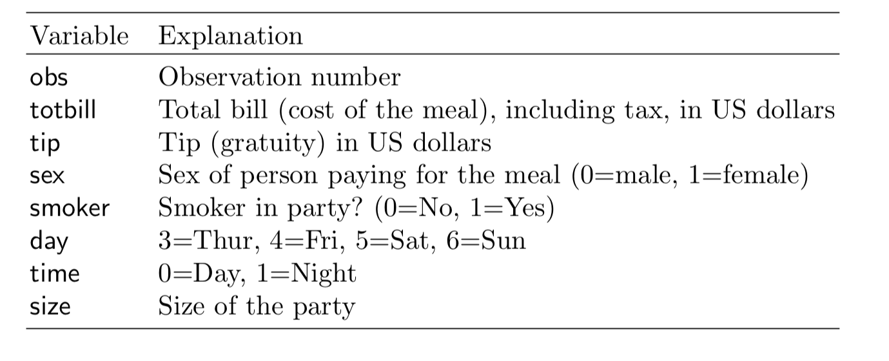

```{r, include = FALSE}
current_file <- knitr::current_input()
```
```{r, include = FALSE, eval = F}
input <- fs::path_ext_set(current_file, "html")
pagedown::chrome_print(input = input, format = "pdf", wait = 20)
```

```{r, include = FALSE}
knitr::opts_chunk$set(
  fig.path = "images/week1/",
  fig.width = 6,
  fig.height = 4,
  fig.align = "center",
  out.width = "100%",
  fig.retina = 3,
  echo = FALSE,
  warning = FALSE,
  message = FALSE,
  cache = FALSE
)
```

```{r titleslide, child="components/titleslide.Rmd"}
```


---
class: transition middle animated slideInLeft

# This is what "exploratory data analysis" means

---
background-image: \url(https://images-na.ssl-images-amazon.com/images/I/51WO7SYkeQL._SX331_BO1,204,203,200_.jpg)
background-size: 40%
background-position: 10% 10%

.pull-right[

What are the factors that affect tipping behaviour?

.font_small[
In one restaurant, a food server recorded the following data on all customers they served during an interval of two and a half months in early 1990.

Food servers’ tips in restaurants may be influenced by many factors, including the nature of the restaurant, size of the party, and table locations in the restaurant. Restaurant managers need to know which factors matter when they assign tables to food servers.
]

<br>

```{r}
library(tidyverse)
tips <- read_csv("http://ggobi.org/book/data/tips.csv")
```



]

---
# General strategy

Its a good idea to examine the data description, and the explanation of the variables. 
--

<br>
<br>
<br>
What does that look like here?
--

<br>
<br>
<br>
Look at the distribution of tips, total bill.
--

<br>
<br>
<br>
Examine the distributions across categorical variables.


---

.pull-left[
.font_small[
```{r tips, echo=TRUE, fig.show='hide'}
ggplot(tips, 
    aes(x=tip)) + #<<
  geom_histogram(
    colour="white")  
```
]
]
.pull-right[
```{r ref.label="tips", echo=FALSE}
```

]

---
background-image: \url(https://upload.wikimedia.org/wikipedia/commons/thumb/6/69/Potato-Chips.jpg/800px-Potato-Chips.jpg)
background-size: cover
class: middle

## Because, one binwidth is never enough ...

---

.pull-left[
.font_small[
```{r tips2, echo=TRUE, fig.show='hide'}
ggplot(tips, 
    aes(x=tip)) +
  geom_histogram(
    breaks=seq(0.5,10.5,1), #<< 
    colour="white") + 
  scale_x_continuous(
    breaks=seq(0,11,1))
```

<br>
<br>
]

Big fat bins. Tips are skewed, which means most tips are relatively small.

]
.pull-right[
```{r ref.label="tips2", echo=FALSE}
```

]
---

.pull-left[
.font_small[
```{r tips3, echo=TRUE, fig.show='hide'}
ggplot(tips, 
    aes(x=tip)) + 
  geom_histogram(
    breaks=seq(0.5,10.5,0.1), #<<
    colour="white") +
  scale_x_continuous(
    breaks=seq(0,11,1))
```

<br>
<br>
]

Skinny bins. Tips are multimodal, and occurring at the full dollar and 50c amounts.

]
.pull-right[
```{r ref.label="tips3", echo=FALSE}
```

]

---
class: middle

## We could also look at total bill this way

---
# Relationship between tip and total


.pull-left[
.font_small[
```{r tips_tot, echo=TRUE, fig.show='hide'}
p <- ggplot(tips, 
    aes(x= totbill, y=tip)) + 
  geom_point() + #<<
  scale_y_continuous(
    breaks=seq(0,11,1))
p
```

<br>
<br>
]

.orange[Why is total on the x axis?]

]
.pull-right[
```{r ref.label="tips_tot", echo=FALSE}
```

]

---
# Add a regression line


.pull-left[
.font_small[
```{r tips_tot2, echo=TRUE, fig.show='hide'}
p <- p + geom_abline(intercept=0, #<<
              slope=0.2) + #<<
  annotate("text", x=45, y=10, 
           label="20% tip") 
p
```
]

<br>
<br>

Most tips less than 20%: Skin flints vs generous diners
<br>

A couple of big tips
<br>

Banding horizontally is the rounding seen previously

]
.pull-right[
```{r ref.label="tips_tot2", echo=FALSE}
```

]
---

.font_small[
```{r tips_sexsmoke, echo=TRUE, fig.show='hide'}
p + facet_grid(smoker~sex) #<<
```
]


```{r ref.label="tips_sexsmoke", echo=FALSE, fig.width=9, fig.height=6, out.width="80%"}
```

---
# What do we learn?

- The bigger bills tend to be paid by men (and females that smoke).
--

- Except for three diners, female non-smokers are very consistent tippers, probably around 15-18% though.
--

- The variability in the smokers is much higher than for the non-smokers.


---
class: transition middle animated slideInLeft

## Isn't this interesting?

---
# Procedure of EDA

In the above example we gained a wealth of insight in a short time. Using nothing but graphical methods we investigated univariate, bivariate, and multivariate relationships. We found both global features and local detail. We saw that tips were rounded; then we saw the obvious correlation between the tip and the size of the bill, noting the scarcity of generous tippers; finally we discovered differences in the tipping behavior of male and female smokers and non-smokers.

---
# Procedure of EDA

Notice that we used very simple plots to explore some pretty complex relationships involving as many as four variables. Each plot shows a subset obtained by partitioning the data according to two binary variables. The statistical term for partitioning based on variables is “conditioning.” For example, the top left plot shows the dining parties that meet the condition that the bill payer was a male non-smoker: sex = male and smoking = False. In database terminology this plot would be called the result of “drill-down.” The idea of conditioning is richer than drill-down because it involves a structured partitioning of all data as opposed to the extraction of a single partition.

---
# Procedure of EDA

Having generated the four plots, we arrange them in a two-by-two layout to reflect the two variables on which we conditioned. Although the axes in each plot are tip and bill, the axes of the overall figure are smoking (vertical) and sex (horizontal). The arrangement permits us to make several kinds of comparisons and to make observations about the partitions.

---
# Getting real

The preceding explanations may have given a somewhat misleading impression of the process of data analysis. In our account the data had no problems; for example, there were no missing values and no recording errors. Every step was logical and necessary. Every question we asked had a meaningful answer. Every plot that was produced was useful and informative. In actual data analysis, nothing could be further from the truth. Real datasets are rarely perfect; most choices are guided by intuition, knowledge, and judgment; most steps lead to dead ends; most plots end up in the wastebasket. This may sound daunting, but even though data analysis is a highly improvisational activity, it can be given some structure nonetheless.

---
# Exploratory data analysis

In this stage in the analysis, we make time to "play in the sand" to allow us to find the unexpected, and come to some understanding of our data. We like to think of this as a little like traveling. We may have a purpose in visiting a new city, perhaps to attend a conference, but we need to take care of our basic necessities, such as finding eating places and gas stations. Some of our movements will be pre-determined, or guided by the advice of others, but some of the time we wander around by ourselves. We may find a cafe we particularly like or a cheaper gas station. This is all about getting to know the neighborhood.

---
# Exploratory data analysis

EDA has always depended heavily on graphics, even before the term data visualization was coined. Our favorite quote from John Tukey’s rich legacy is that we need good pictures to *"force the unexpected upon us."*

---
class: transition middle animated slideInLeft

## What can go wrong?

---
# Is it data snooping?

Because EDA is very graphical, it sometimes gives rise to a suspicion that patterns in the data are being detected and reported that are not really there. 

So many different combinations may be examined, that something is bound to be interesting. 

 `r emo::ji("exclamation")` Structure seen in the plot drives hypothesis testing (on same data).

.orange[Sometimes this is called data snooping.]

---
# Is it data snooping?

We snooped into the Tips data, and from a few plots we learned an enormous amount of information about tipping: There is a scarcity of generous tippers, the variability in tips increases extraordinarily for smoking parties, and people tend to round their tips. These are very different types of tipping behaviors than what we learned from the regression model. The regression model was not compromised by what we learned from graphics, and indeed, 

.orange[we have a richer and more informative analysis. Making plots of the data is just smart.]

---
class: transition middle animated slideInLeft

*False discovery is the lesser danger when compared to nondiscovery. Non-discovery is the failure to identify mean- ingful structure, and it may result in false or incomplete modeling. In a healthy scientific enterprise, the fear of nondiscovery should be at least as great as the fear of false discovery.*

---
# Why aren't there more courses on EDA?

> Teaching data analysis is not easy, and the time allowed is always far from sufficient. But these difficulties have been enhanced by the view that "avoidance of cookbookery and growth of understanding come only by mathematical treatment, with emphasis upon proofs." The problem of cookbookery is not peculiar to data analysis. But the solution of concentrating upon mathematics and proof is.

Tukey 1962 The Future of Data Analysis

---
# There really are many courses

- Every introductory statistics course begins with exploratory data analysis, and teaches box plots. It is just a simple treatment, though.
- A book by [Peng](https://bookdown.org/rdpeng/exdata/), and a [Coursera class by Peng, Leek and Caffo](https://www.coursera.org/learn/exploratory-data-analysis) with more than a 100,000 currently enrolled. 

---
# At Monash

.pull-left[
- FIT5197: Modelling for Data Analysis
- FIT5149 - Applied data analysis
- FIT5145 - Introduction to data science
- FIT5147 - Data exploration and visualisation

all have parts that would be considered exploratory data analysis.
]
--

.pull-right[

You've just completed ETC5510 Introduction to data analysis. Isn't this EDA?

Yes! Think about this course (ETC5521) as advanced exploratory data analysis. We will go a bit deeper, with more structure, and historical background, and venture in with EDA attitude. 
]

---
class: transition middle animated slideInLeft

## Ready?

---
# Resources

- Cook and Swayne (2007) Interactive and Dynamic Graphics for Data Analysis, [Introduction](http://ggobi.org/book/intro.pdf)
- Donoho (2017) [50 Years of Data Science](https://www.tandfonline.com/doi/full/10.1080/10618600.2017.1384734)

---

```{r endslide, child="components/endslide.Rmd"}
```
