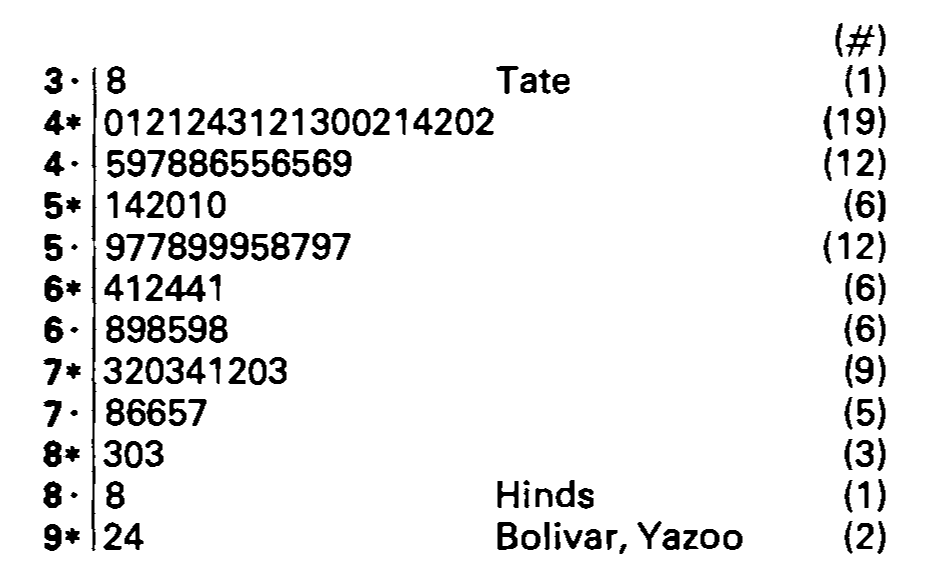
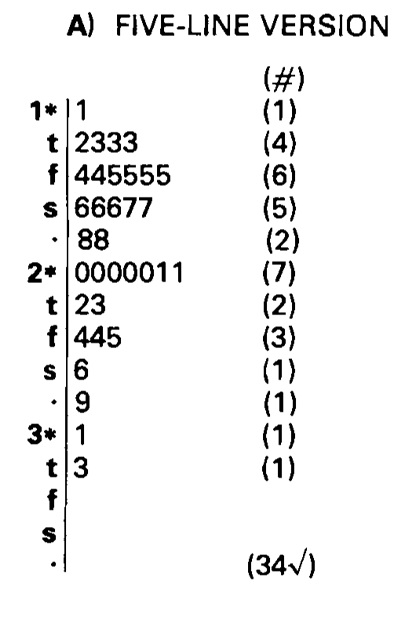
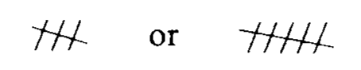
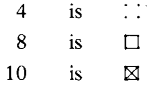
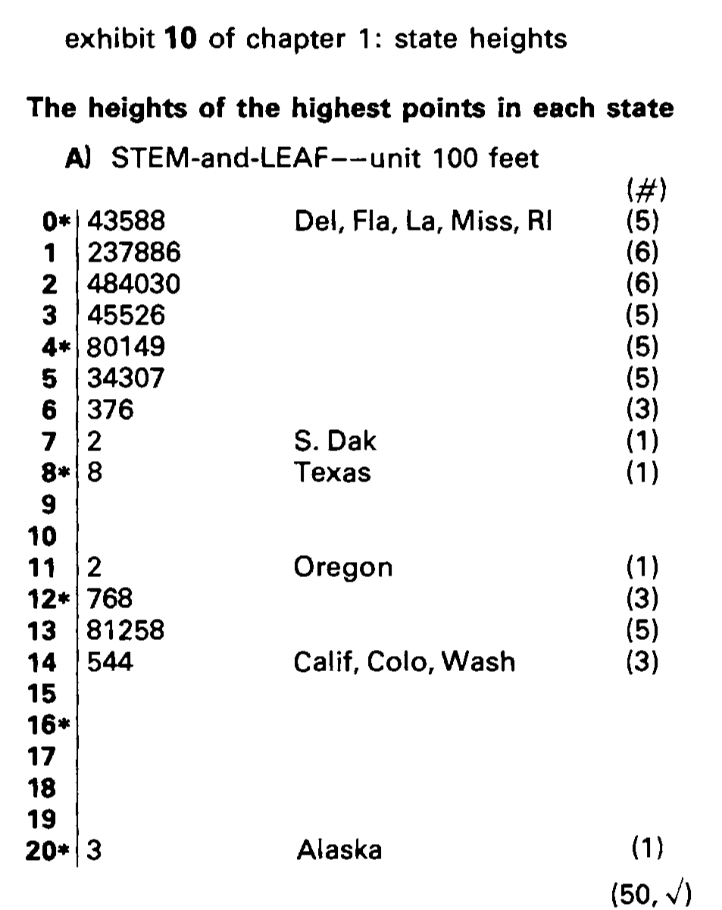

```{r, include = FALSE}
current_file <- knitr::current_input()
```
```{r, include = FALSE, eval = F}
input <- fs::path_ext_set(current_file, "html")
pagedown::chrome_print(input = input, format = "pdf", wait = 20)
```

```{r, include = FALSE}
knitr::opts_chunk$set(
  fig.path = "images/week2/",
  fig.width = 6,
  fig.height = 4,
  fig.align = "center",
  out.width = "100%",
  fig.retina = 3,
  echo = FALSE,
  warning = FALSE,
  message = FALSE,
  cache = FALSE
)
```

```{r}
library(tidyverse)
library(fabricerin)

```

```{r titleslide, child="components/titleslide.Rmd"}
```


---
background-image: \url(images/week2/tukey_cover.png)
background-size: 50%
background-position: 5% 15%
# Birth of EDA

.pull-right[
The field of exploratory data analysis came of age when this book appeared in 1977. 

<br>

.monash-blue[*Tukey held that too much emphasis in statistics was placed on statistical hypothesis testing (confirmatory data analysis); more emphasis needed to be placed on using data to suggest hypotheses to test.*]

]

---
# John W. Tukey

.pull-left[
 
]

.pull-right[
.font_medium[
- Born in 1915, in New Bedford, Massachusetts.
- Mum was a private tutor who home-schooled John. Dad was a Latin teacher. 
- BA and MSc in Chemistry, and PhD in Mathematics
- Awarded the National Medal of Science in 1973, by President Nixon
- By some reports, his home-schooling was unorthodox and contributed to his thinking and working differently. 
]
]

---
class: informative 
# Taking a glimpse back in time 

is possible with the [American Statistical Association video lending library](http://stat-graphics.org/movies/). 

<br>
We're going to watch John Tukey talking about exploring high-dimensional data with an amazing new computer in 1973, four years before the EDA book.  
<br>

`r anicon::faa("lightbulb", animate="float", colour="yellow")` .monash-pink2[Look out for these things:]

`r anicon::nia("Tukey's expertise is described as *for trial and error learning* and the computing equipment.", animate="float", anitype="hover")`

.footnote[First 4.25 minutes of https://www.youtube.com/embed/B7XoW2qiFUA)]


---
<iframe width="840" height="630" src="https://www.youtube.com/embed/B7XoW2qiFUA" frameborder="0" allow="accelerometer; autoplay; encrypted-media; gyroscope; picture-in-picture" allowfullscreen></iframe>

---

.pull-left[
 
]

.pull-right[


]

---
# Setting the frame of mind

.scroll-box-18[
This book is based on an important principle. 

<br>
**It is important to understand  what you CAN DO before you learn to  measure how WELL you seem to have DONE it.** 

<br>
Learning first what you can do will  help you to work more easily  and effectively. 

<br>
This book is about exploratory data analysis, about looking at data to see  what it seems to say. It concentrates on simple  arithmetic and easy-to-draw pictures. It regards whatever appearances  we have recognized as partial descriptions, and tries to look beneather them for  new insights. Its concern is with  appearance, not with confirmation.

<br>
**Examples, NOT case histories**

<br>
The book does not exist to make the case that exploratory data analysis is useful. Rather it exists to expose its readers and users to a considerable variety of techniques for looking more effectively at one's data.  The examples are not intended to be complete case histories. Rather they should isolated techniques in action on real data. The emphasis is on general technqiues, rather than specific problems. 
<br>

A basic problem abou any body of data is to make it more easily and effectively handleable by monds -- our minds, her mind, his mind. To this general end:

- anything that make a simpler description possible makes the description more easily handleable.
- anything that looks below the previously described surface makes the description more effective.


<br>

So we shall always be glad (a) to simplify description and (b) to describe one layer deeper. In particular, 

- to be able to say that we looked one layer deeper, and found nothing, is a definite step forward -- though not as far as to be abe to say that we looked deeper and found thus-and-such.
- to be able to say that "if we change our point of view in the following way ... things are simpler" is always a gain--though not quite so much as to be able to say "if we don't bother to change out point of view (some other) things are equally simple."

<br>
...

<br>
Consistent with this view, we believe, is a clear demand that pictures based on exploration of data should *force* their messages upon us. Pictures that emphasize what we already know--"security blankets" to reassure us--are frequently not worth the space they take. Pictures that have to be gone over with a reading glass to see the main point are wasteful of time and inadequate of effect. **The greatest value of a picture** is when it *forces* us to notice **what we never expected to see.**

<br>
<center> <b>Confirmation</b> </center>
<br>

The principles and procedures of what we call confirmatory data analysis are both widely used and one of the great intellectual products of our century. In their simplest form, these principles and procedures look at a sample--and at what that sample has told us abou the population from which it came--and assess the precision with which our inference from sample to population is made. We can no longer get along without confirmatory data analysis. <b>But we need not start with it.</b>

<br>

The best way to <b>understand what CAN be done is not longer</b>--if it ever was--<b>to ask what things could</b>, in the current state of our skill techniques, <b>be confirmed</b> (positively or negatively). Even more understanding is <em>lost</em> if we consider each thing we can do to data <em>only</em> in terms of some set of very restrictive assumtpions under which that thing is best possible--assumptions we <em>know we CANNOT check in practice</em>.

<center> <b>Exploration AND confirmation</b> </center>

Once upon a time, statisticians only explored. Then they learned to confirm exactly--to confirm a few things exactly, each under very specific circumstances. As they emphasized exact confirmation, their techniques inevitably became less flexible. The connection of the most used techniques with past insights was weakedned. Anything to which confirmatory procedure was not explicitly attached was decried as "mere descriptive statistics", no matter how much we learned from it. 

<br>

Today, the flexibility of (approximate) confirmation by the jacknife makes it relatively easy to ask, for almost any clearly specified exploration, "How far is it confirmed?"

<br>

**Today, exploratory and confirmatory can--and should--proceed side by side**. This book, of course, considers only exploratory techniques, leaving confirmatory techniques to other accounts. 

<br>

<center> <b> About the problems </b> </center>

<br>
The teacher needs to be careful about assigning problems. Not too many, please. They are likely to take longer than you think. The number supplied is to accommodate diversity of interest, not to keep everybody busy. 

<br>
Besides the length of our problems, both teacher and student need to realise that many problems do not have a single "right answer". There can be many ways to approach a body of data. Not all are equally good. For some bodies of data this may be clear, but for others we may not be able to tell from a single body of data which approach is preferred. Even several bodies of data about very similar situations may not be enough to show which approach shoud be preferred. Accordingly, it will often be quite reasonable for different analysts to reach somewhat different analyses.

<br>
Yet more--to unloc the analysis of a body of day, to find the good way to approach it, may require a key, whose finding is a creative act. Not everyone can be expected to create the key to any one situation. And to continue to paraphrase Barnum, no one can be expected to create a key to each situation he or she meets. 

<br>
**To learn about data analysis, it is right that each of us try many things that do not work**--that we tackle more problems than we make expert analyses of. We often learn less from an expertly done analysis than from one where, by not trying something, we missed--at least until we were told about it--an opportunit to learn more. Each teacher needs to recognize this in grading and commenting on problems. 

<br>
<center><b> Precision</b></center>

The teacher who heeds these words and admits that there need be *no one correct approach* may, I regret to contemplate, still want whatever is done to be digit perfect. (Under such a requirement, the write should still be able to pass the course, but it is not clear whether she would get an "A".) One does, from time to time, have to produce digit-perfect, carefully checked results, but forgiving techniques that are not too distributed by unusual data are also, usually, *little disturbed by SMALL arithmetic errors*. The techniques we discuss here have been chosen to be forgiving. It is hoped, then, that small arithmetic errors will take little off the problem's grades, leaving severe penatlies for larger errors, either of arithmetic or concept.
]

---
# Outline

.pull-left[
.monash-orange2[1.Scratching down numbers]<br>
.monash-orange2[2.Schematic summary]<br>
.monash-orange2[3.Easy re-expression]<br>
4.Effective comparison<br>
5.Plots of relationship<br>
 .monash-orange2[6.Straightening out plots (using three points)]
7.Smoothing sequences<br>
8.Parallel and wandering schematic plots<br>
9.Delineations of batches of points<br>
10.Using two-way analyses<br>
]

.pull-right[
.monash-orange2[11.Making two-way analyses]<br>
12.Advanced fits<br>
13.Three way fits<br>
14.Looking in two or more ways at batched of points<br>
15.Counted fractions<br>
16.Better smoothing<br>
.monash-orange2[17.Counts in bin after bin<br>]
18.Product-ratio plots<br>
19.Shapes of distributions<br>
20.Mathematical distributions<br>
]

---
class: transition middle animated slideInLeft

## Here we go <i class="fas fa-pencil-alt"></i> <i class="fas fa-sticky-note"></i>

---
# Scratching down numbers

Prices of Chevrolet in the local used car newspaper ads of 1968. 

```{r}
options(width=20)
chevrolets <- tibble(
  prices = c(250, 150, 795, 895, 695, 
               1699, 1499, 1099, 1693, 1166,
               688, 1333, 895, 1775, 895,
               1895, 795))
#chevrolets$prices
```


Stem-and-leaf plot: still seen introductory statistics books

```{r}

fabric_drawing(cid = "canvas1", 
               cwidth = 950, 
               cheight = 450, 
               cfill = "whitesmoke", 
               drawingWidth = 3, 
               gumSize = 10)
fabric_curtail(cid = "canvas1", imgsrc = "images/week2/chevy.png", 
                    type = "background")
#fabric_text_add(cid = "canvas1", "data1", "250, 150, 795, 895, 695, 1699, 1499, 1099, 1693, 1166, 688, 1333, 895, 1775, 895, 1895, 795", fontFamily = "Courier", fontSize=24, left=10, top=10)
#fabric_text_add(cid = "data1", "data2", "1699, 1499, 1099, 1693, 1166,", fontFamily = "Courier", fontSize=24, left=10, top=30)
#fabric_text_add(cid = "draw1", "data3", "688, 1333, 895, 1775, 895,", fontFamily = "Courier", fontSize=24, left=10, top=50)
#fabric_text_add(cid = "draw1", "data4", "1895, 795", fontFamily = "Courier", fontSize=24, left=10, top=70)
```


---
.pull-left[

First stem-and-leaf, first digit on stem, second digit on leaf


]
--

.pull-right[

Order any leaves which need it, eg stem 6


]
--

<br>
<br>
<br>
<br>
<br>
<br>
<br>
<br>
<br>
<br>
<br>
<br>

.monash-pink2[*A benefit is that the numbers can be read off the plot, but the focus is still on the pattern. Also quantiles like the median, can be computed easily.*]

---
.pull-left[

Shrink the stem


]

.pull-right[

Shrink the stem more


]
---

# And, in R ...

.font_small[
```{r stem, echo=TRUE}
stem(chevrolets$prices)
```
]
---
# <i class="fas fa-bookmark"></i> Remember the tips data

.font_smaller2[
```{r stem_tips, echo=TRUE}
tips <- read_csv("http://ggobi.org/book/data/tips.csv")
stem(tips$tip, scale=0.5, width=120)
```
]
---


.scroll-output[.font_smaller3[
```{r stem_tips2, echo=TRUE}
stem(tips$tip, scale=2)
```
]]
---
class: informative middle

## `r emo::ji("thought_balloon")` Similar information to the histogram, but we can see the actual numbers too. 

---
# Refining the size

.pull-left[

]

.pull-right[


]
---
# a different style of scratching

.pull-left[
We know about


but its too easy to 



make a mistake
]
.pull-right[
Try this instead




]
---
Count this data using the squares approach.

.pull-left[
.font_smaller4[

```{r}
set.seed(20)
tips %>% select(smoker, day) %>% 
  filter(day %in% c("Sat", "Sun")) %>%
  sample_n(25) %>%
  print(n=25)
```

]

]
.pull-right[
```{r}
fabric_drawing(cid = "canvas2", 
               cwidth = 500, 
               cheight = 450, 
               cfill = "whitesmoke", 
               drawingWidth = 3, 
               gumSize = 10)
```
]

---
class: middle

.info-box[
## What does it mean to "feel what the data are like?"]
---

.pull-left[

]

.pull-right[
This is a stem and leaf of the height of the highest peak in each of the 50 US states. 

<br>

The states roughly fall into three groups.

<br>

.font_small[.monash-blue2[It's not really surprising, but we can imagine this grouping. Alaska is in a group of its own, with a much higher high peak. Then the Rocky Mountain states, California, Washington and Hawaii also have high peaks, and the rest of the states lump together.]]

]
---
class: middle

.info-box[
## Exploratory data analysis is detective work -- in the purest sense -- finding and revealing the clues.]
---
# Resources

- [wikipedia](https://en.wikipedia.org/wiki/Exploratory_data_analysis)
- John W. Tukey (1977) Exploratory data analysis

---

```{r endslide, child="components/endslide.Rmd"}
```
