```{r, include = FALSE}
current_file <- knitr::current_input()
```
```{r, include = FALSE, eval = F}
input <- fs::path_ext_set(current_file, "html")
pagedown::chrome_print(input = input, format = "pdf", wait = 20)
```

```{r, include = FALSE}
knitr::opts_chunk$set(
  fig.path = "images/week2/",
  fig.width = 6,
  fig.height = 4,
  fig.align = "center",
  out.width = "100%",
  fig.retina = 3,
  echo = FALSE,
  warning = FALSE,
  message = FALSE,
  cache = FALSE
)
```

```{r}
library(tidyverse)
library(fabricerin)

```

```{r titleslide, child="components/titleslide.Rmd"}
```


---
class: transition middle animated slideInLeft

##  <i class="fas fa-pencil-alt"></i> <i class="fas fa-sticky-note"></i> Easy summaries -- numerical and graphical 

---
# Hinges and 5-number summaries

.pull-left[
.font_small[

```{r}
options(width=25)
x <- c(-3.2, -1.7, -0.4, 0.1, 0.3, 1.2, 1.5, 1.8, 2.4, 3.0, 4.3, 6.4, 9.8)
x
```

]

You know the median is the middle number. What's a hinge?

There are 13 data values here, provided already sorted.  Write them into  a down-up-down-up pattern, evenly. 

.font_small[.monash-blue2[Median will be 7th, hinge will be 4th from each end.]]
]
.pull-right[
```{r}

fabric_drawing(cid = "canvas3", 
               cwidth = 550, 
               cheight = 500, 
               cfill = "whitesmoke", 
               drawingWidth = 3, 
               gumSize = 10)
```
]

---
# Hinges and 5-number summary

.pull-left[
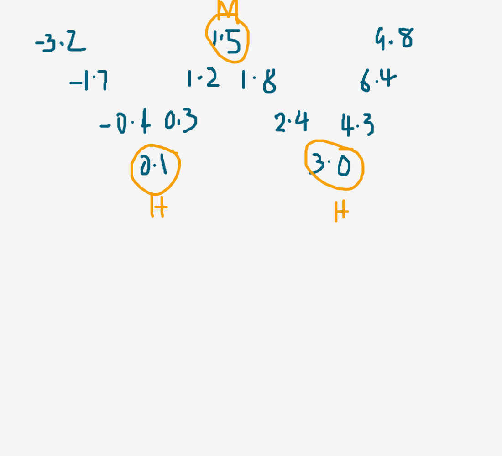
]
.pull-right[
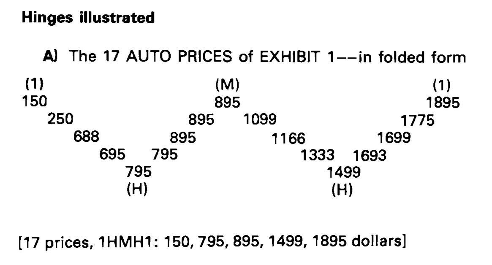
]

hinges are alternatively known as Q1 and Q3.
---

# box-and-whisker display

.pull-left[

]

.pull-right[
Starting with a 5-number summary

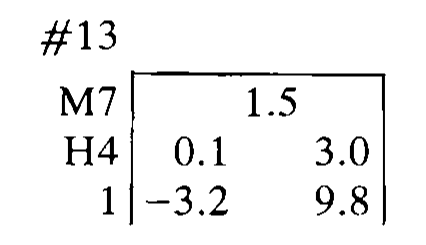
 
]

---

# box-and-whisker display

.pull-left[
Starting with a 5-number summary


 
]

.pull-right[
```{r}
fabric_drawing(cid = "canvas4", 
               cwidth = 550, 
               cheight = 500, 
               cfill = "whitesmoke", 
               drawingWidth = 3, 
               gumSize = 10)
```

]

---
# Identified end values

.pull-left[
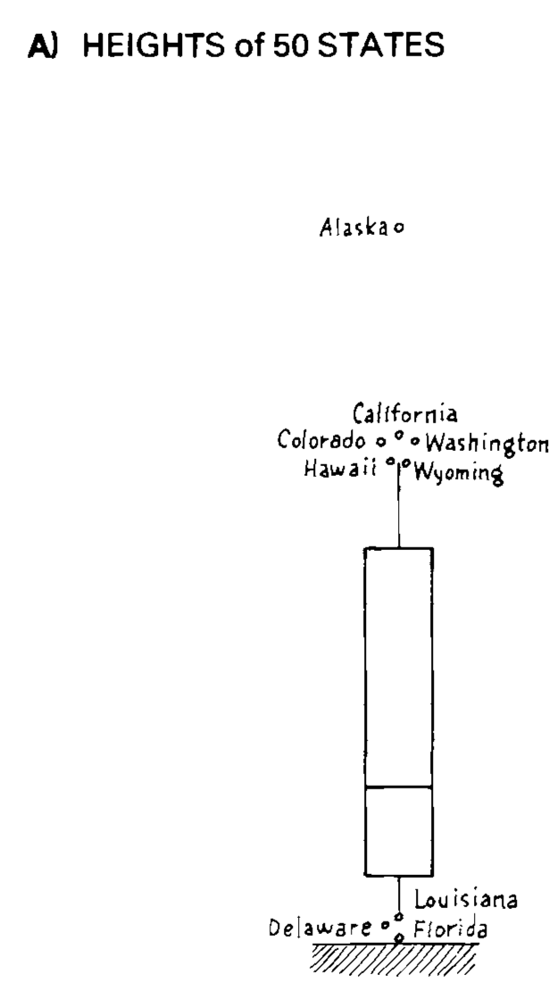

Why are some individual points singled out? 
]
.pull-right[
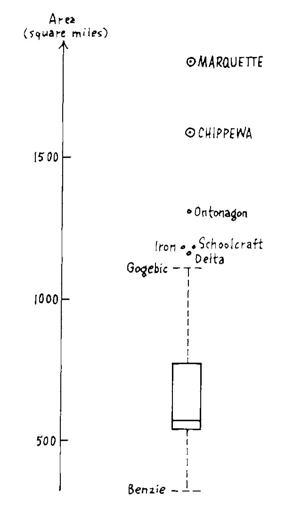

Rules for this one may be clearer?
]
---
class: motivator middle

## `r emo::ji("scream_cat")` Isn't this imposing a belief? 


---
class: middle center

.outline-text[There is no excuse for failing to plot and look]

<br>
<br>

.font_small[Another Tukey wisdom drop]

---
background-image: \url(images/week2/schematic.png)
background-size: 20%
background-position: 99% 50%
# Fences and outside values

- H-spread: difference between the hinges (we would call this Inter-Quartile Range)
- step: 1.5 times H-spread
- inner fences: 1 step outside the hinges
- outer fences: 2 steps outside the hinges
- the value at each end closest to, but still inside the inner fence are "adjacent"
- values between an inner fence and its neighbouring outer fence are "outside"
- values beyond outer fences are "far out"
- these rules produce a SCHEMATIC PLOT

---
# New statistics: trimeans

The number that comes closest to 

$$\frac{\text{lower hinge} + 2\times \text{median} + \text{upper hinge}}{4}$$
is the **trimean**.

<br>
<br>

Think about trimmed means, where we might drop  the highest and lowest 5% of observations.

---
# Letter value plots

.pull-left[
Why break the data into quarters? Why not eighths, sixteenths? k-number summaries?

What does a 7-number summary look like?

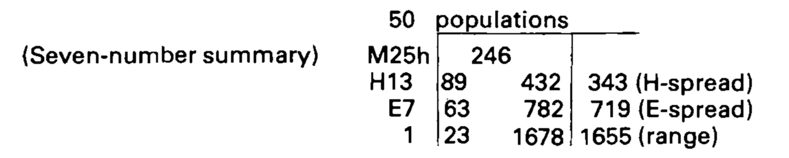

.monash-orange2[How would you make an 11-number summary?]
]
.pull-right[

.font_small[
```{r lvplot, echo=TRUE}
library(lvplot)
p <- ggplot(mpg, 
            aes(class, hwy))
p + geom_lv(aes(fill=..LV..)) + #<<
  scale_fill_brewer() 
```
]
]

---
class: informative middle

## Box plots are ubiquitous in use today. 

`r emo::ji("dog")` `r emo::ji("cat")` Mostly used to compare distributions, multiple subsets of the data.

Puts the emphasis on the `r anicon::nia("middle 50%", animate="spin", anitype="hover", color="yellow")` of observations, although variations can put emphasis on other aspects.

---
class: transition middle animated slideInLeft

## Easy re-expression

---
# Logs, square roots, reciprocals

.pull-left[
What you need to know about logs?
- how to find good enough logs fast and easily
- that equal differences in logs correspond to equal ratios of raw values. .font_small[(This means that wherever you find people using products or ratios-- even in such things as price indexes--using logs--thus converting producers to sums and ratios to differences--is likely to help.)]
]
--

.pull-right[
The most common transformations are logs, sqrt root, reciprocals, reciprocals of square roots

<center> -1, -1/2, +1/2, +1 </center>

What happened to ZERO?
--

`r anicon::nia("It turns out that the role of a zero power, is for the purposes of re-expression, neatly filles by the logarithm.", animate="passing", anitype="hover", size=0.5)`  

]
---
## Re-express to symmetrize the distribution

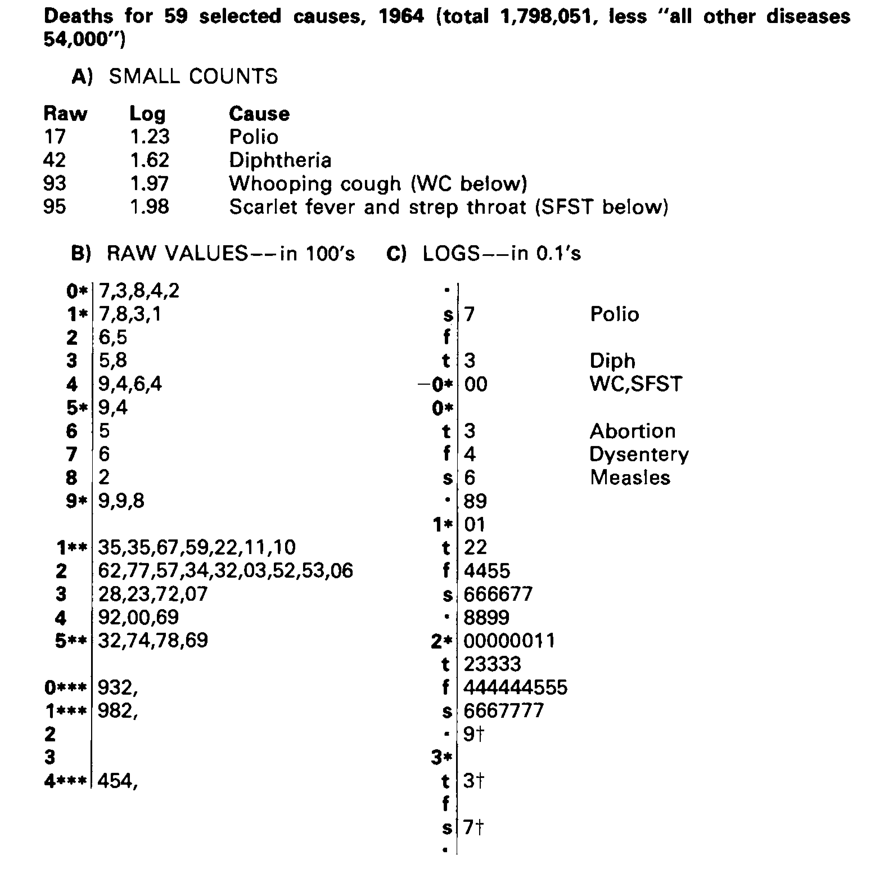

---
class: center middle
## Power ladder
<br>
<br>
<br>

`r anicon::faa("arrow-right", animate="passing",  color="orangered", anitype="hover")` `r anicon::nia("fix RIGHT-skewed values", animate="passing",  color="orangered", anitype="hover")`
<br>
<br>

-2, -1, -1/2, 0 (log), 1/3, 1/2, .font_large[.monash-orange2[1]], 2, 3, 4 

<br>
`r anicon::faa("arrow-left", animate="passing-reverse", color="orangered", anitype="hover")` `r anicon::nia("fix LEFT-skewed values", animate="passing-reverse", color="orangered", anitype="hover")`
---
class: middle center

.outline-text[We now regard re-expression as a tool, something to let us do a better job of grasping. The grasping is done with the eye and the better job is through a more symmetric appearance.]

<br>
<br>
<br>
.font_small[Another Tukey wisdom drop]

---
# Linearising bivariate relationships

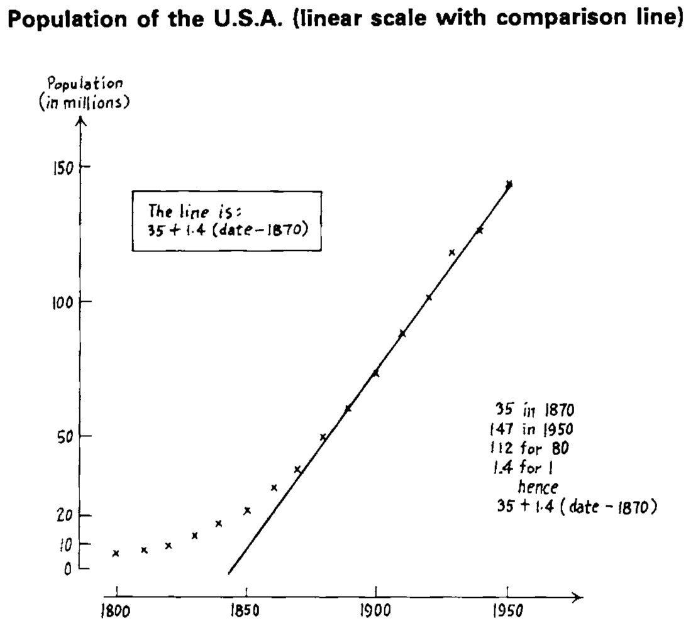 
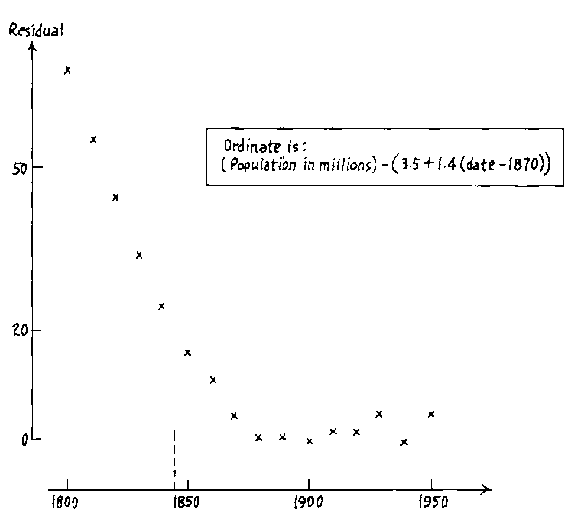 
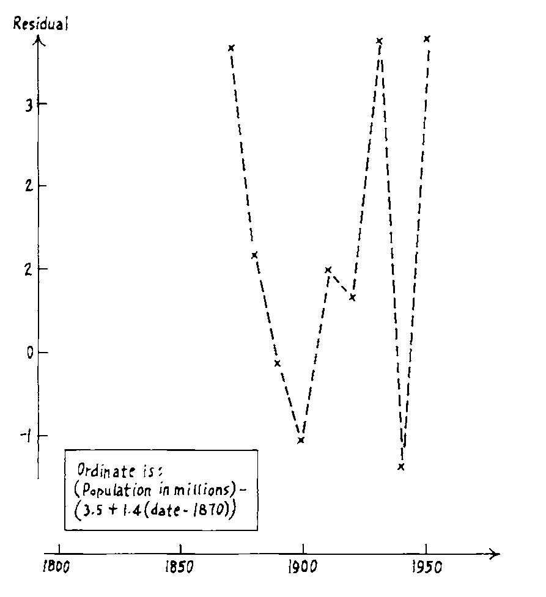 

<br>

The small fluctuations in later years are apparently errors or problems with data collection in the Censuses.

---
# Linearising bivariate relationships

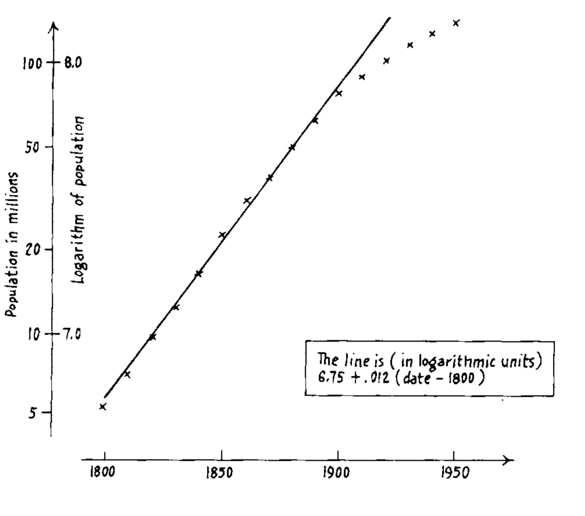 
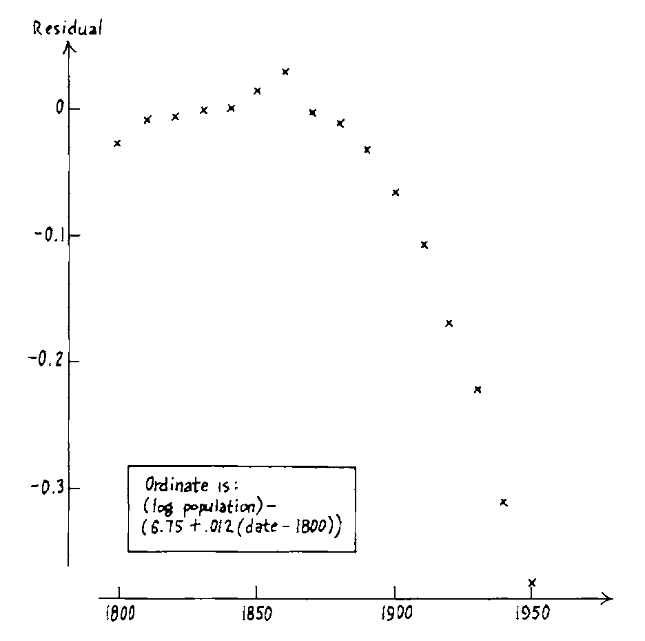 
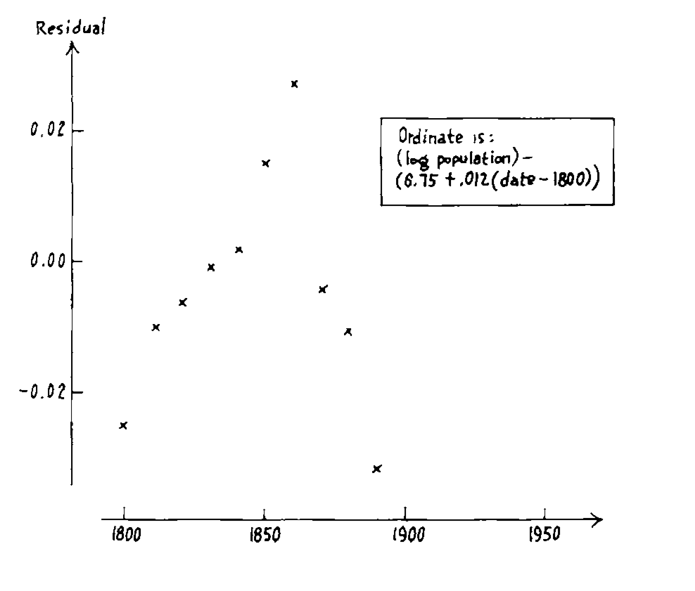 

<br>

No explanation for these fluctuations. (Log didn't linearise, btw.)

---
class: center middle

.outline-text[Whatever the data, we can try to gain by straightening or by flattening. When we succeed in doing one or both, we almost always see more clearly what is going on.]

---
# Rules and advice

.pull-left[
.font_medium2[
1.Graphics are friendly.<br>
2.Arithmetic often exists to make graphs possible.<br>
3.Graphs force us to note the unexpected; nothing could be more important.<br>
4.Different graphs show us quite different aspects of the same data.<br>
5.There is no more reason to expect one graph to "tell all" than to expect one number to do the same.<br>
6."Plotting $y$ against $x$" involves significant choices--how we express one or both variables can be crucial.<br>
]]
--

.pull-right[
.font_small[
7.The first step in penetrating plotting is to straighten out the dependence or point scatter as much as reasonable.<br>
8.Plotting $y^2$, $\sqrt{y}$, $log(y)$, $-1/y$ or the like instead of $y$ is one plausible step to take in search of straightness.<br>
9.Plotting $x^2$, $\sqrt{x}$, $log(x)$, $-1/x$ or the like instead of $x$ is another.<br>
10.Once the plot is straightened, we can usually gain much by flattening it, usually by plotting residuals.<br>
11.When plotting scatters, we may need to be careful about how we express $x$ and $y$ in order to avoid concealment by crowding.<br>
]]


---

class: transition middle animated slideInLeft

## Making two-way analyses

<br>

## <i class="fas fa-pause-circle"></i> Stay tuned for median polish, coming in a later session on spatial data

---
class: middle
background-image: \url(https://vignette.wikia.nocookie.net/starwars/images/d/d6/Yoda_SWSB.png/revision/latest?cb=20150206140125)
background-size: cover

.monash-white[The book is a digest of] `r emo::ji("star")` .monash-white[tricks and treats] `r emo::ji("star")` .monash-white[of massaging numbers and drafting displays.] 

.monash-white[Many of the tools have made it into today's analyses in various ways. Many have not.] 

.monash-white[Notice the word developments too: froots, fences. Tukey brought you the word] .monash-fuchsia2["software"].monash-white[!]

.monash-white[The temperament of the book is an inspiration for the mind-set for this unit. There is such delight in working with numbers!] 

`r anicon::nia("We love data!", animate="spin", anitype="hover", colour="yellow", size="2")`

---
# Resources

- [wikipedia](https://en.wikipedia.org/wiki/Exploratory_data_analysis)
- John W. Tukey (1977) Exploratory data analysis
- Data coding using [`tidyverse` suite of R packages](https://www.tidyverse.org) 
- Sketching canvases made using [`fabricerin`](https://ihaddadenfodil.com/post/fabricerin-a-tutorial/)
- Slides constructed with [`xaringan`](https://github.com/yihui/xaringan), [remark.js](https://remarkjs.com), [`knitr`](http://yihui.name/knitr), and [R Markdown](https://rmarkdown.rstudio.com).

---

```{r endslide, child="components/endslide.Rmd"}
```
