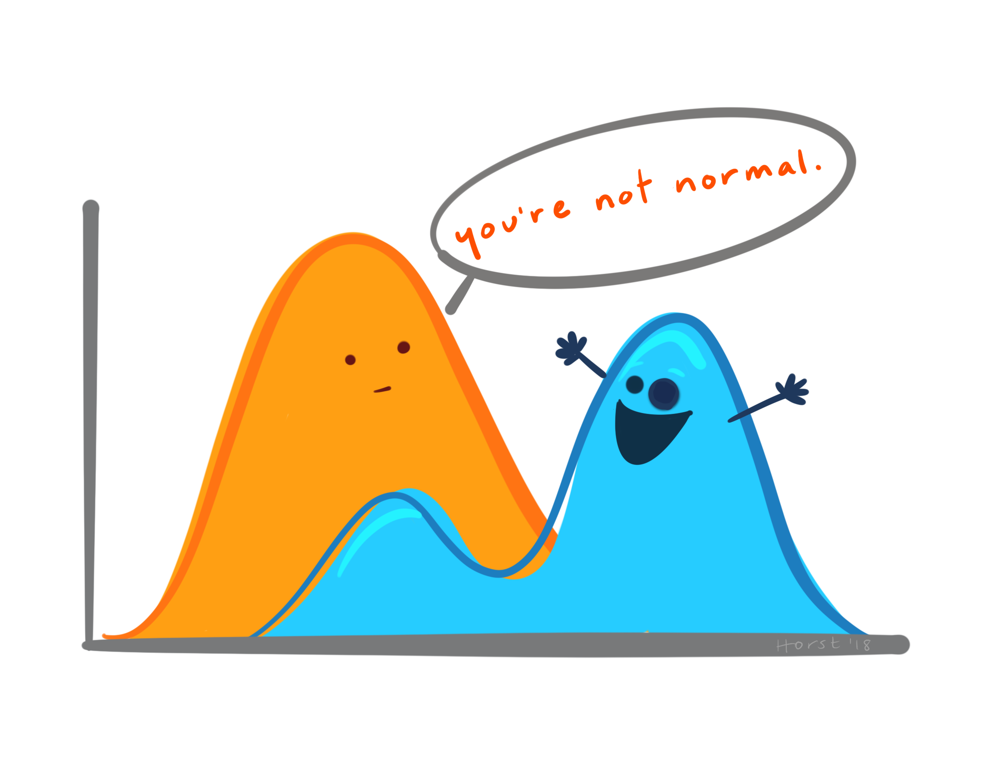
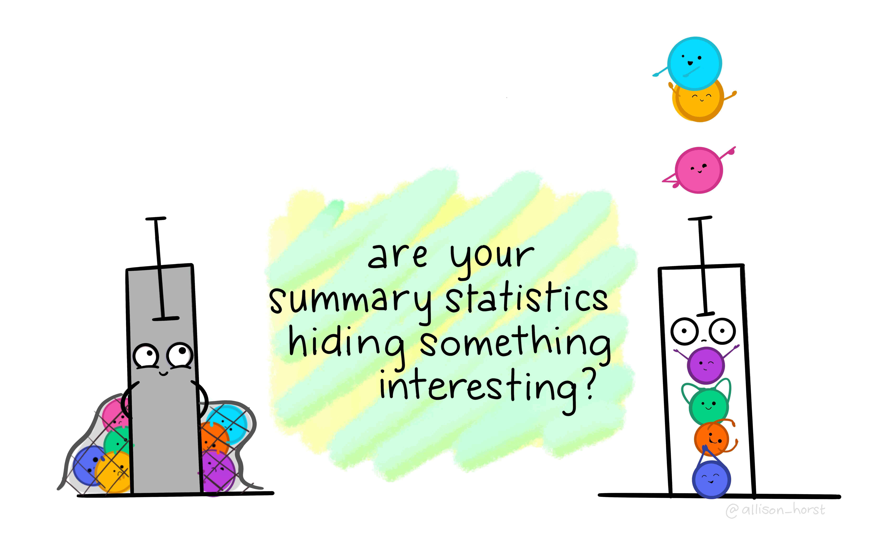
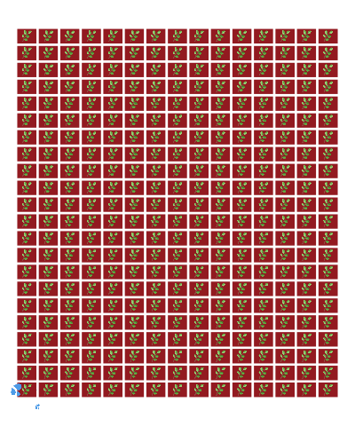

```{r, include = FALSE}
current_file <- knitr::current_input()
```
```{r, include = FALSE, eval = F}
# times out (cry)
input <- fs::path_ext_set(current_file, "html")
pagedown::chrome_print(input = input, format = "pdf", wait = 20)
```

```{r, include = FALSE}
library(tidyverse)
library(colorspace)
options(width = 200)
knitr::opts_chunk$set(
  fig.path = "images/week3B/",
  fig.width = 6,
  fig.height = 4,
  fig.align = "center",
  #out.width = "100%",
  fig.retina = 3,
  echo = FALSE,
  warning = FALSE,
  message = FALSE,
  cache = FALSE
)
theme_set(ggthemes::theme_gdocs(base_size = 18) +
            theme(plot.background = element_blank(), 
                  axis.line.y = element_line(color = "black", linetype = "solid"),
                  plot.title.position = "plot"
                  ) )
```


```{r titleslide, child="components/titleslide.Rmd"}
```

---

class: nostripheader middle


# Initial Data Analysis

<br>

and

<br>

# Exploratory Data Analysis




<div style="position:absolute;bottom:0;left:65%;font-size:18pt;">
Images by Allison Horst
</div>

--

<br>

How are they different?

--

How are they alike?

--


<div style="background-color:#e3e3e3;position:absolute;right:0;top:0%;width:40%;padding:10px;height:100%;">
<Br><br>
<ul>
<li>The statistical techniques applied may be the same or similar.</li>
{{content}}
</ul>
</div>

--

<li>The end result maybe similar (e.g. graphically showing characteristics of the data). </li>
{{content}}

--

<li>Some definitions of EDA encompasses IDA.</li>
{{content}}

--

<li>So what's the difference?</li>
{{content}}

--

<li>Well let's begin first by talking about models.</li>
<br><br><br>


---

class: font_small

# Linear models in R .font_small[REVIEW]

.grid[
.item50.border-right[
```{r, echo = TRUE, fig.height = 3.5}
library(tidyverse)
glimpse(cars)
ggplot(cars, aes(dist, speed)) + 
  geom_point() + 
  geom_smooth(method = "lm", se = FALSE)
```
]
.item[

{{content}}

]
]

--

```
lm(speed ~ dist, data = cars)
```
<center>
is the same as
</center>
```
lm(speed ~ 1 + dist, data = cars)
```

{{content}}

--

and mathematically written as 


$$y_i = \beta_0 + \beta_1 x_i + e_i$$

<ul>
<li>\(y_i\) and \(x_i\) are the speed (in mph) and stopping distance (in ft), respectively, of the \(i\)-th car;</li> <li>\(\beta_0\) and \(\beta_1\) are intercept and slope, respectively; and</li>
<li>\(e_i\) is the random error; usually assuming \(e_i \sim NID(0, \sigma^2)\). </li>
</ul>

---

class: hide-slide-number

# .circle[2] Model formulation .font_small[Part 1/2]

.grid[
.item.border-right[
* Say, we are interested in characterising the price of the diamond in terms of its carat.
```{r, fig.height = 4.5, fig.width = 6}
ggplot(diamonds, aes(carat, price)) + 
  geom_point(alpha = 1/5) + 
  ggtitle("Diamonds") #+ 
  #geom_smooth(method = "lm", se = FALSE) + 
  #ylim(0, max(diamonds$price))
```
* Looking at this plot, would you fit a linear model with formula

.center[
`price ~ 1 + carat`?
]

]
.item[
{{content}}
]
]

--


* What about
<center>
<code>price ~ poly(carat, 2)</code>?
</center>
which is the same as fitting:

$$y_i = \beta_0 + \beta_1 x_i + \beta_2 x_i^2 + e_i.$$

{{content}}
--

* The assumption for error distribution will need to be modified if so.
{{content}}
--


* Should we make some transformation before modelling?
{{content}}
--


* Are there other candidate models?


---

# .circle[2] Model formulation .font_small[Part 2/2]

* Notice that we did _**no formal statistical inference**_ as we initially try to formulate the model.
--


* The goal of the main analysis is to characterise the price of a diamond by its carat. This may involve:
   * formal inference for model selection;
   * justification of the selected "final" model; and
   * fitting the final model.
--


* There may be in fact many, many models considered but discarded at the IDA stage. 
--


* These discarded models are hardly ever reported. Consequently, majority of reported statistics give a distorted view and it's important to remind yourself what might _**not**_ be reported.


---

# Model selection

<br>

## "All models are _approximate_ and _tentative_; approximate in the sense that no model is exactly true and tentative in that they may be modified in the light of further data" 

.pull-right[Chatfield (1985)] 

<br><br>

--

## "All models are wrong but some are useful"

.pull-right[George Box]


---

class: font_smaller

# .orange[Case study] .circle.bg-orange[3]  Wheat yield in South Australia .font_small[Part 1/9]

A wheat breeding trial to test 107 varieties (also called genotype) is conducted in a field experiment laid out in a rectangular array with 22 rows and 15 columns. 

.scroll-800[
```{r, echo = TRUE, render = knitr::normal_print}
data("gilmour.serpentine", package = "agridat")
skimr::skim(gilmour.serpentine)
```
]

.footnote[
Arthur R Gilmour and Brian R Cullis and Arunas P Verbyla (1997) Accounting for natural and extraneous variation in the analysis of field experiments. *Journal of Agric Biol Env Statistics* **2** 269-293
]

---

# .orange[Case study] .circle.bg-orange[3]  Wheat yield in South Australia .font_small[Part 2/9]

## Experimental Design
* The experiment employs what is referred to as a **randomised complete block design** (RCBD) .font_small[(technically it is _near_-complete and not exactly RCBD due to check varieties have double the replicates of test varieties)].
--

* RCBD means that 
    * the there are equal number of replicates for each treatment (here it is `gen`); 
    * each treatment appears exactly once in each block; 
    * the blocks are of the same size; and
    * each treatment are randomised within block.
--


* In agricultural field experiments, blocks are formed spatially by grouping plots within contiguous areas (called `rep` here). 
* The boundaries of blocks may be chosen arbitrary.

---

# .orange[Case study] .circle.bg-orange[3]  Wheat yield in South Australia .font_small[Part 3/9]

## Experimental Design

.grid[.item[
```{r, fig.width = 6, fig.height = 7}
library(gganimate)
gilmour.serpentine %>% 
  mutate(row = factor(row), col = factor(col)) %>% 
  ggplot(aes(col, row, fill = rep)) + 
  geom_tile(color = "black", size = 2) + 
  ggtitle("Block structure") + 
  scale_fill_discrete_qualitative() + 
  coord_equal()
```

]
.item[
```{r, fig.width = 6, fig.height = 7, out.width ="75%", gganimate = list(fps = 2), cache = TRUE}
gen <- levels(gilmour.serpentine$gen)
df <- map_dfr(gen, function(agen) {
  gilmour.serpentine %>% 
    mutate(fill = case_when(
                   gen==agen ~  "#C8008F",
                   rep=="R1" ~ "#e3e3e3",
                   rep=="R2" ~ "#A0A0A0",
                   rep=="R3" ~ "#303030"
                  ), 
           state = agen)
})
df %>% 
 mutate(row = factor(row), col = factor(col)) %>% 
 ggplot(aes(col, row)) + 
  geom_tile(color = "black", size = 2, aes(fill = I(fill))) + 
  coord_equal() + 
  guides(fill = FALSE) + 
  transition_states(state, 
                    transition_length = 3, 
                    state_length = 3) + 
  labs(title = "gen: {closest_state}")
```

]
]

---

# .orange[Case study] .circle.bg-orange[3]  Wheat yield in South Australia .font_small[Part 4/9]

## Analysis

* In the main analysis, people would commonly analyse this using what is called **two-way ANOVA** model (with no interaction effect).
* The two-way ANOVA model has the form
<center>
<code>yield = mean + block + treatment + error</code>
</center>
* So for this data,
```{r, echo = TRUE}
fit <- lm(yield ~ 1 + rep + gen, 
          data = gilmour.serpentine)
```

---

class: font_smaller

# .orange[Case study] .circle.bg-orange[3]  Wheat yield in South Australia .font_small[Part 5/9]

## Analysis

.scroll-900[
```{r, echo = TRUE}
summary(fit)
```
]


---

```{r}
library(tidycat)
est <- fit %>% 
  broom::tidy() %>% 
  tidy_categorical(fit, include_reference = TRUE) %>% 
  filter(variable == "gen")
```

# .orange[Case study] .circle.bg-orange[3]  Wheat yield in South Australia .font_small[Part 6/9]


.grid[.item[
```{r, fig.height = 8, fig.width = 5}
est %>% 
  mutate(gen = fct_reorder(level, estimate)) %>% 
  filter(gen %in% levels(gen)[c(1:10, (107 - 9): 107)]) %>% 
  ggplot(aes(estimate, gen)) + 
  geom_point(size = 2) +
  ggtitle("Top 10 and bottom 10\n genotype by model est.")
```

]
.item[
```{r, fig.height = 8, fig.width = 5}
gilmour.serpentine %>% 
  mutate(gen = fct_reorder(gen, yield, mean)) %>% 
  filter(gen %in% levels(gen)[c(1:10, (107 - 9): 107)]) %>% 
  ggplot(aes(yield, gen)) + 
  geom_point(size = 2) +
  ggtitle("Top 10 and bottom 10\n genotype by mean yield")
```

]
.item[
```{r, fig.height = 8, fig.width = 5}
gilmour.serpentine %>% 
  mutate(gen = fct_reorder(gen, yield, median)) %>% 
  filter(gen %in% levels(gen)[c(1:10, (107 - 9): 107)]) %>% 
  ggplot(aes(yield, gen)) + 
  geom_point(size = 2) +
  ggtitle("Top 10 and bottom 10\n genotype by median yield")
```
]
]

---

# .orange[Case study] .circle.bg-orange[3]  Wheat yield in South Australia .font_small[Part 7/9]

Do you notice anything from below?

<br>

```{r, fig.height = 7, fig.width = 7}
gilmour.serpentine %>% 
  mutate(row = factor(row),
         col = factor(col)) %>% 
  ggplot(aes(col, row, fill = yield)) + 
  geom_tile(color = "black", size = 2) + 
  coord_equal() + 
  scale_fill_continuous_sequential(palette = "Greens 3")
```


---

# .orange[Case study] .circle.bg-orange[3]  Wheat yield in South Australia .font_small[Part 8/9]

```{r, eval = FALSE, fig.width = 12, fig.height = 7}
library(plotly)
library(crosstalk)

sdf <- gilmour.serpentine %>% 
  mutate(gen = fct_reorder(gen, yield, median),
         id = 1:n()) %>% 
  SharedData$new(~id, group = "gilmour")
sdf2 <- gilmour.serpentine %>% 
  mutate(gen = fct_reorder(gen, yield, median),
         id = 1:n()) %>% 
  filter(gen %in% levels(gen)[c(1:10, (107 - 9): 107)]) %>% 
  droplevels() %>% 
  SharedData$new(~id, group = "gilmour")

p1 <- plot_ly(sdf, x = ~col, y = ~row, 
            text = ~gen,  color = ~yield,
            type = "scatter",
            mode = "markers", 
            marker = list(symbol = "square",
                          size = 10,
                          line = list(
                            color = "black",
                            width = 1
                          ))) %>% 
        config(displayModeBar = F) %>% 
        layout(xaxis=list(fixedrange=TRUE),
               yaxis=list(fixedrange=TRUE))

p2 <- plot_ly(sdf2) %>%  
  add_markers(x = ~yield, y = ~gen) %>% 
        config(displayModeBar = F) %>% 
        layout(xaxis=list(fixedrange=TRUE),
               yaxis=list(fixedrange=TRUE))

pp <- bscols(p1, p2)
htmltools::save_html(pp, file = "lecture-03-supp.html") # note the lib folder
# saves to the project location -> moved manually
```


<iframe src="lecture-03-supp.html" width="900", height = "900" frameBorder="0">


---

# .orange[Case study] .circle.bg-orange[3]  Wheat yield in South Australia .font_small[Part 9/9]

* It's well known in agricultural field trials that spatial variations are introduced in traits; this could be because of the fertility trend, management practices or other reasons.
* In the IDA stage, you investigate to identify these spatial variations - you cannot just simply fit a two-way ANOVA model!

.grid[.item.center[

]
.item.center[

]
]


---

class: nostripheader middle


# "Teaching of Statistics should provide a more balanced blend of IDA and inference"

.pull-right[Chatfield (1985)]

--

<br><br>

Yet there is still very little emphasis of it in teaching and also at times in practice.

--

<br>

So don't forget to do IDA!

---

class: nostripheader middle

# Summary

* **_Initial data analysis_** (IDA) is a model-focussed exploration of data with two main objectives:
  * **_data description_** including scrutinizing for data quality, and
  * **_model formulation_** without any formal statistical inference.
* IDA hardly sees the limelight even if it's the very foundation of what the main analysis is built on.


---

# Resources


- Chatfield (1985) “The Initial Examination of Data.” *Journal of the Royal Statistical Society. Series A (General)* **148** (3) 214-253
- Huebner M, le Cessie S, Schmidt CO, Vach W (2018) "A contemporary conceptual framework for initial data analysis." *Observational Studies* **4** 171-192 
- Staniak, Mateusz & Biecek, Przemysław (2019) "The Landscape of R Packages for Automated Exploratory Data Analysis" *R Journal* **11** (2) 
- Data coding using [`tidyverse` suite of R packages](https://www.tidyverse.org) 
- Slides constructed with [`xaringan`](https://github.com/yihui/xaringan), [remark.js](https://remarkjs.com), [`knitr`](http://yihui.name/knitr), and [R Markdown](https://rmarkdown.rstudio.com).

---

```{r endslide, child="components/endslide.Rmd"}
```
