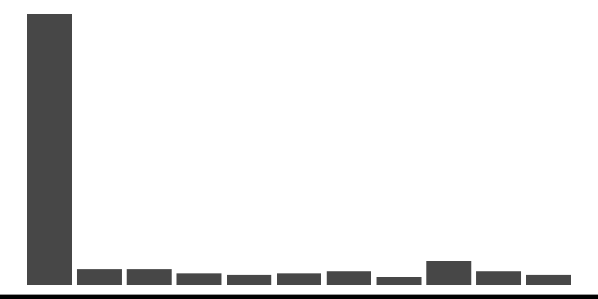

```{r, include = FALSE}
current_file <- knitr::current_input()
```
```{r, include = FALSE, eval = F}
input <- fs::path_ext_set(current_file, "html")
pagedown::chrome_print(input = input, format = "pdf", wait = 20)
```

```{r setup, include = FALSE}
set.seed(1)
#xaringanExtra::use_panelset()
library(tidyverse)
library(colorspace)
library(patchwork)
options(width = 200)
knitr::opts_chunk$set(
  fig.path = "images/week4A/",
  fig.width = 6,
  fig.height = 3.5,
  fig.align = "center",
  dev.args = list(bg = 'transparent'),
  fig.retina = 3,
  echo = FALSE,
  warning = FALSE,
  message = FALSE,
  cache = FALSE,
  cache.path = "cache/week4/"
)
theme_set(ggthemes::theme_gdocs(base_size = 18) +
            theme(plot.background = element_rect(fill = 'transparent', colour = NA), axis.line.y = element_line(color = "black", linetype = "solid"),
                  plot.title.position = "plot",
                  plot.title = element_text(size = 24),
                  panel.background  = element_rect(fill = 'transparent', colour = NA),
                  legend.background = element_rect(fill = 'transparent', colour = NA),
                  legend.key        = element_rect(fill = 'transparent', colour = NA)
                  ) )
```


```{r titleslide, child="components/titleslide.Rmd"}
```

---

class: transition middle

# Continuous variables

<br><br>


This lecture is based on Chapter 3  of <br><br>Unwin (2015) Graphical Data Analysis with R


---

# .orange[Case study] .circle.bg-orange[1] German Bundestag Election 2009 .font_small[Part 1/2]

```{r btw2009-data, include = FALSE}
data("btw2009", package = "flexclust")
df1 <- btw2009 %>%  mutate(perc = 100 * LINKE2 / valid2)
skimr::skim(df1)
```

.panelset[
.panel[.panel-name[📊]

.grid[
.item[
```{r btw2009-hist}
df1 %>% 
  ggplot(aes(perc)) + 
  geom_histogram(binwidth = 1, color = "black", fill = "#027EB6") + 
  labs(y = "Count", 
       x = "Percentage of voter support for Die Linke", 
       title = "2009 Election for German Bundestag")
```
]
.item[
**About**
* Bundestag is the first chamber of the German parliament.
* Germany has 299 constituencies.
* Die Linke is a party on the left.

**What does this graph tell you?**

{{content}}
]
]

]
.panel[.panel-name[data]
.h350.scroll-sign[
```{r btw2009-data, echo = TRUE, render = knitr::normal_print}
```
]]
.panel[.panel-name[R]

```{r btw2009-hist, echo = TRUE, eval = FALSE}
```
]
]

.footnote[
Leisch, Friedrich (2006) A Toolbox for K-Centroids Cluster Analysis. *Computational Statistics and Data Analysis* **51** (2) 526-544<br>
Data source: https://www.bundestag.de/
]

--

<ul>
<li>Majority of the country does not support Die Linke.</li>
<li>The country appear divided in support of Die Linke with some constituents more supportive than the others.</li>
</ul>

---

# .orange[Case study] .circle.bg-orange[1] German Bundestag Election 2009 .font_small[Part 2/2]


.panelset[
.panel[.panel-name[📊]

.grid[
.item[
```{r btw2009-boxplot, fig.height = 7.5, fig.width = 9}
east <- c("Brandenburg", "Mecklenburg-Vorpommern", "Sachsen",
          "Sachsen-Anhalt", "Thueringen")
df1 %>% 
  mutate(color = case_when(state %in% east ~ "#E16A86",
                           TRUE ~ "black"),
         state = glue::glue("<span style='color:{color}'>{state}</span>"),
         state = fct_reorder(state, perc)) %>% 
  ggplot(aes(perc, state)) + 
  geom_boxplot(varwidth = TRUE) + 
  labs(y = "", 
       x = "Percentage of voter support for Die Linke") + 
  theme(axis.text.y = ggtext::element_markdown())
```

]
.item[
* The width of the boxplot is proportional to the Bundesland size.
* The .pink[pink colour] indicates the old-East Germany. 
* Die-Linke had more support in the old-East.
]

]

]
.panel[.panel-name[data]
.h350.scroll-sign[
```{r btw2009-data, echo = TRUE, render = knitr::normal_print}
```
]]
.panel[.panel-name[R]

```{r btw2009-boxplot, echo = TRUE, eval = FALSE}
```
]
]


---

# Possible features of continuous variables

```{r plots, include = FALSE, fig.width = 4, fig.height = 2}
some_df <- tibble(id = 1:200) %>% 
  mutate(x1 = rexp(n()),
         p1 = rbinom(n(), 1, 0.98),
         x2 = p1 * rnorm(n()) + (1 - p1) * runif(n(), 4, 5),
         p2 = rbinom(n(), 1, 0.6),
         x3 = p2 * rnorm(n()) + (1 - p2) * rnorm(n(), 8, 2),
         x4 = p2 * runif(n(), 1, 3) + (1 - p2) * runif(n(), 4, 10),
         x5 = sample(0:10, size = n(), replace = TRUE, prob = c(0.6, rep(0.04, each = 10))),
         x6 = sample(18:30, size = n(), replace = TRUE),
         p3 = rbinom(n(), 1, 0.98), 
         x7 = p3 * rnorm(n()) + (1 - p3) * runif(n(), -10, -3))

ggplot(some_df, aes(x1)) + 
  geom_histogram(binwidth = 0.3) + 
  theme_void() + 
  theme(axis.line.x = element_line(color = "black", size = 2))

ggplot(some_df, aes(x2, "")) + 
  geom_boxplot(binwidth = 0.3) + 
  theme_void() + 
  theme(axis.line.x = element_line(color = "black", size = 2))

ggplot(some_df, aes(x3)) + 
  geom_density() + 
  theme_void() + 
  theme(axis.line.x = element_line(color = "black", size = 2))

ggplot(some_df, aes(x4, y = 1)) + 
  geom_point() + 
  theme_void() + 
  theme(axis.line.x = element_line(color = "black", size = 2))

ggplot(some_df, aes(x5)) + 
  geom_bar() + 
  theme_void() + 
  theme(axis.line.x = element_line(color = "black", size = 2))

ggplot(some_df, aes(x6)) + 
  geom_histogram(binwidth = 0.1) + 
  theme_void() + 
  theme(axis.line.x = element_line(color = "black", size = 2))

ggplot(some_df, aes(x7)) + 
  geom_dotplot() + 
  theme_void() + 
  annotate("rect", xmin = -Inf, xmax = sort(some_df$x7)[3] + 0.5, ymin = 0, ymax = Inf, fill = "red", alpha = 0.3) + 
  theme(axis.line.x = element_line(color = "black", size = 2))
```


Feature | Example | Description
--- | --- | ---
Asymmetry | | The distribution is not symmetrical.
Outliers | | Some observations are that are far from the rest.
Multimodality |   | There are more than one "peak" in the observations. 
Gaps |   | Some continuous interval that are contained within the range but no observations exists. 
Heaping |   |  Some values occur unexpectedly often.
Discretized |   | Only certain values are found, e.g. due to rounding.
Implausible |   | Values outside of plausible or likely range.


---

# Numerical features of a single contiuous variables

```{r example-plot, fig.height = 1.3}
ggplot(some_df, aes(x1)) + 
  geom_histogram(binwidth = 0.2, fill = "pink", color = "black") + 
  theme_void() + 
  theme(axis.line.x = element_line(color = "black", size = 2))
```


* A measure of **_central tendency_**, e.g. mean, median and mode.
* A measure of **_dispersion_** (also called variability or spread), e.g. variance, standard deviation and interquartile range.
* There are other measures, e.g. **_skewness_** and **_kurtosis_** that measures "tailedness", but these are not as common as the measures of first two. 
* The mean is also the _first moment_ and variance, skewness and kurtosis are _second, third, and fourth central moments_. 
* **Significance tests** or **hypothesis tests**: When testing for $H_0: \mu = \mu_0$ vs. $H_1: \mu \neq \mu_0$ (often $\mu_0 = 0$), the $t$-test is commonly used if the underlying data are believed to be normally distributed.
---


# Outliers

.info-box[
**Outliers** are *observations* that are significantly different from the majority.
]

<br>

* Outliers can occur by chance in almost all distributions, but could be indicative of a measurement error, a different population, or an issue with the sampling process.
* Outlying values of independent variables are referred to as **high-leverage points**, although this distinction is not particularly important when analysing a single continuous variable.


---


# Closer look at the _boxplot_


```{r annotated-boxplot, fig.height = 3}
fn <- quantile(mtcars$wt, c(0, 0.25, 0.5, 0.75, 1), type = 7)
iqr <- fn[4] - fn[2]
ggplot(mtcars, aes(wt, "")) + 
  geom_boxplot(size = 1.4, width = 0.2, outlier.color = "#006DAE",
               outlier.size = 3, outlier.fill = "#006DAE") + 
  geom_dotplot(binwidth = 0.1, fill = "gray") + 
  annotate("line", x = fn[c(2,4)], y = 1.3, size = 1.3, color = "#C8008F") +
  annotate("segment", x = fn[c(2, 4, 3)], xend = fn[c(2,4, 3)],
           y = c(1.25, 1.25, 0.75), yend = c(1.35, 1.35, 0.9), size = 1.3, color = "#C8008F") +
  annotate("text", x = c(mean(fn[c(2, 4)]), fn[3]), y = c(1.4, 0.7), label = c("IQR", "median"), size = 10, color = "#C8008F") + 
  # some reason vline didn't work
  annotate("segment", x = c(fn[4] + 1.5 * iqr, fn[2] - 1.5 * iqr),  xend = c(fn[4] + 1.5 * iqr, fn[2] - 1.5 * iqr), y = -Inf, yend = Inf, linetype = "dashed") + 
  theme_void()
```


* Observations that are outside the range of lower to upper thresholds are referred at times as .monash-blue[outliers].
* Plotting boxplots for data from a skewed distribution will almost always show these "outliers" but these are not necessary outliers.
* Some definitions of outliers assume a symmetrical population distribution (e.g. in boxplots or observations a certain standard deviations away from the mean) and these definitions are ill-suited for asymmetrical distributions.


---

# Robust statistics: measure of central tendency

```{r robust-mean, fig.height = 3.5}
df <- tibble(x = rnorm(200) + c(rep(0, each = 195), rep(10, 5)))
ggplot(df, aes(x)) + 
  geom_histogram() + 
  geom_vline(xintercept = mean(df$x),
             color = "#EE0220", size = 1.3) + 
  geom_vline(xintercept = median(df$x),
             color = "#746FB2", size = 1.3) + 
  theme_void()
```


* **Mean** is a non-robust measure of location. 
* Some robust measures of locations are:
  * **Median** is the 50% quantile of the observations
  * **Trimmed mean** is the sample mean after discarding observations at the tails. 
  * **Winsorized mean** is the sample mean after replacing observations at the tails with the minimum or maximum of the observations that remain.

---

# Robust statistics: measure of dispersion

* **Standard deviation** or its square, **variance*, is a popular choice of measure of dispersion but is not robust to outliers. 
* Standard deviation for sample $x_1, ..., x_n$ is calculated as 
$$\sqrt{\sum_{i=1}^n \frac{(x_i - \bar{x})^2}{n - 1}}$$
* Interquartile range is the difference between 1st and 3rd quartile and is more robust measure of spread than above.
* Median absolute deviance (MAD) is also more robust and defined as 
$$\text{median}(|x_i - \bar{x}|).$$


---

# Transformations

* Transformations to data are used as an attempt to stabilize the variance or make the data symmetrical.
* Log and square root transformations are popular.
* A range of $\lambda$ values for (one-parameter) Box-Cox transformation is sometimes used to test for optimal transformation:
$$y(\lambda) = \begin{cases}\dfrac{(y^\lambda - 1)}{\lambda}\\ \log(y)\end{cases}$$

.footnote[
Box, G. E. P. and Cox, D. R. (1964). An analysis of transformations, Journal of the Royal Statistical Society, Series B, 26, 211-252. 
]

---

# .orange[Case study] .bg-orange.circle[2] Children and midparents heights .font_small[Part 1/3]

```{r galton-data, include = FALSE}
data(galton, package = "UsingR")
df2 <- galton %>% 
  pivot_longer(everything(), 
               names_to = "person", 
               values_to = "height") 
skimr::skim(df2)
```

.panelset[
.panel[.panel-name[📊]
.grid[
.item[
```{r galton-plot1, fig.width = 6.4}
ggplot(df2, aes(height)) + 
  geom_histogram(binwidth = 1) + 
  facet_wrap(~ person, scale = "free") + 
  labs(x = "Height (inches)", y = "Frequency")

```
```{r galton-plot2}
ggplot(df2, aes(height)) + 
  geom_histogram(binwidth = 1) + 
  facet_grid(. ~ person) + 
  labs(x = "Height (inches)", y = "Frequency")
```

]
.item[

* Midparent's height is an average of the father's height and 1.08 times the mother's height. 
* The data contains 205 parents and 928 children.
```{r galtond-data-head}
galton %>% 
  arrange(parent, child) %>% 
  as_tibble() %>% 
  print(n = 3)
```
* The data included families of 1 to 15 children, so in the extreme case, one midparent data point is repeated 15 times in the data.
* The frequency of midparents heights therefore are over-represented with parents with large family size.

]
]
]
.panel[.panel-name[data]
.h300.scroll-sign[
```{r galton-data, echo = TRUE, render = knitr::normal_print}
```
]]
.panel[.panel-name[R]

```{r, ref.label = c("galton-plot1", "galton-plot2"), echo = TRUE, eval = FALSE}
```
]
]

.footnote[
Verzani, John (2018). UsingR: Data Sets, Etc. for the Text "Using R for Introductory Statistics", Second Edition. R package version 2.0-6.<br>
Galton, Franics (1886). Regression Towards Mediocrity in Hereditary Stature. *Journal of the Anthropological Institute* **15** 246-263
]


---

# .orange[Case study] .bg-orange.circle[2] Children and midparents heights .font_small[Part 2/3]

.panelset[
.panel[.panel-name[📊]
.grid[
.item[
```{r galton-plot3, fig.width = 6.4}
ggplot(df2, aes(height)) + 
  geom_histogram(binwidth = 1, aes(y = stat(density))) + 
  facet_wrap(~ person) + 
  labs(x = "Height (inches)", y = "Density")

```
```{r galton-plot4, fig.width = 6.4}
ggplot(df2, aes(height)) + 
  geom_histogram(binwidth = 0.1, aes(y = stat(density))) + 
  facet_wrap(~ person) + 
  labs(x = "Height (inches)", y = "Density")
```

]
.item50[

* Changing the bin width of histogram from 1 to 0.1, we can see the data have been rounded and hence some precision is lost in the data.
* The data confirms this with most children's height recorded with ".2" at the end and most midparents heights recorded with ".5" at the end.

<br>

`child`
```{r unique-height-child}
options(width = 50)
unique(galton$child)
```

`parent`
```{r unique-height-parents}
options(width = 50)
unique(galton$parent)
```


]
]
]
.panel[.panel-name[data]
.h300.scroll-sign[
```{r galton-data, echo = TRUE, render = knitr::normal_print}
```
]]
.panel[.panel-name[R]

```{r, ref.label = c("galton-plot3", "galton-plot4"), echo = TRUE, eval = FALSE}
```
]
]

---

# .orange[Case study] .bg-orange.circle[2] Children and midparents heights .font_small[Part 3/3]

.panelset[
.panel[.panel-name[📊]
.grid[
.item[
```{r galton-plot5}
df2sum <- df2 %>% 
  group_by(person) %>% 
  summarise(med = median(height))

ggplot(df2, aes(height)) + 
  geom_histogram(binwidth = 1) + 
  facet_grid(person ~ ., as.table = FALSE) + 
  geom_vline(data = df2sum, 
             aes(xintercept = med), 
             color = "red", size = 2) + 
  labs(x = "Height (inches)", y = "Frequency")

```

```{r galton-plot6}
ggplot(df2, aes(height, person)) + 
  geom_boxplot() + 
  labs(x = "Height (inches)", y = "")

```


]
.item50[

* Aligning the histogram vertically makes it easier to compare the heights of children and midparents. 
* The side-by-side boxplots makes it easy to see the variability of the heights of the midparents are smaller than the children. 
* The smaller variability is expected because the midparents heights are average of two values.
* We can also see that the median height is larger for the midparents than children.
{{content}}

]
]
]
.panel[.panel-name[data]
.h300.scroll-sign[
```{r galton-data, echo = TRUE, render = knitr::normal_print}
```
]]
.panel[.panel-name[R]

```{r, ref.label = c("galton-plot5", "galton-plot6"), echo = TRUE, eval = FALSE}
```
]
]

--


* You may think that the heights of children should be **_bimodal_**, _one peak for **male**_ and the _other peak for **female**_. 
{{content}}
--
But that is not necessary the case as we'll see next.


---

# .orange[Case study] .bg-orange.circle[3] Self-reported heights 


```{r dslabs-heights-data, include = FALSE}
data("heights", package = "dslabs")
skimr::skim(heights)
```


.panelset[
.panel[.panel-name[📊]
.grid[
.item[
```{r dslabs-heights-1}
ggplot(heights, aes(height)) + 
  geom_density(aes(fill = sex), size = 2) +
  scale_fill_discrete_qualitative() + 
  labs(x = "Height (inches)", y = "Density") + 
  theme(legend.position = c(0.2, 0.8)) 

```

```{r dslabs-heights-2}
ggplot(heights, aes(height)) + 
  geom_density(fill = "#027EB6", size = 2) +
  labs(x = "Height (inches)", y = "Density")

```


]
.item50[

* You can see that drawing separate density plots for each sexes shows that the women are on average shorter than men.
* The bimodality is however not visible when the data are combined.

]
]
]
.panel[.panel-name[data]
.h400.scroll-sign[
```{r dslabs-heights-data, echo = TRUE, render = knitr::normal_print}
```
]]
.panel[.panel-name[R]

```{r, ref.label = c("dslabs-heights-1", "dslabs-heights-2"), echo = TRUE, eval = FALSE}
```
]
]

.footnote[
Irizarry, Rafael A. and Gill, Amy (2019). dslabs: Data Science Labs. R package version 0.7.3.
]

---

# .orange[Case study] .circle.bg-orange[4] Men's heights 


```{r pearson-height-data, include = FALSE}
data(father.son, package = "UsingR")
df4 <- father.son %>% 
  pivot_longer(everything(), 
               names_to = "status", 
               values_to = "height") %>% 
  mutate(status = recode(status, 
                         fheight = "father",
                         sheight = "son"))
skimr::skim(df4)
```

.panelset[
.panel[.panel-name[📊]
.grid[
.item[
```{r pearson-height-plot1, fig.width = 6.4}
ggplot(df4, aes(height)) + 
  geom_histogram(binwidth = 1, aes(y = stat(density))) + 
  facet_grid(status ~ .) +
  geom_density(color = "red", size = 2) + 
  labs(x = "Height (inches)", y = "Density")

```
```{r pearson-height-plot2}
ggplot(df4, aes(sample = height)) +
  geom_qq_line(color = "red", size = 2) + 
  geom_qq() +
  facet_grid(. ~ status) + 
  labs(x = "Theoretical quantiles", y = "Sample quantiles")

```

]
.item[

```{r pearson-height-plot3, fig.height = 2}
ggplot(df4, aes(height, status)) + 
  geom_boxplot() + 
  labs(x = "Height (inches)", y = "")

```

* The height distribution of the son appears more normal than of the father looking at the density plot.
* Looking at the Q-Q plots, this however looks the other way around.
* The heights are recorded to five decimal places (e.g. `65.04851`). 
* It's unlikely that the heights were measured to such high precision and rather that someone must have "jittered" the data (i.e. added some small random perturbation to the observation). 


]
]
]
.panel[.panel-name[data]
.h200.scroll-sign[
```{r pearson-height-data, echo = TRUE, render = knitr::normal_print}
```
]]
.panel[.panel-name[R]

```{r, ref.label = c("pearson-height-plot1", "pearson-height-plot2", "pearson-height-plot3"), echo = TRUE, eval = FALSE}
```

]
]

.footnote[
Verzani, John (2018). UsingR: Data Sets, Etc. for the Text "Using R for Introductory Statistics", Second Edition. R package version 2.0-6.<br>
Pearson, Karl and Lee, Alison (1903) On the laws of inheritance in man: I. Inheritance of physical characters. *Biometrika* **2** (4) 357-462
]

---


# .orange[Case study] .circle.bg-orange[5] Boston housing data .font_small[Part 1/4]


```{r boston-data, include = FALSE}
data(bostonc, package = "DAAG")
df5 <- read_tsv(bostonc[10:length(bostonc)]) 
skimr::skim(df5)
```

```{r boston-data-longer, include = FALSE}
df5long <- df5 %>% pivot_longer(MEDV:LSTAT,
                             names_to = "var",
                             values_to = "value") %>% 
  filter(!var %in% c("CHAS", "B", "ZN"))
skimr::skim(df5long)
```


.panelset[
.panel[.panel-name[📊]
.grid[
.item[
```{r boston-plot1, fig.width = 6.4}
ggplot(df5, aes(MEDV)) + 
  geom_histogram(binwidth = 1, color = "black", fill = "#008A25") + 
  labs(x = "Median housing value (US$1000)", y = "Frequency")

```

]
.item[

{{content}}


]
]
]
.panel[.panel-name[data]
.h200.scroll-sign[
```{r boston-data, echo = TRUE, render = knitr::normal_print}
```
]]
.panel[.panel-name[R]

```{r, ref.label = c("boston-plot1"), echo = TRUE, eval = FALSE}
```

]
]

.footnote[
Harrison, David, and Daniel L. Rubinfeld (1978) Hedonic Housing Prices and the Demand for Clean Air, *Journal of Environmental Economics and Management* **5** 81-102. Original data.<br>
Gilley, O.W. and R. Kelley Pace (1996) On the Harrison and Rubinfeld Data. *Journal of Environmental Economics and Management* **31** 403-405. Provided corrections and examined censoring.<br>
Maindonald, John H. and Braun, W. John (2020). DAAG: Data Analysis and Graphics Data and Functions. R package version 1.24
]

--

* Thre is a large frequency in the final bin.
* There is a decline in observations in the $40-49K range as well as dip in observations around $26K and $34K.
* The histogram is using a bin width of 1 unit and is **left-open** (or **right-closed**): (4.5, 5.5], (5.5, 6.5] ... (49.5, 50.5].
* Occasionally, whether it is left- or right-open can make a difference.


---

# .orange[Case study] .circle.bg-orange[5] Boston housing data .font_small[Part 2/4]


.panelset[
.panel[.panel-name[📊]
.grid[
.item[
```{r boston-plot2, fig.height = 2}
ggplot(df5, aes(MEDV, y = "")) + 
  geom_boxplot(fill = "#008A25") + 
  labs(x = "Median housing value (US$1000)", y = "") + 
  theme(axis.line.y = element_blank())

```
```{r boston-plot3, fig.height = 2}
ggplot(df5, aes(MEDV, y = "")) + 
  geom_jitter() + 
  labs(x = "Median housing value (US$1000)", y = "") + 
  theme(axis.line.y = element_blank())

```
```{r boston-plot4, fig.height = 3.5}
ggplot(df5, aes(MEDV)) + 
  geom_density() + 
  geom_rug() + 
  labs(x = "Median housing value (US$1000)", y = "") + 
  theme(axis.line.y = element_blank())

```
]
.item[

* Density plots depend on the bandwidth chosen and more than often do not estimate well at boundary cases.
* There are various way to present features of the data using a plot and what works for one person, may not be as straightforward for another. 
* Be prepared to do multiple plots. 

]
]
]
.panel[.panel-name[data]
.h200.scroll-sign[
```{r boston-data, echo = TRUE, render = knitr::normal_print}
```
]]
.panel[.panel-name[R]

```{r, ref.label = paste0("boston-plot", 2:4), echo = TRUE, eval = FALSE}
```

]
]

---

# .orange[Case study] .circle.bg-orange[5] Boston housing data .font_small[Part 3/4]


.panelset[
.panel[.panel-name[📊]
.grid[
.item[
```{r boston-plot5, fig.height = 2}
ggplot(df5, aes(PTRATIO)) + 
  geom_histogram(fill = "#9651A0",  color = "black", binwidth = 0.2) + 
  labs(x = "Pupil-teacher ratio by town", y = "",
       title = "Bin width = 0.2, Left-open") 

```
```{r boston-plot6, fig.height = 2}
ggplot(df5, aes(PTRATIO)) + 
  geom_histogram(fill = "#9651A0",  color = "black", binwidth = 0.5) + 
  labs(x = "Pupil-teacher ratio by town", y = "",
       title = "Bin width = 0.5, Left-open") 

```
```{r boston-plot7, fig.height = 2}
ggplot(df5, aes(PTRATIO)) + 
  geom_histogram(fill = "#9651A0",  color = "black", bin = 30) + 
  labs(x = "Pupil-teacher ratio by town", y = "",
       title = "Bin number = 30, Left-open") 

```


]
.item[

```{r boston-plot8, fig.height = 2}
ggplot(df5, aes(PTRATIO)) + 
  geom_histogram(fill = "#9651A0", color = "black", binwidth = 0.2, closed = "left") + 
  labs(x = "Pupil-teacher ratio by town", y = "",
       title = "Bin width = 0.2, Right-open") 

```
```{r boston-plot9, fig.height = 2}
ggplot(df5, aes(PTRATIO)) + 
  geom_histogram(fill = "#9651A0", color = "black", binwidth = 0.5, closed = "left") + 
  labs(x = "Pupil-teacher ratio by town", y = "",
       title = "Bin width = 0.5, Right-open") 

```
```{r boston-plot10, fig.height = 2}
ggplot(df5, aes(PTRATIO)) + 
  geom_histogram(fill = "#9651A0", color = "black",
                 bin = 30, closed = "left") + 
  labs(x = "Pupil-teacher ratio by town", y = "",
       title = "Bin number = 30, Right-open") 

```


]
]
]
.panel[.panel-name[data]
.h400.scroll-sign[
```{r boston-data, echo = TRUE, render = knitr::normal_print}
```
]]
.panel[.panel-name[R]
.scroll-sign[.s500[
```{r, ref.label = paste0("boston-plot", 5:10), echo = TRUE, eval = FALSE}
```
]]]
]

---

# .orange[Case study] .circle.bg-orange[5] Boston housing data .font_small[Part 4/4]


.panelset[
.panel[.panel-name[📊]
.grid[
.item[
```{r boston-plotx, fig.height = 6, fig.width = 8}
ggplot(df5long, aes(value)) +
  geom_histogram() +
  facet_wrap( ~var, scale = "free") + 
  labs(x = "", y = "") + 
  theme(axis.text = element_text(size = 12))

```

]
.item[

* CRIM: per capita crime rate by town 
* INDUS: proportion of non-retail business acres per town
* NOX: nitrogen oxides concentration (parts per 10 million)
* RM: average number of room per dwelling
* AGE: proportion of owner-occupied units built prior to 1940
* DIS: weighted mean of distances to 5 Boston employment centres
* RAD: index of accessibility to radial highways
* TAX: full-value property tax rate per $10K
* PTRATIO: pupil-teacher ratio by town 
* LSTAT: lower status of the population (%)
* MEDV: median value of owner-occupied homes in $1000s

]
]
]
.panel[.panel-name[data]
.h200.scroll-sign[
```{r boston-data-longer, echo = TRUE, render = knitr::normal_print}
```
]]
.panel[.panel-name[R]

```{r, ref.label = c("boston-plotx"), echo = TRUE, eval = FALSE}
```

]
]


---


# .orange[Case study] .circle.bg-orange[6] Hidalgo stamps thickness 

```{r hidalgo-data, include = FALSE}
load(here::here("data/Hidalgo1872.rda"))
skimr::skim(Hidalgo1872)
```


.panelset[
.panel[.panel-name[📊]
```{r hidalgo-plot, fig.height = 4, fig.width = 8}
ggplot(Hidalgo1872, aes(thickness)) +
  geom_histogram(binwidth = 0.001, aes(y = stat(density))) + 
  labs(x = "Thickness (0.001 mm)", y = "Density") + 
  geom_density(color = "#E16A86", size = 2) + 
  geom_density(color = "#00AD9A", size = 2, bw = "SJ")

```

* A stamp collector, Walton von Winkle, bought several collections of Mexican stamps from 1872-1874 and measured the thickness of all of them.
* The different bandwidth for the density plot suggest either that there are two or seven modes.

]
.panel[.panel-name[data]
.h200.scroll-sign[
```{r hidalgo-data, echo = TRUE, render = knitr::normal_print}
```
]]
.panel[.panel-name[R]

```{r, ref.label = c("hidalgo-plot"), echo = TRUE, eval = FALSE}
```

]
]


---

# .orange[Case study] .circle.bg-orange[7] Movie length

```{r movies-data, include = FALSE}
data(movies, package = "ggplot2movies")
skimr::skim(movies)
```


.panelset[
.panel[.panel-name[📊]
.grid[
.item[
```{r movies-plot1}
ggplot(movies, aes(length)) +
  geom_histogram() + 
  labs(x = "Length of movie (minutes)", y = "Frequency")

```
```{r movies-plot2, fig.width = 5.3}
ggplot(movies, aes(length, y = "")) +
  geom_boxplot() + 
  labs(x = "Length of movie (minutes)", y = "") + 
  theme(axis.line.y = element_blank())

```

]
.item[

* Upon further exploration, you can find the two movies that are well over 16 hours long are: 
```{r}
movies %>% 
  filter(length > 1000) %>% 
  pull(title) %>% 
  cat(sep = "\n")
```

* We can restrict our attention to films under 3 hours:

```{r movies-plot3, fig.width = 9}
movies %>% 
  filter(length < 180) %>% 
  ggplot(aes(length)) +
  geom_histogram(binwidth = 1, fill = "#795549", color = "black") + 
  labs(x = "Length of movie (minutes)", y = "Frequency") 

```

]
]


]
.panel[.panel-name[data]
.h400.scroll-sign[
```{r movies-data, echo = TRUE, render = knitr::normal_print}
```
]]
.panel[.panel-name[R]

```{r, ref.label = paste0("movies-plot", 1:3), echo = TRUE, eval = FALSE}
```

]
]


---

# Resources


- Unwin (2015) “Graphical Data Analysis with R” 
- Data coding using [`tidyverse` suite of R packages](https://www.tidyverse.org) 
- Slides constructed with [`xaringan`](https://github.com/yihui/xaringan), [remark.js](https://remarkjs.com), [`knitr`](http://yihui.name/knitr), and [R Markdown](https://rmarkdown.rstudio.com).

---

```{r endslide, child="components/endslide.Rmd"}
```
