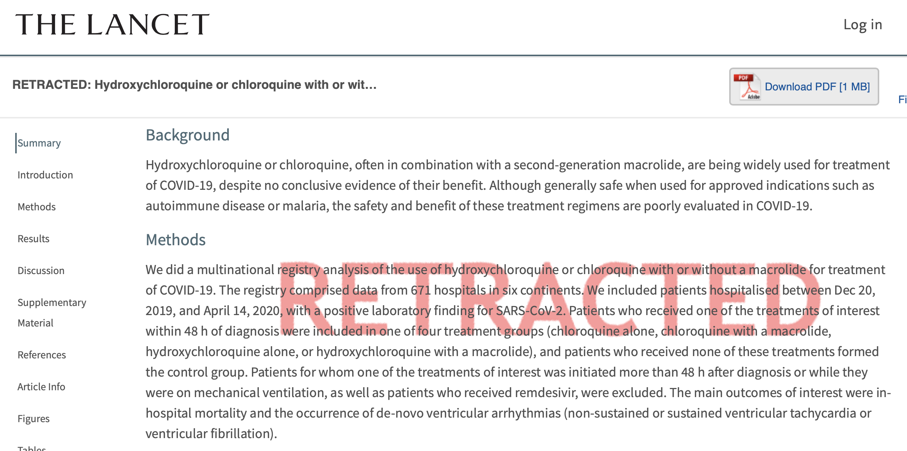
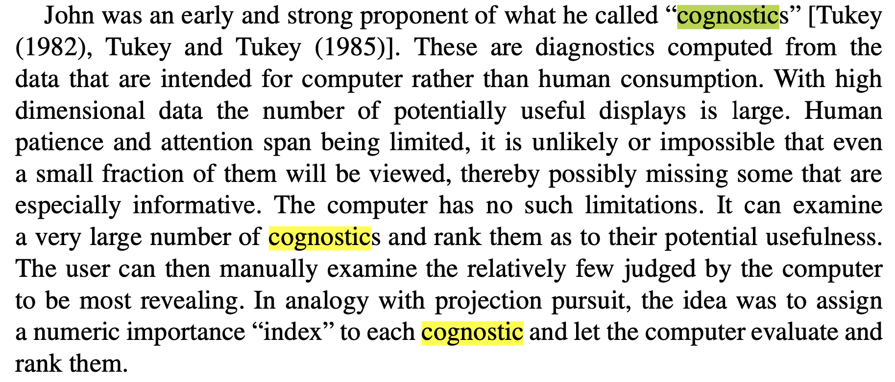
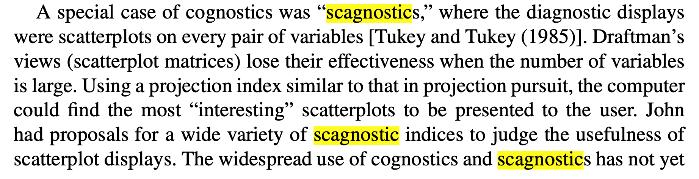
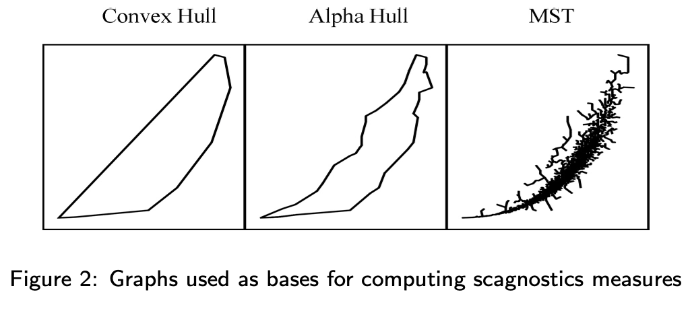

```{r, include = FALSE}
current_file <- knitr::current_input()
```
```{r, include = FALSE, eval = F}
input <- fs::path_ext_set(current_file, "html")
pagedown::chrome_print(input = input, format = "pdf", wait = 20)
```

```{r, include = FALSE}
knitr::opts_chunk$set(
  fig.path = "images/week6/",
  fig.width = 6,
  fig.height = 4,
  fig.align = "center",
  out.width = "100%",
  fig.retina = 3,
  echo = FALSE,
  warning = FALSE,
  message = FALSE,
  cache = FALSE
)
```

```{r}
library(tidyverse)
# remotes::install_github("ggobi/GGally")
library(GGally)
library(gt)
library(tourr)
library(mvtnorm)
library(forcats)
library(gridExtra)
library(binostics)
library(geozoo)
```

```{r titleslide, child="components/titleslide.Rmd"}
```

---

<iframe width="980" height="551" src="https://www.youtube.com/embed/C8oiwnNlyE4" frameborder="0" allow="accelerometer; autoplay; encrypted-media; gyroscope; picture-in-picture" allowfullscreen></iframe>

Read about the original book, and movie on [wikipedia](https://en.wikipedia.org/wiki/Flatland)

.footnote[Trailer for "FLATLAND 2: SPHERELAND"]
---
class: transition middle

# More than two variables? 

# Use a scatterplot matrix

synonyms: splom, draughtsman plot

---
# .orange[Case study] .bg-orange.circle[1] Olive oils

.panelset[
.panel[.panel-name[data]
.scroll-800[
```{r readolive}
olive <- read_csv("http://ggobi.org/book/data/olive.csv") %>%
  rename(id = X1)
olive %>% gt()
```
]
]
.panel[.panel-name[description]

.font_small[
*Source*: Forina, M., Armanino, C., Lanteri, S. & Tiscornia, E. (1983), Classi- fication of Olive Oils from their Fatty Acid Composition, in Martens, H. and Russwurm Jr., H., eds, Food Research and Data Analysis, Applied Science Publishers, London, pp. 189–214. It was brought to our attention by Glover & Hopke (1992)

*Number of rows*: 572 <br>
*Number of variables*: 10 <br>
*Description*: This data consists of the percentage composition of fatty acids found in the lipid fraction of Italian olive oils. The data arises from a study to determine the authenticity of an olive oil.

`region`: Three "super-classes" of Italy: North, South, and the island of Sardinia <br>
`area`: Nine collection areas: three from the region North (Umbria, East and West Liguria), four from South (North and South Apulia, Calabria, and Sicily), and two from the island of Sardinia (inland and coastal Sardinia).<br>
`palmitic`, `palmitoleic`, `stearic`, `oleic`, `linoleic`, `linolenic`, `arachidic`, `eicosenoic`: fatty acids, % $\times$ 100

*Primary question*: How do we distinguish the oils from different regions and areas in Italy based on their combinations of the fatty acids?
]
]
.panel[.panel-name[R]
```{r ref.label="readolive", echo=TRUE, eval=FALSE}
```
]
]

---
# .orange[Case study] .bg-orange.circle[1] Olive oils

.panelset[
.panel[.panel-name[🖼️]

```{r olivepairs, fig.height=10, fig.width=10, out.width="60%"}
ggscatmat(olive, columns=4:11, color = "region") +
  scale_colour_brewer(palette="Set1")
```

]
.panel[.panel-name[learn]

.grid[
.item[


### Differences between groups

- region 1 (south) is separated from the other two using just one variable, eiscosenoic acid
- regions 2 (sardinia) and 3 (north) are separated from each other in a combination of variables: oleic, linoleic, linolenic, arachidic.
]
.item[
### General association between variables, and univariate distributions

- Strong negative association between some variables (oleic, linoleic and other vars)
- Some clustering of observations (linoleic, arachidic, eicosenoic)
- Outliers (linolenic, oleic)
- Discreteness in linolenic and arachidic for region 3 (only) suggesting different recording protocols by region

]]

]
.panel[.panel-name[R]
```{r ref.label="olivepairs", echo=TRUE, eval=FALSE}
```
]
]


---
# .orange[Case study] .bg-orange.circle[2] PISA

.panelset[
.panel[.panel-name[🖼️]
.grid[
.item[
<br>

The Programme for International Student Assessment (PISA) is a triennial survey conducted by the Organization for Economic Cooperation and Development (OECD) on assessment measuring 15-year-old student performances in reading, mathematics and science.

<br>
<br>
.nonash-blue2[Math scores for Australia for 2018.] (Only 6 or the 10 shown.)

]
.item[
```{r pisapairs, fig.height=10, fig.width=10, out.width="90%"}
pisa_oz <-readRDS("../data/pisa2018_oz.rds")
ggscatmat(pisa_oz, columns=6:11, alpha = 0.1) 
```
]
]
]
.panel[.panel-name[learn]

.grid[
.item[
<br>
<br>

Association is uniformly positive, linear and moderately strong. 

<br>
<br>

.monash-blue2[Compare to a simulated sample from a multivariate normal] `r emo::ji("point_right")`

<br>
<br>
.monash-orange2[Can you tell that it is synthetic data?]
]
.item[
```{r mvnorm, fig.height=10, fig.width=10, out.width="90%"}
vc <- matrix(rep(0.80,100), ncol=10)
diag(vc) <- rep(1, 10)
sim <- rmvnorm(7000, mean=rep(0, 10), sigma=vc) 
sim <-as_tibble(sim)
ggscatmat(sim, columns=1:6, alpha = 0.1) 
```
]
]

]
.panel[.panel-name[R]
```{r ref.label="pisapairs", echo=TRUE, eval=FALSE}
```
```{r ref.label="mvnorm", echo=TRUE, eval=FALSE}
```

]
]

---
class: informative middle
# Diversion

This is an example of fraudulent synthetic data, presented in a Lancet article in May 2020 claiming hydroxychloroquinine increased risk of death. 


.footnote[Note: This does not mean that I support the use of HCQ.]

---



.footnote[Ellis (2020) [Surgisphere data fraud fiasco ](https://docs.google.com/presentation/d/1Ls-SsFuFJsGBfvQIcQt7HcojkznaGQN-/edit#slide=id.p5)]

---
background-image: \url(images/week6/covid_HCQ.png)
background-size: 80%
background-position: 50% 5%

<div id="rectangle" style="width: 1250px; height: 5px; background-color: red; position: absolute; top: 410px; left: 0;"></div>

---
background-image: \url(images/week6/covid_HCQ.png)
background-size: 80%
background-position: 50% 5%

<br>
.box[*Another rather remarkable aspect is how beautifully uniform the aggregated data are across continents*]
--

<br> <br>
.box[*For example, smoking is almost between 9.4-10% in 6 continents. As they don’t tell us which countries are involved, hard to see how this matches known smoking prevalences. Antiviral use is 40.5, 40.4, 40.7, 40.2, 40.8, 38.4%. Remarkable! I didn’t realise that treatment was so well coordinated across the world. Diabetes and other co-morbidities don’t vary much either.*]

.footnote[The 28 May open letter to The Lancet
coordinated by James Watson]

---
class: transition middle
# Generalised pairs plot

If the types of variables are not both quantitative, there are some other choices of mapping

---
# .orange[Case study] .bg-orange.circle[3] Tips

.panelset[
.panel[.panel-name[🖼️]
```{r tips-pairs, fig.width=10, fig.height=10, out.width="60%"}
tips <- read_csv("http://ggobi.org/book/data/tips.csv") %>%
  mutate(day = factor(day, levels=c("Thu", "Fri", "Sat", "Sun")))
ggpairs(tips[, c(2,3,8,4:7)])
```
]
.panel[.panel-name[learn]
.grid[
.item[
- positive linear moderate relationship between tip and total
- size also has a weak positive linear association with tip and total 
- total bill from males slightly higher
- total bill are more variable for smoking parties
- total bill lower on Thursday, and increasing through Sunday
- total bill higher at night
]
.item[
- some outliers in tips on Saturday nights, paid by males, at night.
- more bills paid by males
- smaller number of female non-smokers paying bill
- pretty similar number of men and women paying bill at lunchtime, but more men in the evening
- no diners on Thu/Fri during the day!!
]
]
]
.panel[.panel-name[R]

```{r echo=TRUE, eval=FALSE}
```

]
]
---
class: transition middle

# Scagnostics

Has your data got too many pairs of variables to scan easily?

---
background-image: \url(https://upload.wikimedia.org/wikipedia/commons/1/14/1980s_computer_worker%2C_Centers_for_Disease_Control.jpg)
background-size: cover

<center>  </center>

.footnote[Friedman and Stuetzle (2002) [John W. Tukey's work on interactive graphics](https://projecteuclid.org/download/pdf_1/euclid.aos/1043351250)]

---
background-image: \url(https://upload.wikimedia.org/wikipedia/commons/1/14/1980s_computer_worker%2C_Centers_for_Disease_Control.jpg)
background-size: cover

<br>
<br>
<br>
<br>

<center>  </center> 

.footnote[Friedman and Stuetzle (2002) [John W. Tukey's work on interactive graphics](https://projecteuclid.org/download/pdf_1/euclid.aos/1043351250)]

---
# Scagnostics

.panelset[
.panel[.panel-name[🖼️]
```{r scagline, fig.width=8, fig.height=4, out.width="100%"}
library(binostics)
df <- tibble(x=1:10, y=1:10)
p1 <- ggplot(df, aes(x, y)) + geom_point() +
  theme(aspect.ratio=1) + ggtitle("here's the data")
s <- scagnostics(df$x, df$y)$s
df_s <- tibble(scag = names(s), value = s) %>%
  mutate(scag = fct_reorder(scag, value))
p2 <- ggplot(df_s, aes(x=value, y=scag)) + 
  geom_point(size=3, colour="orange") +
  geom_segment(aes(x=value, xend=0, 
                   y=as.numeric(scag), 
                   yend=as.numeric(scag)), colour="orange") +
  ylab("") + xlab("scagnostic value") +
  ggtitle("this is what the computer sees")
grid.arrange(p1, p2, ncol=2)
```
]
.panel[.panel-name[R]
```{r ref.label="scagline", echo=TRUE, eval=FALSE}
```
]
]

---
# Scagnostics

.panelset[
.panel[.panel-name[🖼️]
```{r scagnorm, fig.width=8, fig.height=4, out.width="100%"}
set.seed(98765)
df <- tibble(x=rnorm(100), y=rnorm(100))
p1 <- ggplot(df, aes(x, y)) + geom_point() +
  theme(aspect.ratio=1) + ggtitle("here's the data")
s <- scagnostics(df$x, df$y)$s
df_s <- tibble(scag = names(s), value = s) %>%
  mutate(scag = fct_reorder(scag, value))
p2 <- ggplot(df_s, aes(x=value, y=scag)) + 
  geom_point(size=3, colour="orange") +
  geom_segment(aes(x=value, xend=0, 
                   y=as.numeric(scag), 
                   yend=as.numeric(scag)), colour="orange") +
  ylab("") + xlab("scagnostic value") +
  ggtitle("this is what the computer sees")
grid.arrange(p1, p2, ncol=2)
```
]
.panel[.panel-name[R]
```{r ref.label="scagnorm", echo=TRUE, eval=FALSE}
```
]
]

---
# Scagnostics

.panelset[
.panel[.panel-name[🖼️]
```{r scagcirc, fig.width=8, fig.height=4, out.width="100%"}
df <- as_tibble(sphere.hollow(p=2, n=100)$points)
p1 <- ggplot(df, aes(V1, V2)) + geom_point() +
  theme(aspect.ratio=1) + ggtitle("here's the data")
s <- scagnostics(df$V1, df$V2)$s
df_s <- tibble(scag = names(s), value = s) %>%
  mutate(scag = fct_reorder(scag, value))
p2 <- ggplot(df_s, aes(x=value, y=scag)) + 
  geom_point(size=3, colour="orange") +
  geom_segment(aes(x=value, xend=0, 
                   y=as.numeric(scag), 
                   yend=as.numeric(scag)), colour="orange") +
  ylab("") + xlab("scagnostic value") +
  ggtitle("this is what the computer sees")
grid.arrange(p1, p2, ncol=2)
```
]
.panel[.panel-name[R]
```{r ref.label="scagcirc", echo=TRUE, eval=FALSE}
```
]
]

---
# Scagnostics

.panelset[
.panel[.panel-name[🖼️]
```{r scagstrip, fig.width=8, fig.height=4, out.width="100%"}
p1 <- ggplot(flea, aes(tars2, head)) + geom_point() +
  theme(aspect.ratio=1) + ggtitle("here's the data")
s <- scagnostics(flea$tars2, flea$head)$s
flea_s <- tibble(scag = names(s), value = s) %>%
  mutate(scag = fct_reorder(scag, value))
p2 <- ggplot(flea_s, aes(x=value, y=scag)) + 
  geom_point(size=3, colour="orange") +
  geom_segment(aes(x=value, xend=0, 
                   y=as.numeric(scag), 
                   yend=as.numeric(scag)), colour="orange") +
  ylab("") + xlab("scagnostic value") +
  ggtitle("this is what the computer sees")
grid.arrange(p1, p2, ncol=2)
```
]
.panel[.panel-name[R]
```{r ref.label="scagstrip", echo=TRUE, eval=FALSE}
```
]
]

---
# Scagnostics

.panelset[
.panel[.panel-name[🖼️]
```{r scagclust, fig.width=8, fig.height=4, out.width="100%"}
p1 <- ggplot(flea, aes(tars1, aede1)) + geom_point() +
  theme(aspect.ratio=1) + ggtitle("here's the data")
s <- scagnostics(flea$tars1, flea$aede1)$s
flea_s <- tibble(scag = names(s), value = s) %>%
  mutate(scag = fct_reorder(scag, value))
p2 <- ggplot(flea_s, aes(x=value, y=scag)) + 
  geom_point(size=3, colour="orange") +
  geom_segment(aes(x=value, xend=0, 
                   y=as.numeric(scag), 
                   yend=as.numeric(scag)), colour="orange") +
  ylab("") + xlab("scagnostic value") +
  ggtitle("this is what the computer sees")
grid.arrange(p1, p2, ncol=2)
```
]
.panel[.panel-name[R]
```{r ref.label="scagclust", echo=TRUE, eval=FALSE}
```
]
]

---
# How are scagnostics calculated?

.grid[
.item[


<br>
.font_small[
edge lengths, $e$, $T$ total number of edges <br><br>
$A$ alpha hull, $H$ convex hull
]


]
.item[


<br><br>
**outlying** $(\#e>Q_3+1.5(Q_3-Q_1))/T$ <br>
**convex** $area(A)/area(H)$ (shape) <br>
**skinny** $1-\sqrt{4\pi area(A)}/perimeter(A)$ (shape) <br>
**stringy** $diameter(T)/length(T)$ (shape) <br>
**monotonic** is $r^2$ (trend) <br>
**skewed** clumpy (density) <br>
**striated** (coherence)

]
]
.footnote[[Wilkinson, Anand, Grossmann (1994)]( https://papers.rgrossman.com/proc-094.pdf)]
---
# Scagnostics from familiar measures

There are many more ways  to numerically characterise association that can be used as scagnostics too

- Slope, intercept, and error estimate from a simple linear model
- Correlation
- Principal component analysis: first eigenvalue
- Linear discriminant analysis: Between group SS to  within group SS
- Cluster metrics
- Also see 
    - tignostics for time series
    - longnostics for longitudinal data

---
# Resources

- Friendly and Denis "Milestones in History of Thematic Cartography, Statistical Graphics and Data Visualisation" available at http://www.datavis.ca/milestones/
- Schloerke et al (2020). GGally: Extension to
  'ggplot2'. https://ggobi.github.io/ggally.
- Wilkinson et al (1994) Graph-Theoretic Scagnostics, http://papers.rgrossman.com/proc-094.pdf
- Hofmann et al (2020) binostics:
  Compute Scagnostics. R package version 0.1.2.
  https://CRAN.R-project.org/package=binostics
- O'Hara-Wild, Hyndman, Wang
  (2020). 
  https://CRAN.R-project.org/package=fabletools
- Tierney, Cook, Prvan (2020) 
  https://github.com/njtierney/brolgar

---

```{r endslide, child="components/endslide.Rmd"}
```
