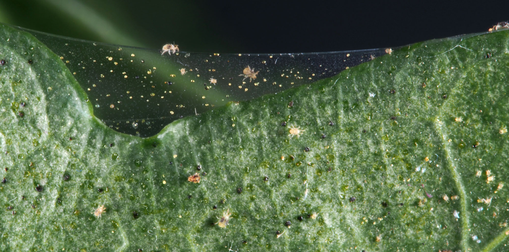
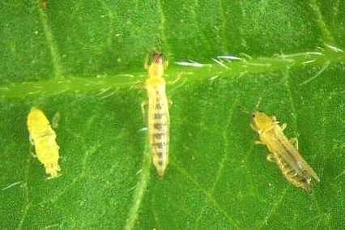

```{r, include = FALSE}
current_file <- knitr::current_input()
```
```{r, include = FALSE, eval = F}
input <- fs::path_ext_set(current_file, "html")
pagedown::chrome_print(input = input, format = "pdf", wait = 20)
```

```{r, include = FALSE}
library(tidyverse)
library(colorspace)
library(patchwork)
options(width = 200)
knitr::opts_chunk$set(
  fig.path = "images/week7A/",
  fig.width = 10,
  fig.height = 7,
  fig.align = "center",
  dev.args = list(bg = 'transparent'),
  #out.width = "100%",
  fig.retina = 3,
  echo = FALSE,
  warning = FALSE,
  message = FALSE,
  cache = TRUE,
  cache.path = "cache/week7/"
)
theme_set(ggthemes::theme_gdocs(base_size = 18) +
            theme(plot.background = element_rect(fill = 'transparent', colour = NA), axis.line.y = element_line(color = "black", linetype = "solid"),
                  plot.title.position = "plot",
                  plot.title = element_text(size = 24),
                  panel.background  = element_rect(fill = 'transparent', colour = NA),
                  legend.background = element_rect(fill = 'transparent', colour = NA),
                  legend.key        = element_rect(fill = 'transparent', colour = NA)
                  ) )
```


```{r titleslide, child="components/titleslide.Rmd"}
```

```{css, echo = FALSE}
.gray80 {
  color: #505050!important;
  font-weight: 300;
}
```


---

# .orange[Case study] .circle.bg-orange[1] Pest resistance maize .font_small[Part 1/2]

* <i class="fas fa-bug"></i> Pests, like thrips and spiders, damage maize crops. .font_small[Note: Maize = Corn]
* <i class="fas fa-dna"></i> One strategy to protect crops against pests is to cultivate *genetically modified* (GM) maize that expresses a toxic protein.

<div class="grid" style="grid-template-columns: 300px auto;">
<div class="item" width="100px">

```{r bt-table}
data(gathmann.bt, package = "agridat")
gathmann.bt %>% 
  filter(gathmann.bt=="Bt") %>% 
  select(Thrips = thysan, Spiders = aranei) %>% 
  knitr::kable(format = "html")
```

</div>
<div class="item" width="1000px">
<ul>
<li>The species abundance on 8 <i>Bt</i> GM maize is shown.</li>
{{content}}
</ul>
</div>
</div>


.footnote[
Kevin Wright (2018). agridat: Agricultural Datasets. R package version 1.16.

L. A. Hothorn, 2005. Evaluation of Bt-Maize Field Trials by a Proof of Safety. http://www.seedtest.org/upload/cms/user/presentation7Hothorn.pdf
]

--
<li>Is the strategy working?</li>
{{content}}
--
<li>Well it didn't completely eliminate pests but <em class="monash-blue">did it lower the abundance?</em></li>
{{content}}
--
<li>We can't tell without knowing what the typical abundance is.</li>
{{content}}
--
<blockquote style="margin-left:-30px;margin-right:-1px;">
At the heart of quantitative reasoning is a single question: <b class="monash-blue">Compared to what?</b><br><br>
<footer>-Edward Tufte</footer>
</blockquote>

---

```{r crop-data, include = FALSE}
data(gathmann.bt, package = "agridat")
df1 <- gathmann.bt %>% 
  pivot_longer(-gen, values_to = "abundance",
               names_to = "species") %>% 
  mutate(species = case_when(species=="thysan" ~ "Thrip",
                             TRUE ~ "Spider"))
skimr::skim(df1)
```


# .orange[Case study] .circle.bg-orange[1] Pest resistance maize .font_small[Part 2/2]

* The actual experiment compared *Bt* variety to the **isogenic control variety**.
--

* How would you compare graphically?

.panelset[
.panel[.panel-name[📊]

```{r crop-plot1, fig.width = 14, fig.height = 6}
g1 <- ggplot(df1, aes(gen, abundance, color = species)) +
  geom_point(size = 3) + 
  facet_wrap(~species, scales = "free") + 
  scale_color_discrete_qualitative() + 
  guides(color = FALSE) + 
  labs(x = "", y = "Abundance", tag = "(A)") + 
  theme(axis.text.x = element_text(angle = 90, vjust = 0.5, hjust = 1))

g2 <- ggplot(df1, aes(gen, abundance, color = species)) +
  geom_point(size = 3) + 
  scale_color_discrete_qualitative() + 
  guides(color = FALSE) + 
  labs(x = "", y = "Abundance", tag = "(B)", color = "Species") + 
  theme(axis.text.x = element_text(angle = 90, vjust = 0.5, hjust = 1))

g3 <- ggplot(df1, aes(gen, abundance, color = species)) +
  geom_point(size = 3) + 
  facet_wrap(~species) + 
  scale_color_discrete_qualitative() + 
  labs(x = "", y = "Abundance", tag = "(C)", color = "Species") + 
  theme(axis.text.x = element_text(angle = 90, vjust = 0.5, hjust = 1))

g4 <- ggplot(df1, aes(species, abundance, color = gen)) +
  geom_point(size = 3) + 
  facet_wrap(~gen, scales = "free") + 
  scale_color_discrete_qualitative(palette = "Harmonic") + 
  guides(color = FALSE) + 
  labs(x = "", y = "Abundance", tag = "(D)") + 
  theme(axis.text.x = element_text(angle = 90, vjust = 0.5, hjust = 1))

g5 <- ggplot(df1, aes(species, abundance, color = gen)) +
  geom_point(size = 3) + 
  scale_color_discrete_qualitative(palette = "Harmonic") + 
  guides(color = FALSE) + 
  labs(x = "", y = "Abundance", tag = "(E)") + 
  theme(axis.text.x = element_text(angle = 90))

g6 <- ggplot(df1, aes(species, abundance, color = gen)) +
  geom_point(size = 3) + 
  facet_wrap(~gen) + 
  scale_color_discrete_qualitative(palette = "Harmonic") + 
  labs(x = "", y = "Abundance", tag = "(F)", color = "Genotype")  + 
  theme(axis.text.x = element_text(angle = 90, vjust = 0.5, hjust = 1))

(g1 + g2 + g3) / (g4 + g5 + g6)
```

]
.panel[.panel-name[data]
.h100.scroll-sign[
```{r crop-data, echo = T, render = knitr::normal_print}
```
]]
.panel[.panel-name[R]
.s300.scroll-sign[
```{r crop-plot1, eval = F, echo = T}
```

]]

]

---

# Comparing like-with-like .font_small[Part 1]

.info-box[

Comparison should be fair - any differences should be due to the factor you wish to investigate.
]

--

.grid[.item[

<br>

<center>


</center>

```{r crop-plot2, fig.width = 8, fig.height = 3.5}
g3 + labs(tag = "") + guides(color = FALSE)
```


]
.item[

**Comparable populations and measurements**

* Abundance is measured for two species: spiders and thrips.
* The abundance metric differ between species.
* Would you compare the .gray80[abundance of spiders on a *Bt* variety] to the .gray80[abundance of thrips on a isogenic variety]?

]
]


.footnote[
Image source: https://www.infonet-biovision.org/PlantHealth/Pests/Thrips
and https://cropwatch.unl.edu/2016/managing-spider-mites-corn-and-soybean
]


---

# .orange[Case study] .circle.bg-orange[2] Maize kernels .font_small[Part 1/2]

<div class="grid" style="grid-template-columns: 350px 800px;">
.item.font_small[


1.	Plant pathologist
2.	Associate plant pathologist
3.	Professor of agronomy
4.	Assistant professor of agronomy
5.	Professor of philosophy
6.	Biologist
7.	Biologist (also author)
8.	Assistant in biology
9.	Data entry clerk (a.k.a. "Computer")
10.	Farmer
11.	Professor of plant physiology
12.	Instructor in plant physiology
13.	Assistant in plant physiology
14.	Assistant in plant physiology
15.	Professor of biology
]
.item[

* 4 maize ears selected.
* 15 observers asked to classify kernels to (i) starchy yellow, (ii) starchy white, (iii) sweet yellow or (iv) sweet white. 
* Ear 11 was slightly abnormal due to a fungus attack giving some pinkish tinge to some kernels. 
* Is Ear 11 different?

```{r kernel-plot1, fig.height = 4, fig.width = 12}
data(pearl.kernels, package = "agridat")
df2 <- pearl.kernels %>% 
  pivot_longer(-c(ear, obs), 
               values_to = "count",
               names_to = "type") %>% 
  mutate(color = ifelse(type %in% c("ys", "yt"),
                        "Yellow", "White"),
         kind = ifelse(type %in% c("ys", "ws"),
                       "Starchy", "Sweet")) 

df2A <- df2 %>% 
  group_by(ear, color, kind) %>% 
  summarise(count = sum(count))
df2B <- filter(df2, obs=="Obs01") %>% 
  group_by(ear, kind, color) %>% 
  summarise(count = sum(count))

g1 <- df2B %>% 
  ggplot(aes(ear, count)) + 
  geom_col(aes(fill = color), color = "black",
           position = "fill") + 
  scale_fill_manual(values = c("white", "yellow")) +
  facet_wrap(~kind, scale = "free") +
  labs(x = "", y = "Proportion", fill = "Color", tag = "(A)") +
  guides(fill = FALSE) +
  theme(axis.text.x = element_text(angle = 90, vjust = 0.5, hjust = 1))

g2 <- df2B  %>% 
  ggplot(aes(ear, count)) + 
  geom_col(aes(fill = kind), color = "black",
           position = "fill") + 
  scale_fill_discrete_qualitative() + 
  facet_wrap(~color, scale = "free") +
  labs(x = "", y = "Proportion", fill = "", tag = "(B)") +
  theme(axis.text.x = element_text(angle = 90, vjust = 0.5, hjust = 1))

g1 + g2 + plot_annotation(title = "Observer 1")
```


]
</div>

.footnote[
Raymond Pearl, 1911. The Personal Equation In Breeding Experiments Involving Certain Characters of Maize, Biol. Bull., 21, 339-366. 
]

---

# .orange[Case study] .circle.bg-orange[2] Maize kernels .font_small[Part 2/2]

<div class="grid" style="grid-template-columns: 350px 800px;">
.item.font_small[


1.	Plant pathologist
2.	Associate plant pathologist
3.	Professor of agronomy
4.	Assistant professor of agronomy
5.	Professor of philosophy
6.	Biologist
7.	Biologist (also author)
8.	Assistant in biology
9.	Data entry clerk (a.k.a. "Computer")
10.	Farmer
11.	Professor of plant physiology
12.	Instructor in plant physiology
13.	Assistant in plant physiology
14.	Assistant in plant physiology
15.	Professor of biology
]
.item[

* All observer are counting the kernels of the same ears, however there are variations across observers.
* Notice Observer 1 classifies more kernels as yellow for Ear 11.

```{r kernel-plot2, fig.width = 11.5, fig.height = 5.5}
df2 %>% 
  mutate(type = interaction(kind, color)) %>% 
  ggplot( aes(obs, count, color = type, group = type)) + 
  geom_point(size = 3) +
  geom_line() + 
  facet_wrap(~ear) +
  theme(axis.text.x = element_text(angle = 90, vjust = 0.5, hjust = 1)) + 
  labs(x = "Observer", y = "Count", color = "Type") +
  scale_color_discrete_qualitative()
```


]
</div>

---

# Comparing like-with-like .font_small[Part 2]

**Comparable conditions**

* The variability due to other sources need to be accounted, removed or "averaged" out for a fair comparison.

```{r kernel-plot3}
(g1 + labs(tag = "", title = "Observer 1 only")) / (g1 %+% df2A + labs(title = "All observers", tag = ""))
```
---

# Comparing like-with-like .font_small[Part 3]

<center>

</center>

**Comparable variables and sources** 

* Data collected by different sources may have different rules. E.g. in Australia, "a COVID-19 death is defined for surveillance purposes as a death in a probable or confirmed COVID-19 case, unless there is a clear alternative cause of death that cannot be related to COVID19 (e.g. trauma)"<sup>[1]</sup> 
* .gray80[Do other countries use the same definition?]
* The COVID-19 death data often have delays in reporting and data would be updated or corrected later.

.footnote[
<sup>[1]</sup> https://www.health.gov.au/resources/total-covid-19-cases-and-deaths-by-states-and-territories
]

---

# .orange[Case study] .circle.bg-orange[3] Multi-environment soybean trial 

```{r soy-data, include = FALSE}
data(australia.soybean, package = "agridat")
skimr::skim(australia.soybean)
```

* 58 soy varieties are grown in four locations in Queensland in 1970 then 1971.
* Soy breeders are interested in finding the "best" variety.
* So which variety is the best for yield?

.panelset[
.panel[.panel-name[📊]
```{r soy-plot1, fig.height = 4, fig.width = 14.8}
australia.soybean %>% 
  mutate(gen = reorder(gen, yield)) %>% 
  ggplot(aes(gen, yield, color = loc, shape = as.factor(year))) +
  geom_point(size = 3) + 
  labs(x = "Genotype", y = "Yield (tons/hectare)", shape = "Year", color = "Location") +
  scale_color_discrete_qualitative() +
  theme(axis.text.x = element_text(angle = 90, vjust = 0.5, hjust = 1)) 
```
]
.panel[.panel-name[data]
.h200.scroll-sign[
```{r soy-data, echo = TRUE, render=knitr::normal_print}
```
]]
.panel[.panel-name[R]
```{r soy-plot1, eval = FALSE, echo = TRUE}
```
]

]

---

# Types of comparison

* Is the interest to find the best variety *for a location*? 
* In that case, should the comparison be within location?
* Or is the interest to find the overall best variety *at any location*?
* Comparisons may be specific or general. 
* A different type of comparison may require a different calculation or graphic for investigation.

.panelset[
.panel[.panel-name[📊]
```{r soy-plot2, fig.height=3.5}
ggplot(australia.soybean, aes(env, yield, group = gen)) +
  geom_point(size = 6, color = "gray") + 
  geom_line(size = 1.3, color = "gray") +
  geom_point(data = filter(australia.soybean, gen %in% c("G49", "G48", "G50")), aes(color = gen), size = 6) + 
  geom_line(data = filter(australia.soybean, gen %in% c("G49", "G48", "G50")), aes(color = gen), size = 1.3) +
  scale_color_discrete_qualitative() + 
  labs(x = "Environment", y = "Yield",
       color = "Genotype") 
```
]
.panel[.panel-name[R]
```{r soy-plot2, echo = TRUE, eval = FALSE}
```

]]

---

# .orange[Case study] .circle.bg-orange[4] Weight of calves with different diets .font_small[Part 1/2]

```{r diet-data, include = FALSE}
data(urquhart.feedlot, package = "agridat")
df4 <- urquhart.feedlot %>% 
  pivot_longer(c(weight1, weight2), names_to = "when", values_to = "weight") %>% 
  mutate(when = factor(as.character(when), 
                       labels = c("initial", "final"),
                       levels = c("weight1", "weight2")),
         diet = factor(diet, levels = c("High", "Medium", "Low")))
skimr::skim(df4)
```


* 67 calves born in 1975 across 11 herds are fed of one of three diets with low, medium or high energy with their initial and final weights recorded.
* Different graphics and metrics will help to make comparison easier and fair.

.panelset[
.panel[.panel-name[📊]
```{r diet-plot1, cache.vars = df4, fig.height = 4.5, fig.width = 12}
df4 %>% 
  ggplot(aes(diet, weight, color = diet)) + 
  geom_point(size = 3) + facet_grid(when ~ herd, scale="free_y") + 
  scale_color_discrete_qualitative() + 
  labs(x = "Diet", y = "Weight", title = "Weight by herd, timing and diet") + 
  guides(color = FALSE) + 
  theme(axis.text.x = element_text(angle = 90, vjust = 0.5, hjust = 1)) 
```
]
.panel[.panel-name[data]
.h100.scroll-sign[
```{r diet-data, render=knitr::normal_print, echo = TRUE}
```
]]
.panel[.panel-name[R]
```{r diet-plot1, eval = FALSE, echo = TRUE}
```
]
]


---

# .orange[Case study] .circle.bg-orange[4] Weight of calves with different diets .font_small[Part 2/3]

* Weight data are *paired* so comparison of initial and final weights should be matched with the animal.


.panelset[
.panel[.panel-name[📊]
```{r diet-plot2, fig.width = 14, fig.height = 6}
ggplot(df4, aes(when, weight, color = diet, group = animal)) + 
  geom_point(size = 3) + facet_wrap(~herd, nrow = 2) + 
  geom_line() + 
  labs(x = "", y = "Weight", color = "Diet")
```
       
]
.panel[.panel-name[R]
```{r diet-plot2, echo = TRUE, eval = FALSE}
```
]]

---

# .orange[Case study] .circle.bg-orange[4] Weight of calves with different diets .font_small[Part 3/3]

* People are generally better at comparing lengths on a common scale instead of angles .font_small[(see Cleveland & McGill, 1985)]
* We could compare the *difference in inital and final weight*.
* Weight gain doesn't take into account the initial weight though.
* We could consider computing the relative weight gain with respect to its initial weight.


.panelset[
.panel[.panel-name[📊]
```{r diet-plot3, fig.width = 14, fig.height = 2.5}
g1 <- urquhart.feedlot %>% 
  mutate(diet = factor(diet, 
                       levels = c("High", "Medium", "Low"))) %>% 
  ggplot(aes(diet, weight2 - weight1, color = diet)) + 
  geom_boxplot() + 
  labs(x = "", y = "Weight gain", color = "Diet") + 
  guides(color = FALSE)
g2 <- urquhart.feedlot %>% 
  mutate(diet = factor(diet, 
                       levels = c("High", "Medium", "Low"))) %>% 
  ggplot(aes(diet, (weight2 - weight1)/weight1, color = diet)) + 
  geom_boxplot() + 
  labs(x = "", y = "Relative weight\ngain", color = "Diet") + 
  guides(color = FALSE)

g1 + g2
```


       
]
.panel[.panel-name[R]
.s200.scroll-sign[
```{r diet-plot3, echo = TRUE, eval = FALSE}
```
]]]

.footnote[
Cleveland, William S., and Robert Mc Gill. n.d. “Graphical Perception: Theory, Experimentation, and Application to the Development of Graphical Methods.”
]

---

# .orange[Case study] .circle.bg-orange[5] Swiss bank notes

* Comparisons are not always based on point estimates.
* Below is the comparison of distribution for the diagonal length of genuine and forged Swiss bank notes.

```{r bank-data, include = FALSE}
data(bank, package = "gclus")
df5 <- bank %>% 
  mutate(status = ifelse(Status==0, "genuine", "forgery")) 
skimr::skim(bank)
```


.panelset[
.panel[.panel-name[📊]

```{r bank-plot1, fig.height = 5.7}
g1 <- ggplot(df5, aes(Diagonal, fill = status)) + 
        geom_histogram(binwidth = 0.2, color = "white") +
        facet_grid(status ~ . ) + 
  labs(x = "Diagonal length (mm)", 
       y = "Count") + 
  guides(fill = FALSE) + 
  scale_fill_manual(values = c("#C7A76C", "#7DB0DD"))

g1
```


]
.panel[.panel-name[data]
.h200.scroll-sign[
```{r bank-data, echo = TRUE, render = knitr::normal_print}
```
]]
.panel[.panel-name[R]

```{r, ref.label = "bank-plot1", echo = TRUE, eval = FALSE}
```
]
]

---

# Comparing graphically .font_small[Part 1]

* From (A) we can see that the diagonal length distribution is quite different between forged and genuine notes. 
* Comparing (B) and (C) is however difficult due to different **aspect ratio** and graphs are not in **common scale** nor **alignment**.

```{r bank-plot2, fig.height = 6}
g2 <- df5 %>% 
  filter(status == "forgery") %>% 
  ggplot(aes(Diagonal)) + 
        geom_histogram(binwidth = 0.2, color = "white",
                       fill = "#C7A76C") + 
  labs(x = "Diagonal length (mm)", y = "Count", title = "Forgery", tag = "(B)")

g3 <- df5 %>% 
  filter(status == "genuine") %>% 
  ggplot(aes(Diagonal)) + 
        geom_histogram(binwidth = 0.2, color = "white",
                       fill = "#7DB0DD") + 
  labs(x = "Diagonal length (mm)", y = "Count", title = "Genuine", tag = "(C)")

(g1 + labs(tag = "(A)") + g2) / g3
```

---

# .orange[Case study] .bg-orange.circle[6] Barley Yield .font_small[Part 1/2]


```{r barley-data, include = FALSE}
data("barley", package = "lattice")
skimr::skim(barley)
```

.grid[.item50[
.panelset[
.panel[.panel-name[📊]
```{r barley-plot1}
ggplot(barley, aes(yield, variety, shape = year)) + 
  geom_point(size = 3) + 
  facet_wrap(~site) + 
  theme(plot.title.position = "plot",
        plot.title = element_text(face = "bold")) + 
  labs(x = "Yield", shape = "Year", y = "Variety")
```
]
.panel[.panel-name[data]
.h300.scroll-sign[
```{r barley-data, echo = TRUE, render=knitr::normal_print}
```
]]
.panel[.panel-name[R]
```{r barley-plot1, eval = FALSE, echo = TRUE}
```
]
]

]
.item[
* 10 barley varieties were tested at 6 locations in 1931 and in 1932
* Do you notice anything about the yield with respect to the years?
]

]

.footnote[
Immer, R. F., H. K. Hayes, and LeRoy Powers. (1934). Statistical Determination of Barley Varietal Adaptation. *Journal of the American Society of Agronomy* **26** 403–419
]

---

count: false


# .orange[Case study] .bg-orange.circle[6] Barley Yield .font_small[Part 1/2]


.grid[.item50[
.panelset[
.panel[.panel-name[📊]
```{r barley-plot2}
ggplot(barley, aes(yield, variety, color = year)) + 
  geom_point(size = 3) + 
  facet_wrap(~site) + 
  theme(plot.title.position = "plot",
        plot.title = element_text(face = "bold")) + 
  labs(x = "Yield", y = "Variety", color = "Year") + 
  scale_color_discrete_qualitative()
```
]
.panel[.panel-name[data]
.h300.scroll-sign[
```{r barley-data, echo = TRUE, render=knitr::normal_print}
```
]]
.panel[.panel-name[R]
```{r barley-plot2, eval = FALSE, echo = TRUE}
```
]
]

]
.item[
* 10 barley varieties were tested at 6 locations in 1931 and in 1932
* Do you notice anything about the yield with respect to the years?

<br>

*How about now?*
]

]

.footnote[
Immer, R. F., H. K. Hayes, and LeRoy Powers. (1934). Statistical Determination of Barley Varietal Adaptation. *Journal of the American Society of Agronomy* **26** 403–419
]

---

count: false


# .orange[Case study] .bg-orange.circle[6] Barley Yield .font_small[Part 1/2]


.grid[.item50[
.panelset[
.panel[.panel-name[📊]
```{r barley-plot3}
ggplot(barley, aes(yield, variety, color = year)) + 
  geom_point(size = 3, alpha = 0.4) + 
  geom_point(data = subset(barley, (site=="University Farm" & variety == "No. 475") | (site=="Grand Rapids" & variety == "Velvet")), size = 3) +
  facet_wrap(~site) + 
  theme(plot.title.position = "plot",
        plot.title = element_text(face = "bold")) + 
  labs(x = "Yield", y = "Variety", color = "Year") + 
  scale_color_discrete_qualitative()
```
]
.panel[.panel-name[data]
.h300.scroll-sign[
```{r barley-data, echo = TRUE, render=knitr::normal_print}
```
]]
.panel[.panel-name[R]
```{r barley-plot3, eval = FALSE, echo = TRUE}
```
]
]

]
.item[
* 10 barley varieties were tested at 6 locations in 1931 and in 1932
* Do you notice anything about the yield with respect to the years?

<br>

*How about now?*
]

]

.footnote[
Immer, R. F., H. K. Hayes, and LeRoy Powers. (1934). Statistical Determination of Barley Varietal Adaptation. *Journal of the American Society of Agronomy* **26** 403–419
]

---

# .orange[Case study] .bg-orange.circle[6] Barley Yield .font_small[Part 2/2]


.grid[.item[
```{r barley-plot3}
```
]
.item[

* Cleveland (1993) speculated that the year labels may have been reversed for some data.
* Wright (2013) investigated this by examining extended data from 1927 to 1936, in addition to weather covariates, and found that the observations are not particularly unusual.

]

]

.footnote[
Cleveland, W. S. (1993) Visualising Data, Summit, NJ: Hobart Press.<br>
Wright, Kevin (2013). Revisiting Immer's Barley Data. The American Statistician. **67** (3) 129–133.
]


---


# .orange[Case study] .circle.bg-orange[7] Olive oils

```{r olives-data, include = FALSE}
data(olives, package = "classifly")
df2 <- olives %>% 
  mutate(Region = factor(Region, labels = c("South", "Sardinia", "North")))
  
skimr::skim(df2)
```


.panelset[
.panel[.panel-name[📊]

```{r olives-plot1, fig.height = 7.5, fig.width = 14}
g1 <- 
  df2 %>% 
  mutate(Area = fct_reorder(Area, palmitic)) %>% 
  ggplot(aes(Area, palmitic, color = Region)) + 
  geom_boxplot() + 
  scale_color_discrete_qualitative() + 
  guides(color = FALSE, x = guide_axis(n.dodge = 2))

g2 <- ggplot(df2, aes(Region, palmitic, color = Region)) + 
  geom_boxplot() + 
  scale_color_discrete_qualitative() + 
  guides(color = FALSE)

g3 <- ggplot(df2, aes(palmitic, color = Region)) + 
  geom_density() +
  scale_color_discrete_qualitative() + 
  guides(color = FALSE)

g4 <- ggplot(df2, aes(palmitic, color = Region)) + 
  stat_ecdf() +
  scale_color_discrete_qualitative()

g1 / (g2 | (g3 / g4)) + plot_layout(guides = "collect", byrow = FALSE)
```


]
.panel[.panel-name[data]
.h300.scroll-sign[
```{r olives-data, echo = TRUE, render = knitr::normal_print}
```
]]
.panel[.panel-name[R]
.s400.scroll-sign[
```{r, ref.label = "olives-plot1", echo = TRUE, eval = FALSE}
```
]
]]


---

# Comparing graphically .font_small[Part 2]

.grid[.item[

.panelset[
.panel[.panel-name[📊]
```{r color-olives}
ggplot(olives, aes(palmitoleic, palmitic, color = Area)) + 
  geom_point() + 
  scale_color_discrete_qualitative()
```
]
.panel[.panel-name[R]
```{r color-olives, echo = TRUE, eval = FALSE}
```
]
]

]
.item[
* Color is a great way to differentiate categories but if there are too many categories then it becomes hard to compare.
* In this scatter plot, there are too many overlapping points so splitting the data to **multiple windows** via facetting may make it easier to compare. 
]
]

---

# Comparing graphically .font_small[Part 3]

.grid[.item50[
.panelset[
.panel[.panel-name[📊]
```{r no-shadow, fig.width = 7}
ggplot(olives, aes(palmitoleic, palmitic, color = Area)) + 
  geom_point() + 
  facet_wrap(~Area) + 
  scale_color_discrete_qualitative() + 
  guides(color = FALSE)
```
]
.panel[.panel-name[R]
```{r no-shadow, echo = TRUE, eval = FALSE}
```
]
]
]
.item[

{{content}}

]
]

--

<div class="panelset">
<div class="panel">
<span class="panel-name">📊</span>

```{r shadow, fig.width = 7}
ggplot(olives, aes(palmitoleic, palmitic)) + 
  geom_point(data = dplyr::select(olives, -Area), color = "gray") + 
  geom_point(aes(color = Area)) +
  facet_wrap(~Area)+ 
  scale_color_discrete_qualitative() + 
  guides(color = FALSE)
```

</div>
<div class="panel">
<span class="panel-name">R</span>

```{r shadow, echo = TRUE, eval = FALSE}
```

</div>
</div>

---

# .orange[Case study] .circle.bg-orange[8] England and East Indies trade data

```{r trade-data, include = FALSE}
data(EastIndiesTrade, package = "GDAdata")
skimr::skim(EastIndiesTrade)
```
.grid[
.item50[
.panelset[
.panel[.panel-name[📊]
```{r trade-plot1, fig.height = 7.5, fig.width = 7}
g1 <- ggplot(EastIndiesTrade, aes(Year, Exports)) +
    annotate("rect", xmin = 1701, xmax = 1714, 
           ymin = -Inf, ymax = Inf, 
           fill = "red", alpha = 0.3) +
  annotate("rect", xmin = 1756, xmax = 1763, 
           ymin = -Inf, ymax = Inf, 
           fill = "red", alpha = 0.3) +
  annotate("rect", xmin = 1775, xmax = 1780, 
           ymin = -Inf, ymax = Inf, 
           fill = "red", alpha = 0.3) +
  geom_line(color = "#339933", size = 2) + 
  geom_line(aes(Year, Imports), color = "red", size = 2) +
  geom_ribbon(aes(ymin = Exports, ymax = Imports), fill = "gray") + 
  labs(y = "<span style='color:#339933'>Export</span>/<span style='color:red'>Import</span>", tag = "(A)") + 
  theme(axis.title.y = ggtext::element_markdown())

g2 <- ggplot(EastIndiesTrade, aes(Year, Exports - Imports)) +
  annotate("rect", xmin = 1701, xmax = 1714, 
           ymin = -Inf, ymax = Inf, 
           fill = "red", alpha = 0.3) +
  annotate("rect", xmin = 1756, xmax = 1763, 
           ymin = -Inf, ymax = Inf, 
           fill = "red", alpha = 0.3) +
  annotate("rect", xmin = 1775, xmax = 1780, 
           ymin = -Inf, ymax = Inf, 
           fill = "red", alpha = 0.3) +
  geom_line(size = 2) +
  labs(tag = "(B)")

g3 <- ggplot(EastIndiesTrade, aes(Year, (Exports - Imports)/(Exports + Imports) * 2)) + 
    annotate("rect", xmin = 1701, xmax = 1714, 
           ymin = -Inf, ymax = Inf, 
           fill = "red", alpha = 0.3) +
  annotate("rect", xmin = 1756, xmax = 1763, 
           ymin = -Inf, ymax = Inf, 
           fill = "red", alpha = 0.3) +
  annotate("rect", xmin = 1775, xmax = 1780, 
           ymin = -Inf, ymax = Inf, 
           fill = "red", alpha = 0.3) +
  geom_line(color = "#001a66", size = 2) + 
  labs(y = "Relative difference", tag = "(C)")

g1 / g2 / g3 
```


]
.panel[.panel-name[data]
.h300.scroll-sign[
```{r trade-data, echo = TRUE, render = knitr::normal_print}
```
]]
.panel[.panel-name[R]
.s400.scroll-sign[
```{r, ref.label = "trade-plot1", echo = TRUE, eval = FALSE}
```
]]
]

]
.item[
* (A) shows the export from England to the East Indies and the import to England from the East Indies in millions of pounds.
* Import and export figures are easier to compare by plotting the difference like in (B).
* Relative difference may be more of an interest - (C) plots the relative difference with respect to the average of export and import values. 
* The red area correspond to War of the Spanish Succession (1701-14), Seven Years' War (1756-63) and the American Revolutionary War (1775-83).
]
]


---

# .orange[Case study] .circle.bg-orange[9] Melbourne's daily maximum temperature

```{r temp-data, include = FALSE}
df9 <- read_csv(here::here("data", "melb_temp.csv")) %>% 
  janitor::clean_names() %>% 
  rename(temp = maximum_temperature_degree_c) %>% 
  filter(!is.na(temp)) %>% 
  dplyr::select(year, month, day, temp)
skimr::skim(df9)
```

.grid[
.item50[
.panelset[
.panel[.panel-name[📊]
```{r temp-plot1, cache.vars=df9}
ggplot(df9, aes(month, temp)) + 
  geom_boxplot() + 
  labs(x = "Month", y = "Maximum temperature (°C)")
```
]
.panel[.panel-name[data]
.h300.scroll-sign[
```{r temp-data, render = knitr::normal_print, echo = TRUE}
```

]]
.panel[.panel-name[R]
```{r temp-plot1, echo = TRUE, eval = FALSE}
```
]

]]
.item[
* Melbourne's daily maximum temperature from 1970 to 2020.
* How are the temperature across months?
* What about the temperature within a month?
* You'll explore this data in week 8 tutorial!
]

]

<div style="position:absolute;bottom:0;left:10px;font-size:12pt;">Thanks to Di for the data!</div>

---

# Resources


- Unwin (2015) “Graphical Data Analysis with R” 
- Data coding using [`tidyverse` suite of R packages](https://www.tidyverse.org) 
- Slides constructed with [`xaringan`](https://github.com/yihui/xaringan), [remark.js](https://remarkjs.com), [`knitr`](http://yihui.name/knitr), and [R Markdown](https://rmarkdown.rstudio.com).

---

```{r endslide, child="components/endslide.Rmd"}
```
