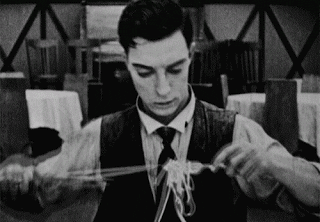

```{r, include = FALSE}
current_file <- knitr::current_input()
```
```{r, include = FALSE, eval = F}
input <- fs::path_ext_set(current_file, "html")
pagedown::chrome_print(input = input, format = "pdf", wait = 20)
```

```{r setup, include = FALSE}
options(width = 200)
knitr::opts_chunk$set(
  fig.path = "images/week9B/",
  fig.width = 6,
  fig.height = 6,
  fig.align = "center",
  dev.args = list(bg = 'transparent'),
  out.width = "100%",
  fig.retina = 3,
  echo = FALSE,
  warning = FALSE,
  message = FALSE,
  cache = FALSE,
  cache.path = "cache/week9/"
)
```

```{r libraries}
library(tidyverse)
library(tsibble)
library(DT)
library(lubridate)
library(sugrrants)
library(brolgar)
library(gghighlight)
library(imputeTS)
library(ochRe)
library(lme4)
library(modelr)
```

```{r settheme, eval=FALSE}
theme_set(ggthemes::theme_gdocs(base_size = 18) +
            theme(plot.background = element_rect(fill = 'transparent', colour = NA), 
                  axis.line.x = element_line(color = "grey60", linetype = "solid", size = 1),
                  axis.line.y = element_line(color = "grey60", linetype = "solid", size = 1),
                  plot.title.position = "plot",
                  plot.title = element_text(size = 24),
                  panel.background  = element_rect(fill = 'transparent', colour = NA),
                  legend.background = element_rect(fill = 'transparent', colour = NA),
                  legend.key        = element_rect(fill = 'transparent', colour = NA)
                  ) )
```

```{r titleslide, child="components/titleslide.Rmd"}
```

```{css, echo = FALSE}
.gray80 {
  color: #505050!important;
  font-weight: 300;
}
.bg-gray80 {
  background-color: #DCDCDC!important;
}
```

---
# Outline

- missing values 
- longitudinal data

---
class: transition middle animated slideInLeft

## Working with missings

---
# Checking counting and filling missings in time

.grid[
<div class="item50 border-right" style="font-size:20pt">

```{r missings_simple, echo=TRUE}
set.seed(328)
harvest <- tsibble(
  year = c(2010, 2011, 2013, 2011, 2012, 2013),
  fruit = rep(c("kiwi", "cherry"), each = 3),
  kilo = sample(1:10, size = 6),
  key = fruit, index = year
)
harvest
```
]

.item[
```{r missing_gaps, echo=TRUE}
has_gaps(harvest, .full = TRUE) #<<
```

<br>
Both levels of the key have missings.

<br><br>
Can you see the gaps in time?

</div>

]
---
# Checking counting and filling missings in time

.grid[
<div class="item50 border-right" style="font-size:20pt">

```{r ref.label="missings_simple", echo=TRUE}
```

]

.item[
```{r missing_count, echo=TRUE, echo=TRUE}
count_gaps(harvest,  .full=TRUE) #<<
```

<br>

One missing in each level, although it is a different year.

<br> <br>

Notice how `tsibble` handles this summary so neatly.

</div>
]


---
# Checking counting and filling missings in time

.grid[
<div class="item50 border-right" style="font-size:20pt">

```{r ref.label="missings_simple", echo=TRUE}
```

]

.item[
```{r missing_fill, echo=TRUE, highlight.output=c(5,11), echo=TRUE}
harvest <- fill_gaps(harvest, .full=TRUE) #<<
harvest 
```

<br>

Make the implicit missing values .monash-orange2[explicit].

</div>
]

---
# Checking counting and filling missings in time

.grid[
<div class="item50 border-right" style="font-size:20pt">

```{r ref.label="missings_simple", echo=TRUE, eval=FALSE}
```

]

.item[
```{r missing_impute, echo=TRUE, echo=TRUE, highlight.output=c(5,11)}
harvest_nomiss <- harvest %>% 
  group_by(fruit) %>% #<<
  mutate(kilo = na_interpolation(kilo)) %>% #<<
  ungroup()
harvest_nomiss
```

</div>
]

---
# .orange[Case study] .bg-orange.circle[3] Melbourne pedestrian traffic .font_small[Part 1/5]

.grid[
<div class="item50 border-right" style="font-size:20pt">

```{r ped_missing, echo=TRUE}
has_gaps(pedestrian, .full = TRUE)
ped_gaps <- pedestrian %>% 
  count_gaps(.full = TRUE)
```
]
.item[

```{r ped_gaps, fig.width=6, fig.height=4, out.width="100%"}
ggplot(ped_gaps, aes(x = Sensor, colour = Sensor)) +
  geom_linerange(aes(ymin = .from, ymax = .to)) +
  geom_point(aes(y = .from)) +
  geom_point(aes(y = .to)) +
  coord_flip() +
  scale_y_datetime("", 
                     date_breaks = "4 months", 
                     date_labels = "%y-%m",
                     date_minor_breaks = "1 month") +
  scale_color_brewer("", palette="Dark2") +
  theme(legend.position = "bottom")
```

What happens in April, for there to be missing on all sensors?

</div>
]

```{r ped_missing2}
ped_full <- pedestrian %>% 
  fill_gaps(.full = TRUE)
ped_nomiss <- ped_full %>%   
  group_by(Sensor) %>%
  mutate(Count_int = na_interpolation(Count),
         #Count_spl = na_interpolation(Count, "spline"),
         #Count_kal = na_kalman(Count), 
         Count_mean = na_mean(Count),
         Count_rand = na_random(Count),
         Count_ma = na_ma(Count, k=24),
         Count_loc = na_locf(Count))
```

---
# .orange[Case study] .bg-orange.circle[3] Melbourne pedestrian traffic .font_small[Part 2/5]

.panelset[
.panel[.panel-name[🖼️]


```{r ped_missing3, fig.width=12, fig.height=6, out.width="100%"}
ped_full %>% 
  filter(month(Date_Time) == 12, year(Date_Time) == 2015,
         mday(Date_Time) > 24) %>%
  ggplot(aes(x=Date_Time, y=Count, 
             colour=Sensor, group=Sensor)) + 
    geom_line() +
    geom_point() +
    facet_wrap(~Sensor, ncol=2, scales="free_y") +
    scale_color_brewer("", palette="Dark2") +
    theme(legend.position = "bottom")
```

Missings at the end of the year at QV market.

]

.panel[.panel-name[R]

```{r ref.label="ped_missing3", eval=FALSE, echo=TRUE}
```
]
]
---
# .orange[Case study] .bg-orange.circle[3] Melbourne pedestrian traffic .font_small[Part 3/5]

.panelset[
.panel[.panel-name[🖼️]

```{r ped_missing4, fig.width=12, fig.height=6, out.width="100%"}
ped_nomiss %>% 
  filter(month(Date_Time) == 12, year(Date_Time) == 2015,
         mday(Date_Time) > 24) %>%
  mutate(is_miss = ifelse(is.na(Count), "missing", "not")) %>%
  ggplot(aes(x=Date_Time, y=Count_ma, 
             group=Sensor, colour = is_miss)) + 
    geom_line() +
    geom_point() +
    facet_wrap(~Sensor, ncol=2, scales="free_y") +
    scale_color_brewer("", palette="Paired", direction = -1) +
    ylab("Count") +
    theme(legend.position = "bottom")
```

Imputed by moving average. (Would be better imputation if we used hour and type of day.)
]

.panel[.panel-name[R]

```{r ref.label="ped_missing4", eval=FALSE, echo=TRUE}
```
]
]
---
# .orange[Case study] .bg-orange.circle[3] Melbourne pedestrian traffic .font_small[Part 4/5]

.panelset[
.panel[.panel-name[🖼️]

```{r ped_missing5, fig.width=12, fig.height=6, out.width="100%"}
ped_full %>% 
  filter(month(Date_Time) == 11, year(Date_Time) == 2015,
         mday(Date_Time) < 8) %>%
  ggplot(aes(x=Date_Time, y=Count, 
             colour=Sensor, group=Sensor)) + 
    geom_line() +
    geom_point() +
    facet_wrap(~Sensor, ncol=2, scales="free_y") +
    scale_color_brewer("", palette="Dark2") +
    theme(legend.position = "bottom")
```

Missings in November at Birrarung Marr.
]

.panel[.panel-name[R]

```{r ref.label="ped_missing5", eval=FALSE, echo=TRUE}
```
]
]
---
# .orange[Case study] .bg-orange.circle[3] Melbourne pedestrian traffic .font_small[Part 5/5]

.panelset[
.panel[.panel-name[🖼️]

```{r ped_missing6, fig.width=12, fig.height=6, out.width="100%"}
ped_nomiss %>% 
  filter(month(Date_Time) == 11, year(Date_Time) == 2015,
         mday(Date_Time) < 8) %>%
  mutate(is_miss = ifelse(is.na(Count), "missing", "not")) %>%
  ggplot(aes(x=Date_Time, y=Count_ma, 
             group=Sensor, colour = is_miss)) + 
    geom_line() +
    geom_point() +
    facet_wrap(~Sensor, ncol=2, scales="free_y") +
    scale_color_brewer("", palette="Paired", direction = -1) +
    ylab("Count") +
    theme(legend.position = "bottom")
```

Imputed by moving average. Its difficult to do well at imputation with the irregular patterns at this location. 

]

.panel[.panel-name[R]

```{r ref.label="ped_missing6", eval=FALSE, echo=TRUE}
```
]
]

---
class: transition middle animated slideInLeft

## Longitudinal data

Information from the same individuals, recorded at multiple points in time.

Usually irregular, and not easy to regularise. Lots more short series.

Longitudinal data has the .monash-yellow2[same properties] as time series, but generally .monash-yellow2[different objectives] for the analysis.


---

 In the `brolgar` package methods build on the `tsibble` data object.  

```{r wages, highlight.output = c(1:2)}
wages
```

---
# .orange[Case study] .bg-orange.circle[4] Wages .font_small[Part 1/15]

.pull-left[
```{r spaghetti, echo=TRUE, fig.show = 'hide'}
wages %>%
  ggplot(aes(x = xp,
             y = ln_wages,
             group = id)) + 
  geom_line(alpha=0.3) 
```

Log(wages) of 888 individuals, measured at various times in their employment (workforce experience). 

]

.pull-right[
```{r ref.label = 'spaghetti', echo = FALSE}
```
]

---
class: middle center

# from a spaghetti mess


.footnote[Source: giphy]
---
class: middle center

# to controlled spaghetti handling


.footnote[Source: giphy]

---
class: middle center

# to perfection



.footnote[Source: giphy]

---
# .orange[Case study] .bg-orange.circle[4] Wages .font_small[Part 2/15]

.pull-left[

Using features, compute the number of measurements for each subject

```{r nobs, echo=TRUE, fig.show = 'hide'}
wages %>%
  features(ln_wages, n_obs) %>% #<<
  ggplot(aes(x = n_obs)) + 
  geom_bar() +
  xlab("Number of observations") 
```

Different number of observations per person!

]

.pull-right[
```{r ref.label = 'nobs', echo = FALSE}
```
]
---
# .orange[Case study] .bg-orange.circle[4] Wages .font_small[Part 3/15]


.pull-left[
It can be important to filter on this, to remove subjects with little information

```{r show-add-n-obs, echo=TRUE, results='hide'}
wages <- wages %>% add_n_obs() #<<
wages %>% 
  filter(n_obs > 3) %>% #<<
  select(id, ln_wages, xp, n_obs)
```
]

.pull-right[
```{r ref.label = 'show-add-n-obs', echo=FALSE, highlight.output = 2}
wages <- wages %>% add_n_obs() 
wages %>% 
  filter(n_obs > 3) %>%
  select(id, ln_wages, xp, n_obs)
```
]


---
# .orange[Case study] .bg-orange.circle[4] Wages .font_small[Part 4/15]

.pull-left[
Using features to extract minimum time

```{r start-time, fig.show='hide', echo=TRUE}
wages %>%
  features(xp, list(min = min)) %>% #<<
  ggplot(aes(x = min)) + 
  geom_histogram(binwidth=0.5) +
  xlim(c(0, 13)) +
  xlab("First time in study") 
```

Subjects start in the study at different employment experience times
]

.pull-right[
```{r ref.label = 'start-time', echo=FALSE}
```
]

---
# .orange[Case study] .bg-orange.circle[4] Wages .font_small[Part 5/15]

.pull-left[
Using features to extract range of time index

```{r wages-xp, fig.show='hide', echo=TRUE}
wages_xp_range <- wages %>% 
  features(xp, feat_ranges) #<<

ggplot(wages_xp_range,
       aes(x = range_diff)) + 
  geom_histogram() + 
  xlab("Range of experience")
```

There's a range of workforce experience.
]

.pull-right[

```{r ref.label = 'wages-xp', echo=FALSE}
```
]

---
# .orange[Case study] .bg-orange.circle[4] Wages .font_small[Part 6/15]

.pull-left[
.monash-orange2[Small spoonfuls of spaghetti]

Sample some individuals

```{r}
set.seed(20200720)
```

```{r spoonful, fig.show='hide', echo=TRUE}
wages %>%
  sample_n_keys(size = 10) %>% #<<
  ggplot(aes(x = xp,
             y = ln_wages,
             group = id)) + 
  geom_line() +
  xlim(c(0,13)) + ylim(c(0, 4.5)) +
  xlab("Years of experience") + 
  ylab("Log wages") 
```

.font_small[Wages conversion 0.5 = $1.65; 4.5 = $90]
]

.pull-right[
```{r ref.label = 'spoonful', echo=FALSE}
```
]

---
count: false
# .orange[Case study] .bg-orange.circle[4] Wages .font_small[Part 6/15]


.pull-left[
.monash-orange2[Small spoonfuls of spaghetti]

Sample some individuals

```{r ref.label = 'spoonful', echo=TRUE, eval=FALSE}
```

.font_small[Wages conversion 0.5 = $1.65; 4.5 = $90]
]

.pull-right[
```{r ref.label = 'spoonful', echo=FALSE, eval=TRUE}
```
]

---
count: false
# .orange[Case study] .bg-orange.circle[4] Wages .font_small[Part 6/15]


.pull-left[
.monash-orange2[Small spoonfuls of spaghetti]

Sample some individuals

```{r ref.label = 'spoonful', echo=TRUE, eval=FALSE}
```

.font_small[Wages conversion 0.5 = $1.65; 4.5 = $90]
]

.pull-right[
```{r ref.label = 'spoonful', echo=FALSE, eval=TRUE}
```
]

---
# .orange[Case study] .bg-orange.circle[4] Wages .font_small[Part 7/15]

.pull-left[
.monash-orange2[Take a spoonful of different lengths]

Sample experienced individuals

```{r spoonful_long, fig.show='hide', echo=TRUE}
wages %>%
  add_n_obs() %>%
  filter(n_obs > 7) %>% #<<
  sample_n_keys(size = 10) %>%
  ggplot(aes(x = xp,
             y = ln_wages,
             group = id)) + 
  geom_line()  +
  xlim(c(0,13)) + ylim(c(0, 4.5)) +
  xlab("Years of experience") + 
  ylab("Log wages")
```

.font_small[Wages conversion 0.5 = $1.65; 4.5 = $90]
]

.pull-right[
```{r ref.label = 'spoonful_long', echo=FALSE}
```
]

---
count: false
# .orange[Case study] .bg-orange.circle[4] Wages .font_small[Part 7/15]


.pull-left[
.monash-orange2[Take a spoonful of different lengths]

Sample experienced individuals

```{r ref.label = 'spoonful_long', echo=TRUE, eval=FALSE}
```

.font_small[Wages conversion 0.5 = $1.65; 4.5 = $90]
]

.pull-right[
```{r ref.label = 'spoonful_long', echo=FALSE, eval=TRUE}
```
]

---
count: false
# .orange[Case study] .bg-orange.circle[4] Wages .font_small[Part 7/15]


.pull-left[
.monash-orange2[Take a spoonful of different lengths]

Sample experienced individuals

```{r ref.label = 'spoonful_long', echo=TRUE, eval=FALSE}
```

.font_small[Wages conversion 0.5 = $1.65; 4.5 = $90]
]

.pull-right[
```{r ref.label = 'spoonful_long', echo=FALSE, eval=TRUE}
```
]

---
# .orange[Case study] .bg-orange.circle[4] Wages .font_small[Part 8/15]

.panelset[
.panel[.panel-name[🖼️]

```{r wages_facet, fig.width=10, fig.height=6, out.width="100%", echo=FALSE}
wages %>% 
  filter(n_obs > 1) %>%
  ggplot(aes(x = xp,
           y = ln_wages,
           group = id)) +
  geom_line() +
  facet_sample(n_per_facet = 3, #<<
               n_facets = 20)  + #<<
  xlab("Years of experience") + 
  ylab("Log wages") 
```


]
.panel[.panel-name[info]

- `facet_strata`: show the whole pot, neatly separated into equally portioned
- `facet_sample`: show most of the pot in neatly separated portions

]
.panel[.panel-name[R]

```{r ref.label="wages_facet", echo=TRUE, eval=FALSE}
```

]
]

---
class: refresher middle animated slideInLeft

## Special features 

Remember scagnostics?

Compute longnostics for each subject

- Slope, intercept from simple linear model
- Variance, standard deviation
- Jumps, differences

For large collections of time series, take a look at the `feasts` package, which has a long list of time series features (tignostics) to calculate.

---
# .orange[Case study] .bg-orange.circle[4] Wages .font_small[Part 9/15]

.pull-left[

.monash-orange2[increasing]

```{r increasing, fig.show='hide', echo=TRUE}
wages_slope <- wages %>%   
  add_n_obs() %>%
  filter(n_obs > 4) %>%
  add_key_slope(ln_wages ~ xp) %>% #<<
  as_tsibble(key = id, index = xp) 

wages_slope %>% 
  filter(.slope_xp > 0.4) %>% #<<
  ggplot(aes(x = xp, 
             y = ln_wages, 
             group = id)) + 
  geom_line() +
  ylim(c(0, 4.5)) +
  xlab("Years of experience") + 
  ylab("Log wages") 
```

]

.pull-right[
```{r ref.label = 'increasing', echo=FALSE}
```
]

---
# .orange[Case study] .bg-orange.circle[4] Wages .font_small[Part 10/15]

.pull-left[

.monash-orange2[decreasing]

```{r decreasing, fig.show='hide', echo=TRUE}
wages_slope %>% 
  filter(.slope_xp < (-0.7)) %>% #<<
  ggplot(aes(x = xp, 
             y = ln_wages, 
             group = id)) + 
  geom_line() +
  ylim(c(0, 4.5)) +
  xlab("Years of experience") + 
  ylab("Log wages")
```

]

.pull-right[
```{r ref.label = 'decreasing', echo=FALSE}
```
]

---
class: informative middle animated slideInLeft
# Summarising individuals

A different style of five number summary

Who is average?
Who is different?

Find those individuals who are representative of the min, median, maximum, etc of growth, using `keys_near()`

---
# .orange[Case study] .bg-orange.circle[4] Wages .font_small[Part 11/15]

.pull-left[

```{r three_number, fig.show='hide', echo=TRUE}
wages_threenum <- wages %>%   
  add_n_obs() %>%
  filter(n_obs > 4) %>%
  key_slope(ln_wages ~ xp) %>%
  keys_near(key = id, #<<
            var = .slope_xp, #<<
            funs = l_three_num) %>% #<<
  left_join(wages, by = "id") %>%
  as_tsibble(key = id, index = xp) 
```

]

.pull-right[
```{r three_number_plot, echo=FALSE}

clrs <- c("#BCACDB","#002b36","#686CA9")
wages_threenum %>%
  ggplot(aes(x = xp,
             y = ln_wages,
             group = id,
             colour = stat)) + 
  geom_line() + 
  ylim(c(0, 4.5)) +
  scale_colour_manual("", values = clrs) +
  xlab("Years of experience") + ylab("Log wages") 
```
]

---
# .orange[Case study] .bg-orange.circle[4] Wages .font_small[Part 12/15]

.pull-left[

```{r five_number, fig.show='hide', echo=TRUE}
wages_fivenum <- wages %>%   
  add_n_obs() %>%
  filter(n_obs > 4) %>%
  key_slope(ln_wages ~ xp) %>%
  keys_near(key = id,
            var = .slope_xp,
            funs = l_five_num) %>% #<<
  left_join(wages, by = "id") %>%
  as_tsibble(key = id, index = xp) 
```
]

.pull-right[
```{r five_number_plot, echo=FALSE}
wages_fivenum %>%
  ggplot(aes(x = xp,
             y = ln_wages,
             group = id)) + 
  geom_line() + 
  ylim(c(0, 4.5)) +
  facet_wrap(~stat, ncol=5) +
  xlab("Years of experience") + ylab("Log wages")
```
]

---
# .orange[Case study] .bg-orange.circle[4] Wages .font_small[Part 13/15]

.pull-left[

.monash-orange2[Sculpting spaghetti]

Mixed effects model, education as fixed effect, subject random effect using slope.

```{r model, fig.show='hide', echo=TRUE}
wages_fit_int <- 
  lmer(ln_wages ~ xp + high_grade + #<<
         (xp |id), data = wages) #<<
wages_aug <- wages %>%
  add_predictions(wages_fit_int, 
                  var = "pred_int") %>%
  add_residuals(wages_fit_int, 
                var = "res_int")
```
]

.pull-right[
```{r model_plot, echo=FALSE}
ggplot(wages_aug,
       aes(x = xp,
           y = pred_int,
           group = id)) + 
  geom_line(alpha = 0.2) +
  xlab("Years of experience") + ylab("Log wages") 
```
]

---
# .orange[Case study] .bg-orange.circle[4] Wages .font_small[Part 14/15]

.panelset[
.panel[.panel-name[🖼️]

Sample and show the data, too

```{r model-data, echo=FALSE, fig.width=12, fig.height=6, out.sidth="100%"} 
set.seed(1)
wages_aug %>% add_n_obs() %>% filter(n_obs > 4) %>%
  sample_n_keys(size = 12) %>%
  ggplot(aes(x = xp, y = pred_int, group = id, #<<
             colour = factor(id))) + 
  geom_line() + 
  geom_point(aes(x = xp, y = ln_wages, #<<
                 colour = factor(id))) + 
  scale_colour_ochre(palette = "emu_woman_paired") +
  facet_wrap(~id, ncol=4)  +
  xlab("Years of experience") + ylab("Log wages") +
  theme(legend.position = "none")
```

]
.panel[.panel-name[R]

```{r ref.label="model-data", echo=TRUE, eval=FALSE}
```
]
]

---
# .orange[Case study] .bg-orange.circle[4] Wages .font_small[Part 15/15]

- The individual wage experience is extremely varied
- Some individuals see a decline in their wages the longer they are in the workforce
- Most individuals generally see some (small) increase, on average

<br>

Exploratory analysis of this individual temporal patterns is really interesting!

---

# Resources and Acknowledgement

- Tidy tools for time series [tidyverts](https://tidyverts.org)
- Imputing missings in time using [imputeTS](https://cran.r-project.org/web/packages/imputeTS/vignettes/imputeTS-Time-Series-Missing-Value-Imputation-in-R.pdf)
- [Temporal missings](https://tsibble.tidyverts.org/articles/implicit-na.html)
- [Longitudinal data exploration](http://brolgar.njtierney.com/index.html)
- Data coding using [`tidyverse` suite of R packages](https://www.tidyverse.org) 
- Slides constructed with [`xaringan`](https://github.com/yihui/xaringan), [remark.js](https://remarkjs.com), [`knitr`](http://yihui.name/knitr), and [R Markdown](https://rmarkdown.rstudio.com).

---

```{r endslide, child="components/endslide.Rmd"}
```
