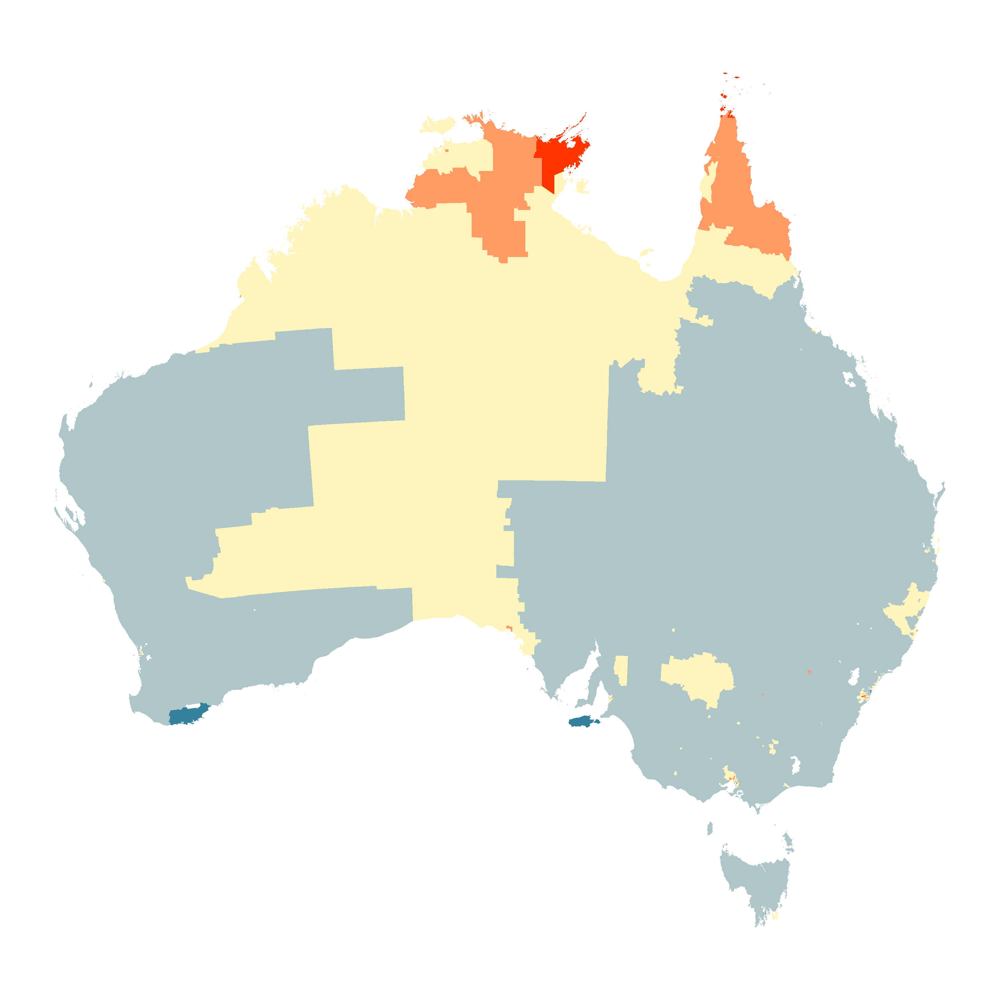

```{r, include = FALSE}
current_file <- knitr::current_input()
```
```{r, include = FALSE, eval = F}
input <- fs::path_ext_set(current_file, "html")
pagedown::chrome_print(input = input, format = "pdf", wait = 20)
```

```{r setup, include = FALSE}
options(width = 200)
knitr::opts_chunk$set(
  fig.path = "images/week10A/",
  fig.width = 6,
  fig.height = 6,
  fig.align = "center",
  dev.args = list(bg = 'transparent'),
  out.width = "100%",
  fig.retina = 3,
  echo = FALSE,
  warning = FALSE,
  message = FALSE,
  cache = FALSE,
  cache.path = "cache/week9/"
)
```

```{r libraries}
library(tidyverse)
library(GGally)
library(ggthemes)
library(gt)
library(ggExtra)
library(cartogram)
library(maptools)
library(broom)
library(patchwork)
library(maps)
library(fabricerin)
```

```{r settheme, eval=FALSE}
theme_set(ggthemes::theme_gdocs(base_size = 18) +
            theme(plot.background = element_rect(fill = 'transparent', colour = NA), 
                  axis.line.x = element_line(color = "grey60", linetype = "solid", size = 1),
                  axis.line.y = element_line(color = "grey60", linetype = "solid", size = 1),
                  plot.title.position = "plot",
                  plot.title = element_text(size = 24),
                  panel.background  = element_rect(fill = 'transparent', colour = NA),
                  legend.background = element_rect(fill = 'transparent', colour = NA),
                  legend.key        = element_rect(fill = 'transparent', colour = NA)
                  ) )
```

```{r titleslide, child="components/titleslide.Rmd"}
```

```{css, echo = FALSE}
.gray80 {
  color: #505050!important;
  font-weight: 300;
}
.bg-gray80 {
  background-color: #DCDCDC!important;
}
```

---
background-image: \url(https://bjork.com/images/Floral-B-Logo-300.png)
background-position: 20% 80%

.pull-left[
> You show me continents, I see the islands, You count the centuries, I blink my eyes

[Björk](https://www.bjork.com)

]
--

.pull-right[
# Outline

- Breaking up data by time, and by space
- Maps of space over time
- Exploring time over space glyph maps
- Bending the choropleth map 
- A flash back to the 1970s: Tukey's median polish 
]

---
# .orange[Case study] .bg-orange.circle[1] Temperature change in Americas

.panelset[
.panel[.panel-name[data]
6 years of monthly measurements of a 24x24 spatial grid from Central America collated by Paul Murrell, U. Auckland.

.scroll-box-16[
```{r nasa}
data(nasa)
nasa %>% slice_head(n=20) %>% gt()
```
]
]
.panel[.panel-name[R]

```{r ref.label="nasa", echo=TRUE, eval=FALSE}
```

]
]
---
# .orange[Case study] .bg-orange.circle[1] Temperature change in Americas

.pull-left[
.panelset[
.panel[.panel-name[plot]
```{r spatial, fig.width=6, fig.height=6, out.width="100%"}
ggplot(filter(nasa, time == 1), aes(x=long, y=lat)) + 
  geom_point() +
  geom_point(data=filter(nasa, time==1, x==5, y==20),
             colour="orange", size=4) +
  geom_point(data=filter(nasa, time==1, x==20, y==2),
             colour="turquoise", size=4)
```
]
.panel[.panel-name[R]
```{r ref.label="spatial", echo=TRUE, eval=FALSE}
```
]
]

]

.pull-right[
.panelset[
.panel[.panel-name[plot]
```{r temporal, fig.width=6, fig.height=2, out.width="120%"}
ggplot(nasa, aes(x=date, y=surftemp, group=id)) + 
    geom_line(alpha=0.2) +
    geom_line(data=filter(nasa, x == 5, y == 20),
             colour="orange", size=2) +
    geom_line(data=filter(nasa, x == 20, y == 2),
             colour="turquoise", size=2)
```
]
.panel[.panel-name[R]
```{r ref.label="temporal", echo=TRUE, eval=FALSE}
```
]
]
]

---
class: informative middle nostripheader
# Pre-processing of time and space

.info-box[Think of .monash-orange2[time and space as a categorical variables]. You may need to create the categories of time. Spatial variable might need to be discretised, or gridded.]

---
# Slice in time and create a spatial map

.panelset[
.panel[.panel-name[plot]

```{r raster, fig.width=6, fig.height=6, out.width="60%"}
sth_america <- map_data("world") %>%
  filter(between(long, -115, -57), between(lat, -21.5, 36.5))
ggplot() + 
  geom_tile(data = filter(nasa, time == 1), 
            aes(x=long, y=lat, fill=surftemp)) +
  geom_path(data=sth_america, 
            aes(x=long, y=lat, group=group), 
            colour="white", size=1) +
  scale_fill_viridis_c("", option = "magma") +
  theme_map() +
  theme(legend.position = "bottom") +
  ggtitle("January 1995")
```
]
.panel[.panel-name[learn]

<br> <br>

In January 2005, temperatures are

- cool over land in the north 
- cool over the Andes in south america
- warm on the equator, and along the coastline

There are 12*6=72 maps to make!!

]
.panel[.panel-name[R]
```{r ref.label="raster", echo=TRUE, eval=FALSE}
```
]
]

---
# Expand using facets in time

.panelset[
.panel[.panel-name[plot]
```{r space_time, fig.width=10, fig.height=6, out.width="100%"}
ggplot(nasa, aes(x=long, y=lat, fill=surftemp)) + 
  geom_tile() +
  facet_grid(year~month) +
  scale_fill_viridis_c("surface temperature",
                       option = "magma") +
  theme_map() +
  theme(legend.position="bottom")
```
]
.panel[.panel-name[learn]

This approach is exploring spatial trend over time.

Can you see El Nino in 1997? Can you see the summer vs winter in the different hemispheres?

]
.panel[.panel-name[R]
```{r ref.label="space_time", echo=TRUE, eval=FALSE}
```
]

]
---
# Expand time across space

.pull-left[
.panelset[
.panel[.panel-name[plot]

This is called a glyph map. Small time series are plotted at each spatial location. 

```{r time_space, fig.width=6, fig.height=6, out.width="100%"}
temp.gly <- glyphs(nasa, "long", "day", "lat",
                   "surftemp", height=2.5)
ggplot(temp.gly, ggplot2::aes(gx, gy, group = gid)) +
  add_ref_lines(temp.gly, color = "grey90") +
  add_ref_boxes(temp.gly, color = "grey90") +
  geom_path() +
  labs(x = "", y = "") +
  coord_map() + theme_map()     

```
]
.panel[.panel-name[R]

```{r ref.label="time_space", echo=TRUE, eval=FALSE}
```

]
]

]
.pull-right[
.panelset[
.panel[.panel-name[plot]

This is for exploring temporal trends over space. Here the time series are represented in polar coordinates. 

```{r time_space2, fig.width=6, fig.height=6, out.width="100%"}
temp.gly <- glyphs(nasa, "long", "day", "lat",
                   "surftemp", height=2.5, 
                   y_scale = range01, polar = TRUE)
ggplot(temp.gly, ggplot2::aes(gx, gy, group = gid)) +
  add_ref_lines(temp.gly, color = "grey90") +
  add_ref_boxes(temp.gly, color = "grey90") +
  geom_path() +
  labs(x = "", y = "") +
  coord_map() +
  theme_map()  
```
]
.panel[.panel-name[R]

```{r ref.label="time_space2", echo=TRUE, eval=FALSE}
```

]
]

]

---
# .orange[Case study] .bg-orange.circle[1] Temperature change in Americas

## Detecting El Nino

Slice space, and show the time series, and the pattern is very clear: The seasonal water temperature decrease doesn't happen in 1997, and water in this area stays unseasonably warm.

```{r over_time, fig.width=10, fig.height=4, out.width="100%"}
p1 <- ggplot() + 
        geom_polygon(data = sth_america, 
                     aes(x=long, y=lat, group=group), 
                     fill = "grey90", colour = "white") + 
        geom_point(data = filter(nasa, time == 1), 
                   aes(x=long, y=lat), size = 1) +
        geom_point(data = filter(nasa, time == 1, 
                             between(lat, -10, 5), 
                             long < (-80)), 
                   aes(x=long, y=lat), 
                   colour = "red") +
          coord_map() +
          theme_map()
p2 <- nasa %>%   
        ggplot(aes(x=date, y=surftemp, group=id)) + 
          geom_line(alpha=0.2) +
          geom_line(data = filter(nasa, 
                                  between(lat, -5, 5), 
                             long < (-80)), 
                             colour = "red") +
          xlab("") + ylab("Surface temperature") +
          theme_bw() + theme(aspect.ratio = 0.5)
p1 + p2 + plot_layout(widths = c(1,2))
```

---

`r anicon::faa("wrench", animate="wrench", speed="slow", colour="#D93F00", anitype="hover")` Your turn using tsibbletalk

```{r eval=FALSE, echo=TRUE}
library(tsibble)
library(tsibbletalk)
library(lubridate)
nasa_shared <- nasa %>% 
  mutate(date = ymd(date)) %>%
  select(long, lat, date, surftemp, id) %>%
  as_tsibble(index=date, key=id) %>%
  as_shared_tsibble()
p1 <- nasa_shared %>%
  ggplot(aes(x = long, y = lat)) +
  geom_point(aes(group = id)) 
p2 <- nasa_shared %>%
  ggplot(aes(x = date, y = surftemp)) +
  geom_line(aes(group = id), alpha = 0.5) 
library(plotly)
subplot(
    ggplotly(p1, tooltip = "Region", width = 100),
    ggplotly(p2, tooltip = "Region", width = 900),
    nrows = 1, widths=c(0.4, 0.6)) %>%
  highlight(dynamic = TRUE)
```

---
class: transition middle

## A flash back to the 1970s: Tukey's median polish

This is a useful data scratching technique, particularly for spatial data, to remove complicated trends.

---
# Median polish technique

.pull-left[
```{r}
fabric_drawing(cid = "twoway", 
               cwidth = 500, 
               cheight = 500, 
               cfill = "whitesmoke", 
               drawingWidth = 3, 
               gumSize = 10)
fabric_text_add(cid = "twoway", textId = "txt1",
                text = " 10  8  6  4  2 ",
                left = 10, top = 10, 
                fontFamily = "Courier", fontSize = 18)
fabric_text_add(cid = "twoway", textId = "txt2",
                text = "  8  6  4  2  4",
                left = 10, top = 40, 
                fontFamily = "Courier", fontSize = 18)
fabric_text_add(cid = "twoway", textId = "txt3",
                text = "  6  4  2  4  6",
                left = 10, top = 70, 
                fontFamily = "Courier", fontSize = 18)
fabric_text_add(cid = "twoway", textId = "txt3",
                text = "  4  2  4  6  8",
                left = 10, top = 100, 
                fontFamily = "Courier", fontSize = 18)
fabric_text_add(cid = "twoway", textId = "txt3",
                text = "  2  4  6  8  10",
                left = 10, top = 130, 
                fontFamily = "Courier", fontSize = 18)
```
]
.pull-right[
.font_medium[
1. Compute row medians, and the median of the row medians,  called **row overall effect**.
2. Subtract each element in a row by its row median.
3. Subtract the row overall effect from each row median.
4. Do the same columns. Add the column overall effect to row overall effect.
5. Repeat 1-4 until negligible change occur with row or column medians.
]
]

---
# Median polish technique

.pull-left[


]

.pull-right[

.scroll-box-16[
```{r}
# check calculations
x <- matrix(c(10,  8,  6,  4,  2,
              8,  6,  4,  2,  4,
              6,  4,  2,  4,  6,
              4,  2,  4,  6,  8,
              2,  4,  6,  8,  10), nrow=5, byrow=T)
medpolish(x, maxiter = 1)
```
]
]

---
# Median polish technique

.pull-left[

.scroll-box-16[
```{r}
medpolish(x, maxiter = 5)
```
]

]

.pull-right[

Median polish is effectively fitting a model of this form:

*overall effect + row effect + column effect*

which can be written as:

$$y_{ij} = \mu + \alpha_i + \beta_j + \varepsilon_{ij}$$
<br>
<br>

Nice explanation by [Manny Gimond (2020)](https://mgimond.github.io/ES218/Week11a.html)

]

---

# .orange[Case study] .bg-orange.circle[2] Soils

.panelset[
.panel[.panel-name[plot]


```{r med_polish, fig.width=10, fig.height=4, out.width="100%", results="hide"}
baker <- read_csv("../data/baker.csv")
p1 <- ggplot(baker, aes(x=X, y=Y, fill=Corn97BU)) +
  geom_tile() + 
  scale_fill_viridis_c("") +
  theme_map() +
  theme(legend.position = "none") 
baker_mat <- baker %>%
  select(X, Y, Corn97BU) %>%
  pivot_wider(names_from = "Y", values_from = Corn97BU) 
baker_mat <- as.matrix(baker_mat)
rownames(baker_mat) <- baker_mat[,1]
baker_mat <- baker_mat[,-1]

baker_mp <- medpolish(baker_mat[,-1], na.rm=TRUE)
baker_mp$residuals <- cbind(as.numeric(rownames(baker_mp$residuals)), baker_mp$residuals)
colnames(baker_mp$residuals)[1] <- "X"
baker_mp_res <- baker_mp$residuals %>%
  as_tibble() %>% 
  pivot_longer(cols=`48`:`336`, names_to = "Y", 
               values_to = "Corn97BU") %>%
  mutate(Y = as.numeric(Y))
p2 <- ggplot(baker_mp_res, aes(x=X, y=Y, fill=Corn97BU)) +
  geom_tile() + 
  scale_fill_viridis_c("", na.value="white") +
  theme_map() +
  theme(legend.position = "none") 

col_marg <- bind_rows(col=as.numeric(names(baker_mp$col)), 
                      Corn97BU = as.numeric(baker_mp$col))
row_marg <- bind_rows(row=as.numeric(names(baker_mp$row)), 
                      Corn97BU = as.numeric(baker_mp$row))
p3 <- ggplot(col_marg, aes(x = col, y = Corn97BU)) +
        xlab("") + ylab("") +
        geom_col() + theme_map() +
        coord_flip()
p4 <- ggplot(row_marg, aes(x = row, y = Corn97BU)) +
        geom_col() + theme_map() +
        xlab("") + ylab("") 
 
design <- "
##11#
22334
22334
22334"
p4 + p1 + p2 + p3 +
  plot_layout(design = design)
```

This is the baker field data that we have seen before. The heatmap shows corn yield in a farm field in Iowa. High values are yellow and low values are dark blue. 

The right-side heatmap shows the residuals from median polish, and the row and column marginal effects. After a median polish, the values should look randomly distributed.

]

.panel[.panel-name[R]

.scroll-500[
```{r ref.label="med_polish", echo=TRUE, eval=FALSE}
```
]

]
]

---
class: transition middle

## Choropleth maps and cartograms

---
# Choropleth maps 

A choropleth map is used to show a measured variable associated with a political or geographic region. Polygons for the region are filled with colour. 

.pull-left[
 
]
.pull-right[

Here's a map of liver cancer incidence for Australia, for local government regions. .monash-orange2[Orange] indicates .monash-orange2[high], and dark .monash-blue2[blue] represents .monash-blue2[low].

<br>

Where would you say is the highest incidence of liver cancer?

]

---
# Choropleth maps 

The problem with choropleth maps is that geographically large areas dominate the view and obscure the statistics of small regions. 

.pull-left[
 
]
.pull-right[

Here is a hexmap of liver cancer across Australia made with the [sugarbag](https://srkobakian.github.io/sugarbag/) package by Steff Kobakian. Each LGA is reprensented as a hexagon, roughly in its same geographic location. 

<br>

Would you change your previous answer?

]


---
# Cartograms

A [cartogram](https://www.r-graph-gallery.com/cartogram.html) transforms the geographic shape to match the value of a statistic. Its a useful exploratory technique for examining the spatial distribution of a measured variable. 

.panelset[
.panel[.panel-name[plot]

```{r cartogram, fig.width=10, fig.height=4, out.width="100%", results="hide"}
data(wrld_simpl)
afr <- wrld_simpl[wrld_simpl$REGION==2,]
afr <- spTransform(afr, CRS("+init=epsg:3395"))
# epsg:3395 means mercator projection

afr_tb <- tidy(afr)
afr_tb <- afr_tb %>% 
  left_join(. , afr@data, by=c("id"="ISO3")) 
p1 <- ggplot() +
  geom_polygon(data = afr_tb, 
               aes(fill = POP2005, x = long, y = lat, 
                   group = group), size=0, alpha=0.9) +
  scale_fill_viridis_c() +
  theme_map() +
  ggtitle("Choropleth map")

afr_cartogram <- cartogram_cont(afr, "POP2005", itermax=10)

afr_c_tb <- tidy(afr_cartogram)
afr_c_tb <- afr_c_tb %>% 
  left_join(. , afr_cartogram@data, by=c("id"="ISO3")) 
p2 <- ggplot() +
  geom_polygon(data = afr_c_tb, 
               aes(fill = POP2005, x = long, y = lat, 
                   group = group), size=0, alpha=0.9) +
  scale_fill_viridis_c() +
  theme_map() +
  ggtitle("Cartogram")

afr_dorling <- cartogram_dorling(afr, "POP2005")
afr_d_tb <- tidy(afr_dorling)
afr_d_tb <- afr_d_tb %>% 
  left_join(. , afr_dorling@data, by=c("id"="ISO3")) 
p3 <- ggplot() +
  geom_polygon(data = afr_d_tb, 
               aes(fill = POP2005, x = long, y = lat, 
                   group = group) , size=0, alpha=0.9) +
  scale_fill_viridis_c() +
  theme_map() +
  ggtitle("Dorling cartogram")
lemon::grid_arrange_shared_legend(p1, p2, p3, ncol=3)
```
]
.panel[.panel-name[R]

.scroll-box-16[
```{r ref.label="cartogram", echo=TRUE, eval=FALSE}
```
]

]
]

---

# Resources and Acknowledgement

- [Healy (2018) Data Visualization](https://socviz.co/maps.html#maps)
- [Perpinan Lamigueiro (2018) Displaying time series, spatial and space-time data with R](https://oscarperpinan.github.io/bookvis/)
- Wikle, Zammit-Mangion, Cressie (2018) [Spatio-Temporal Statistics with R](https://spacetimewithr.org)
- Tools for handling spatial objects,  [maptools](https://cran.r-project.org/web/packages/maptools/index.html)
- Spatial features package [sf](https://r-spatial.github.io/sf/)
- Hexmaps with [sugarbag](https://srkobakian.github.io/sugarbag/)
- Making [cartograms](https://www.r-graph-gallery.com/cartogram.html) in R
- Median polish on two way tables from Tukey, J. W. (1977). Exploratory Data Analysis, Reading Massachusetts: Addison-Wesley. (See [Manny Gimond (2020)](https://mgimond.github.io/ES218/Week11a.html))

---

```{r endslide, child="components/endslide.Rmd"}
```
