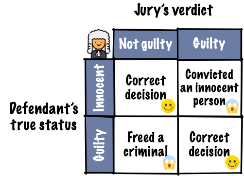

```{r, include = FALSE}
current_file <- knitr::current_input()
```
```{r, include = FALSE, eval = F}
input <- fs::path_ext_set(current_file, "html")
pagedown::chrome_print(input = input, format = "pdf", wait = 20)
```

```{r, include = FALSE}
library(tidyverse)
library(colorspace)
library(patchwork)
library(broom)
options(width = 200)
knitr::opts_chunk$set(
  fig.path = "images/week11A/",
  fig.width = 6,
  fig.height = 6,
  fig.align = "center",
  dev.args = list(bg = 'transparent'),
  #out.width = "100%",
  fig.retina = 3,
  echo = FALSE,
  warning = FALSE,
  message = FALSE,
  cache = TRUE,
  cache.path = "cache/week11/"
)
theme_set(theme_bw(base_size = 18) +
            theme(plot.background = element_rect(fill = 'transparent', colour = NA), axis.line.y = element_line(color = "black", linetype = "solid"),
                  plot.title.position = "plot",
                  plot.title = element_text(size = 24),
                  panel.background  = element_rect(fill = 'transparent', colour = NA),
                  legend.background = element_rect(fill = 'transparent', colour = NA),
                  legend.key        = element_rect(fill = 'transparent', colour = NA)
                  ) )
```

```{r titleslide, child="components/titleslide.Rmd"}
```

```{css, echo = FALSE}
.gray80 {
  color: #505050!important;
  font-weight: 300;
}
.bg-gray80 {
  background-color: #DCDCDC!important;
}
.font18 {
  font-size: 18pt;
}
```

---

class: transition middle

# Revisiting <br> .yellow[hypothesis testing]


---

```{r coin}
set.seed(1)
head <- ''
tail <- ''
```


# Testing coin bias .font_small[Part 1/2]

* Suppose I have a coin that I'm going to flip `r tail` 
--

* If the coin is unbiased, what is the probability it will show heads?
--

* Yup, the probability should be 0.5. 
--

* So how would I test if a coin is biased or unbiased?
--

* We'll collect some data. 
--

* **Experiment 1**: I flipped the coin 10 times and this is the result:

<center>
```{r coin-bias, results='asis'}
samp10 <- sample(rep(c(head, tail), c(7, 3)))
cat(paste0(samp10, collapse = ""))
```
</center>
--

* The result is 7 head and 3 tails. So 70% are heads. 
--

* Do you believe the coin is biased based on this data?


---

# Testing coin bias .font_small[Part 2/2]

* **Experiment 2**: Suppose now I flip the coin 100 times and this is the outcome:

```{r coin-bias100, results='asis'}
samp100 <- sample(rep(c(head, tail), c(70, 30)))
cat(paste0(samp100, collapse = ""))
```
--

* We observe 70 heads and 30 tails. So again 70% are heads. 
--

* Based on this data, do you think the coin is biased?

---

# (Frequentist) hypotheses testing framework

* Suppose $X$ is the number of heads out of $n$ independent tosses.
* Let $p$ be the probability of getting a head for this coin.

|     |     |
|-----|-----|
|**Hypotheses**  | $H_0: p = 0.5$ vs. $H_1: p \neq 0.5$   |
|**Assumptions**  | Each toss is independent with equal chance of getting a head.   |
|**Test statistic** | $X \sim B(n, p)$. Recall $E(X) = np$.<br> The observed test statistic is denoted $x$. |
|**P-value** <br>.font_small[(or critical value or confidence interval)] | $P(\mid X - np\mid \geq \mid x - np\mid )$ |
|**<i class="fas fa-gavel"></i> Conclusion** | Reject null hypothesis when the $p$-value is less than<br> some significance level $\alpha$. Usually $\alpha = 0.05$.|

--

* The p-value for experiment 1 is $P(|X - 5| \geq 2) \approx 0.34$.
* The p-value for experiment 2 is $P(|X - 50| \geq 20) \approx 0.00008$.

---

# Judicial system

.grid[
.item[
<br>
<center>

</center>
]

.item.bg-gray80[
<br>
{{content}}
]

]

--

<center>

</center>
<ul>
<li><i class="fas fa-search"></i> Evidence by test statistic</li>
<li><i class="fas fa-gavel"></i> Judgement by p-value, critical value or confidence interval</li>
</ul>
{{content}}

--

<span class="red">Does the test statistic have to be a <i>numerical summary statistics</i>?</span>


---

class: transition middle

# Visual inference

---

# Visual inference

.grid[
.item[

* Hypothesis testing in visual inference framework is where:
   * <i class="fas fa-search"></i>  the .monash-blue[_test statistic is a plot_] and 
   * <i class="fas fa-gavel"></i> judgement is by human perceptions.
{{content}}

]
.item.bg-gray80[

From Exercise 4 in week 9 tutorial: a residual plot after modelling high-density lipoprotein in human blood.


```{r HDL-resplot, fig.height = 5}
samples <- read_csv(here::here("data/HDLsamples.csv"))
fit <- lm(HDL ~ cholesterol + trigylceride + SPB, data = samples)
df <- augment(fit)
ggplot(df, aes(.fitted, .std.resid)) + 
  geom_point() + 
  geom_hline(yintercept = 0, linetype = "dashed") +
  labs(x = "Fitted values", y = "Studentised residuals")
```
]
]
--

* You (and many other people) actually do visual inference many times but generally in an informal fashion.
{{content}}
--

* Here, we are making an inference on whether the residual plot has any patterns based on a single data plot.

---

class: transition middle

.font_large[

<i class="fas fa-chart-bar"></i> Data plots tend to be over-interpreted

<br>

<i class="fas fa-chart-bar"></i> Reading data plots require calibration


]

---

# Visual inference more formally

<div class="grid" style="grid: 1fr / 5fr 3fr;">

.item[
1. State your null and alternate hypotheses.
{{content}}

]
.item.bg-gray80[

]

</div>
--
2. Define a <b>visual test statistic</b>, $V(.)$, i.e. a function of a sample to a plot.
{{content}}
--
3. Define a <b>null generating method</b> to generate <b>null data</b>, $\boldsymbol{y}_0$. 
{{content}}
--
4. $V(\boldsymbol{y})$ maps the actual data, $\boldsymbol{y}$, to the plot. We call this the <b class="monash-blue">data plot</b>.
{{content}}
--
5. $V(\boldsymbol{y}_0)$ maps a null data to a plot of the same form. We call this the <b class="monash-blue">null plot</b>. We repeat this $m - 1$ times to generate $m-1$ null plots. 
{{content}}
--
6. A <b class="monash-blue">lineup</b> displays these $m$ plots in a random order. 
{{content}}
--
7. Ask $n$ human viewers to select a plot in the lineup that looks different to others without any context given.

---

count: false

# Visual inference more formally

<div class="grid" style="grid: 1fr / 5fr 3fr;">

.item[
1. State your null and alternate hypotheses.
2. Define a **visual test statistic**, $V(.)$, i.e. a function of a sample to a plot.
3. Define a **null generating method** to generate **null data**, $\boldsymbol{y}_0$. 
4. $V(\boldsymbol{y})$ maps the actual data, $\boldsymbol{y}$, to the plot. We call this the .monash-blue[**data plot**].
5. $V(\boldsymbol{y}_0)$ maps a null data to a plot of the same form. We call this the .monash-blue[**null plot**]. We repeat this $m - 1$ times to generate $m-1$ null plots. 
6. A .monash-blue[**lineup**] displays these $m$ plots in a random order. 
7. Ask $n$ human viewers to select a plot in the lineup that looks different to others without any context given.

]
.item.bg-gray80[

.info-box[
Suppose $x$ out of $n$ people correctly identified the data plot from a lineup, then
* the .monash-blue[**visual inference p-value**] is given as $$P(X \geq x)$$ where $X \sim B(n, 1/m)$, and 
* the .monash-blue[**power of a lineup**] is estimated as $x/n$.
]

]

</div>

---

# .orange[Case study] .circle.bg-orange[1] Uniformity trial of peanuts .font_small[Part 1/8]

.grid[
.item[
.panelset[
.panel[.panel-name[📊]
```{r peanut-data, include = FALSE}
data(bancroft.peanut.uniformity, package = "agridat")
skimr::skim(bancroft.peanut.uniformity)
```
```{r peanut-plot, fig.height = 6, fig.width = 6}
ggplot(bancroft.peanut.uniformity, aes(factor(col), factor(row), fill = yield)) + 
  geom_tile(color = "black", size = 2) + 
  facet_wrap(~block) +
  scale_fill_continuous_sequential(palette = "YlGn") +
  labs(x = "Column", y = "Row", fill = "Yield")
```
```{r peanut-plot2, fig.height = 2, fig.width = 6}
ggplot(bancroft.peanut.uniformity, aes(yield)) + 
  geom_histogram() + 
  facet_wrap(~block) +
  labs(x = "Yield")
```


]
.panel[.panel-name[data]
.h200.scroll-sign[
```{r peanut-data, echo = TRUE, render = knitr::normal_print}
```

]]
.panel[.panel-name[R]
```{r, eval = FALSE, ref.label = c("peanut-plot", "peanut-plot2"), echo = TRUE}
```
]

]


]
.item[

* Same peanut variety planted in Alabama field in two blocks of rectangular array of 18 rows by 6 plots.
* The yield (in pounds) is measured. 
* Are the yields from the two blocks similar?
{{content}}

]

]

--
```{r peanut-numbers}
bancroft.peanut.uniformity %>% 
  group_by(block) %>% 
  summarise(Mean = mean(yield), SD = sd(yield)) %>% 
  knitr::kable(col.names = c("Block", "Mean", "Std. Dev"),
              digits = 3) 
```

{{content}}
--
```{r peanut-ttest}
with(bancroft.peanut.uniformity, 
     t.test(yield[block=="B1"], yield[block=="B2"]))
```

---
# .orange[Case study] .circle.bg-orange[1] Uniformity trial of peanuts .font_small[Part 2/8]

1. $H_0: \mu_1 = \mu_1 \quad \text{ vs. } \quad H_1: \mu_1 \neq \mu_2$ where $\mu_1$ and $\mu_2$ are yield means of block 1 and 2, respectively.
--

2. We choose our visual test statistic $V_1$ as a side-by-side boxplots of yield by block.
--

3. We generate the null data from $N(\bar{y}, s^2)$ where $\bar{y}$ and $s$ are the sample mean and sample standard deviation of the yields.

--

<br><br>

.center.font_large[
Now we construct the lineup...
]

---

# .orange[Case study] .circle.bg-orange[1] Uniformity trial of peanuts .font_small[Part 3/8]

```{r peanut-lineup, fig.height = 8, fig.width = 13}
library(nullabor)
set.seed(1)
method <- null_dist("yield", dist = "norm", 
                    params = list(mean = mean(bancroft.peanut.uniformity$yield),
                                  sd = sd(bancroft.peanut.uniformity$yield)))
lineup1 <- lineup(method, true = bancroft.peanut.uniformity, n = 10)
lineup1 %>% 
  ggplot(aes(block, yield)) +
  geom_boxplot() +
  facet_wrap(~.sample, nrow = 2) +
  theme(axis.text = element_blank(),
        axis.title = element_blank())
# decrypt("bhMq KJPJ 62 sSQ6P6S2 um")
# kyuu
```

---

# .orange[Case study] .circle.bg-orange[1] Uniformity trial of peanuts .font_small[Part 4/8]

* So <span contenteditable="true">&nbsp;&nbsp; $x$ &nbsp;&nbsp;</span> out of <span contenteditable="true">&nbsp;&nbsp; $n$ &nbsp;&nbsp;</span> of you chose the data plot.
* So the visual inference p-value is $P(X \geq x)$ where $X \sim B(n, 1/10)$.
* In R, this is 
```r
1 - pbinom(x - 1, n, 1/10) 
# OR 
nullabor::pvisual(x, n, 10)
```
* The power of the lineup is given as 
```r
x/n
# OR (need to use development one)
# install.packages("devtools")
# devtools::install_github("dicook/nullabor")
tibble(pic_id = 1, id = 1:n, 
           response = 1, # dummy responses
           detected = rep(c(0, 1), c(x, n - x))) %>% 
    nullabor::visual_power(10)
```

---

# .orange[Case study] .circle.bg-orange[1] Uniformity trial of peanuts .font_small[Part 5/8]

What about if we change the visual test statistic?

```{r peanut-lineup2, fig.height = 7, fig.width = 13}
lineup2 <- lineup1 %>% 
  mutate(.sample2 = factor(.sample, labels = sample(1:10)),
         .sample2 = factor(.sample2, levels = 1:10))

ggplot(lineup2, aes(block, yield)) +
  geom_point() +
  facet_wrap(~.sample2, nrow = 2) +
  theme(axis.text = element_blank(),
        axis.title = element_blank())
# lineup2 %>% filter(.sample==9)
# yon
```

---

# .orange[Case study] .circle.bg-orange[1] Uniformity trial of peanuts .font_small[Part 6/8]

What about this one?

```{r peanut-lineup3, fig.height = 7, fig.width = 13}
lineup3 <- lineup1 %>% 
  mutate(.sample2 = factor(.sample, labels = sample(1:10)),
         .sample2 = factor(.sample2, levels = 1:10))

ggplot(lineup3, aes(block, yield)) +
  geom_jitter() +
  facet_wrap(~.sample2, nrow = 2) +
  theme(axis.text = element_blank(),
        axis.title = element_blank())
# lineup3 %>% filter(.sample==9)
# san
```

---

# .orange[Case study] .circle.bg-orange[1] Uniformity trial of peanuts .font_small[Part 7/8]

* For the scatter plot <span contenteditable="true">&nbsp;&nbsp; $x_2$ &nbsp;&nbsp;</span> out of <span contenteditable="true">&nbsp;&nbsp; $n_2$ &nbsp;&nbsp;</span> of you chose the data plot.
* So the visual inference p-value is $P(X_2 \geq x_2)$ where $X_2 \sim B(n_2, 1/10)$.

--- 

* For the jittered plot <span contenteditable="true">&nbsp;&nbsp; $x_3$ &nbsp;&nbsp;</span> out of <span contenteditable="true">&nbsp;&nbsp; $n_3$ &nbsp;&nbsp;</span> of you chose the data plot.
* So the visual inference p-value is $P(X_3 \geq x_3)$ where $X_3 \sim B(n_3, 1/10)$.

--- 

So the power difference is $100\times \left|\dfrac{x_2}{n_2} - \dfrac{x_3}{n_3}\right|\%$.

.footnote[
Hofmann, H., L. Follett, M. Majumder, and D. Cook. 2012. “Graphical Tests for Power Comparison of Competing Designs.” IEEE Transactions on Visualization and Computer Graphics 18 (12): 2441–48.
]

---

# .orange[Case study] .circle.bg-orange[1] Uniformity trial of peanuts .font_small[Part 8/8]

What if we change the null generating method so that instead we permute the block labels?

```{r peanut-lineup-v2, fig.height = 6.5, fig.width = 13}
method <- null_permute("block")
lineup_v2 <- lineup(method, true = bancroft.peanut.uniformity, n = 10)

ggplot(lineup_v2, aes(block, yield)) +
  geom_boxplot() +
  facet_wrap(~.sample, nrow = 2) +
  theme(axis.text = element_blank(),
        axis.title = element_blank())
# decrypt("bhMq KJPJ 62 sSQ6P6S2 u4")
# nana
```

---

# Statistical significance and practical significance

.grid[
.item[
```{r sim, echo = TRUE}
set.seed(1)
sim <- tibble(id = 1:10000000) %>% 
         mutate(y = c(rnorm(n()/2), rnorm(n()/2, 0.001)),
                group = rep(c("A", "B"), each = n()/2))
with(sim, mean(y[group=="A"]) - mean(y[group=="B"]))
with(sim, t.test(y[group=="A"], y[group=="B"]))
```

]
.item[

* Notice here the real difference in the two groups is small (0.001) here.
* The two groups have a slightly different but the true difference is small, you might not care. 
* The **practical significance** takes into account the effect size.

]

]

---

# Statistical significance of the data plot

* Unlike conventional hypothesis testing, visual inference p-value depends on:
   * the visual test statistic $V$,
   * the individuals' visual perceptions,
   * the number of $K$ observers,
   * the size $m$ of the lineup, and 
   * the effect size. 
* The concept of conventional p-value is difficult for those that are not trained in statistics.
* The lineup is easier to understand to both novices and experts.

---

# Lineup of small effect difference

```{r sim-lineup, fig.height = 7, fig.width = 13}
method <- null_permute("group")
# this takes too long with my computer
# let's just subset the data
lineup_v3 <- lineup(method, true = sample_n(sim, 10000), n = 10)

ggplot(lineup_v3, aes(group, y)) +
  geom_boxplot() +
  facet_wrap(~.sample, nrow = 2) +
  theme(axis.text = element_blank(),
        axis.title = element_blank())
# decrypt("bhMq KJPJ 62 sSQ6P6S2 7Z")
# jyuu
```
.font_small[For computational reasons, only 10,000 data points for each plot are used above.]


---

# Some considerations in visual inference

* In practice you don't want to bias the judgement of the human viewers so for a proper visual inference:   
   * you should _not_ show the data plot before the lineup
   * you should _not_ give the context of the data 
   * you should remove labels in plots
* You can crowd source these by paying for services like:
   * [Amazon Mechanical Turk](https://www.mturk.com/), 
   * [Appen (formerly Figure Eight)](https://appen.com/figure-eight-is-now-appen/) and
   * [LABVANCED](https://www.labvanced.com/).
* If the data is for research purposes, then you may need ethics approval for publication.

---

# Resources and Acknowledgement

.font18[
- Buja, Andreas, Dianne Cook, Heike Hofmann, Michael Lawrence, Eun-Kyung Lee, Deborah F. Swayne, and Hadley Wickham. 2009. “Statistical Inference for Exploratory Data Analysis and Model Diagnostics.” Philosophical Transactions. Series A, Mathematical, Physical, and Engineering Sciences 367 (1906): 4361–83.
- Wickham, Hadley, Dianne Cook, Heike Hofmann, and Andreas Buja. 2010. “Graphical Inference for Infovis.” IEEE Transactions on Visualization and Computer Graphics 16 (6): 973–79.
- Hofmann, H., L. Follett, M. Majumder, and D. Cook. 2012. “Graphical Tests for Power Comparison of Competing Designs.” IEEE Transactions on Visualization and Computer Graphics 18 (12): 2441–48.
- Majumder, M., Heiki Hofmann, and Dianne Cook. 2013. “Validation of Visual Statistical Inference, Applied to Linear Models.” Journal of the American Statistical Association 108 (503): 942–56.
- Data coding using [`tidyverse` suite of R packages](https://www.tidyverse.org) 
- Slides constructed with [`xaringan`](https://github.com/yihui/xaringan), [remark.js](https://remarkjs.com), [`knitr`](http://yihui.name/knitr), and [R Markdown](https://rmarkdown.rstudio.com).

]

---

```{r endslide, child="components/endslide.Rmd"}
```
