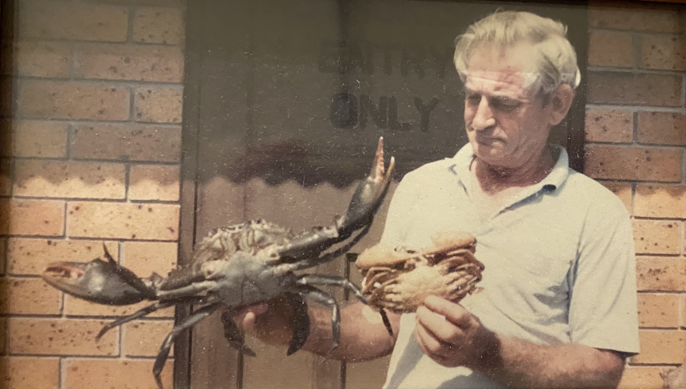

```{r setup, include = FALSE}
knitr::opts_chunk$set(
  echo = FALSE, 
  message = FALSE, 
  warning = FALSE, 
  cache = TRUE,
  cache.path = "tutorial06-cache/",
  fig.path = "images/tutorial06/",
  fig.align = "center"
)
```

```{r libraries}
library(tidyverse)
library(ggExtra)
library(gridExtra)
```

## `r emo::ji("warning")` Tutorial will be recorded

This tutorial, including the chat, will be recorded, so that you can re-visit the instructions later, as needed. This includes private chats. It is expected that you are respectful of your class members and tutors, while actively engaging in the work. 

## `r emo::ji("target")` Objectives

These are exercises in making scatterplots and variations to examine association between two variables, and to make practice using transformations.

## `r emo::ji("wrench")` Preparation 

Install the following R-packages if you do not have it already:

```{r pkgs, eval = FALSE}
install.packages(c("VGAMdata", "lawstat", 
                   "meta", "Sleuth2", "ggExtra", "gridExtra"))
```

*Note*: Some code chunks are provided in the Rmd with `???` in places that need some input from you. This is to help you with the most difficult coding that is needed for answering some questions.

## Exercise 0: Introduction

In the chat window, say hello, and if you feel comfortable tell us something fun about yourself, or what you have done this last week.

The following are questions mostly based from Unwin (2015) Graphical Data Analysis with R Chapter 5. 

## Exercise 1: Olympics

We have seen from the lecture that the Athletics category has too many different types of athletics in it for it to be a useful group for studying height and weight. There is another variable called `Event` which contains more specific information.

a. Tabulate `Event` for just the Sport category `Athletics`, and decide which new categories to create.
b. Create the new categories, in steps, creating a new binary variable for each. The function `str_detect` is useful for searching for text patterns in a string. It also helps to know about regular expressions to work with strings like this. And there are two sites, which are great for learning: [Regex puzzles](https://regexcrossword.com/challenges/beginner/puzzles/1), [Information and testing board](https://regex101.com)
c. Make a plot that explores the association between height and weight for the different athletic categories.
d. Write a paragraph explaining what is learned about body types across the different athletics types. 

```{r eval=FALSE}
data(oly12, package = "VGAMdata")
oly12 %>% 
  filter(Sport == ???) %>%
  count(Event, sort = TRUE)
oly12_ath <- oly12 %>% 
  filter(Sport == ???) %>%
  mutate(run = str_detect(Event, "[1248]00m|Hurd"),
         run_long = str_detect(Event, "Mara|000m|Steep"),
         ???) %>%
  mutate(Ath_type = case_when(run ~ "Running",
                              ???,
                              TRUE ~ "Other")
         )
```


## Exercise 2: Fisherman's Reach crabs

Mud crabs are delicious to eat! Prof Cook's father started a crab farm at Fisherman's Reach, NSW, when he retired. He caught small crabs (with a special license) and nurtured and fed the crabs until they were marketable size. They were then sent to market, like Queen Victoria Market in Melbourne, for people to buy to eat. Mud crabs have a strong and nutty flavour, and a good to eat simply after steaming or boiling.

Early in the farming setup, he collected the measurements of 62 crabs of different sizes, because he wanted to learn when was the best time to send the crab to market. Crabs re-shell from time to time. They grow too big for their shell, and need to discard it. Ideally, the crabs should be sent to market just before they re-shell, because the will be crab will be fuller in the shell, less air, less juice and more crab meat.  



a. Where is Fisherman's Reach? What would you expect the relationship between Length and Weight of a crab to be?
b. Make a scatterplot of Weight by NSW Length. Describe the relationship. It might be even better if you can add marginal density plots to the sides of the scatterplot. (Aside: Should one variable be considered a dependent variable? If so, make sure this is on the $y$ axis.)
c. Examine transformations to linearise the relationship. (Think about why the relationship between Length and Weight is nonlinear.)
d. Is there a lurking variable? Examine the variables in the data, and use colour in the plot to check for another variable explaining some of the relationship.
e. If you have determined that the is a lurking variable, make changes in the plots to explore the relationship between Weight and Length accordingly.
f. How would you select the crabs that were close to re-shelling based on this data?

```{r eval=FALSE}
fr_crabs <- read_csv("https://raw.githubusercontent.com/numbats/eda/master/data/fr-crab.csv") %>%
  mutate(Sex=factor(Sex))
```

## Exercise 3: Thrombolytic therapy

The results of 70 studies on thrombolytic therapy after acute myocardial infarction are reported in the *Olkin95* data in the **meta** package. 

a. What is acute myocardial infarction?
b. What is a meta-analysis?
c. Draw a scatterplot of the number of observations in the experimental group against that number in the control group. What do you notice?
d. What fraction of the studies have less than 100 patients in the experimental group?
e. Re-make the scatterplot, just on the studies with the fewer patients. What do you notice?

```{r}
data(Olkin95, package = "meta")
```

## Exercise 4: Zuni educational funding

```{r}
data(zuni, package = "lawstat")
```

a. Make a scatterplot of average revenue per student against the corresponding number of students. What do you learn?
b. What sort of transformation would be useful to re-make this plot? Are there still outliers? What would you do to look at the relationship without them, if so?
c. There might be more that is needed to be done, to examine the relationship between revenue and reports. Describe the relationship now.

# Exercise 5: Bank discrimination

a. Look at the help page for the `case1202` from the `Sleuth2` package. What does the variable "Senior" measure? "Exper"? Age?
b. Make all the pairwise scatterplots of Senior, Exper and Age. What do you learn about the relationship between these three pairs of variables? How can the age be 600? Are there some wizards or witches or vampires in the data?
c. Colour the observations by Sex. What do you learn?
d. Instead make faceted histograms (stacked) of the three variables against age. What do you learn about the difference in distribution of these three variables between the sexes.
e. The data also has starting salary and annual salary. Plot these two variables, faceted by Sex, and explain the relationships. 
f. Examine this against the two different salaries against `Senior` and `Exper`, separately by Sex. What is the relationship?
g. Would you say that this data provides evidence of sex discrimination?

```{r}
data(case1202, package = "Sleuth2")
```

# Exercise 6: Baker field corn yield
 
This is the corn yield and soil characteristics of the Iowa field (discussed in lecture). 

a. Construct a histogram of yield, with an appropriate choice in bin width. Describe the shape. 
b. The variables X and Y provide the grid locations of the area being sampled. Make a bubble chart of the corn yield for the spatial locations of the measurements. Are there some areas of the field that have really low yield?
c. Turn this into a tile map of the field instead. Is it easier to see the low yield locations in the field?
d. Compute the correlation between corn yield and all of the soil chemistry variables. Make a scatterplot of yield against the chemical that is most correlated with yield. Describe the relationship. 
e. If need be, make a transformation to linearise the relationship. 
f. Make the field map for this chemical, alongside the field map (like you did in part c). Are the low values for the chemical in the same spatial locations as the low values for yield?  
 
```{r eval=FALSE}
corn <- read_csv("https://raw.githubusercontent.com/numbats/eda/master/data/baker.csv") 
```
