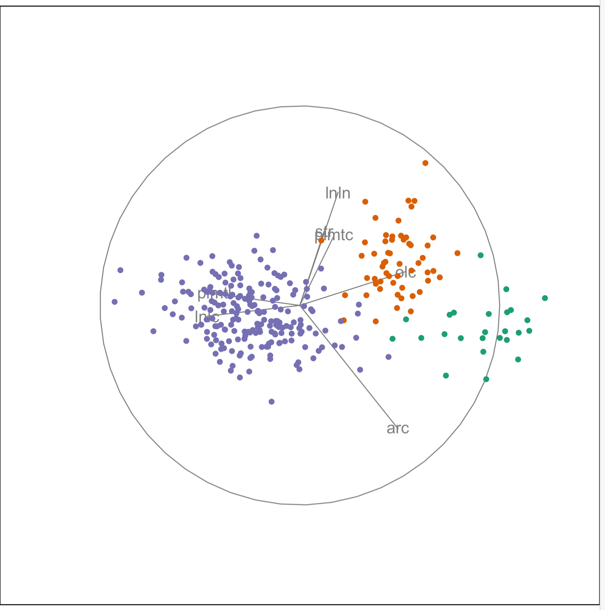

```{r setup, include = FALSE}
knitr::opts_chunk$set(
  echo = FALSE, 
  eval = FALSE, 
  message = FALSE, 
  warning = FALSE, 
  cache = TRUE,
  cache.path = "tutorial06-cache/",
  fig.path = "images/tutorial06/",
  fig.align = "center"
)
```

```{r libraries, eval=TRUE}
library(tidyverse)
library(ggExtra)
library(gridExtra)
library(plotly)
library(GGally)
library(tourr)
library(RColorBrewer)
library(binostics)
library(spinifex)
library(vcd)
library(ggpubr)
```

## Exercise 1:  Melbourne housing


a. Read in a copy of the Melbourne housing data from  [Nick Tierney's github repo](https://github.com/njtierney/melb-housing-data) which is a collation from the version at [kaggle](https://www.kaggle.com/anthonypino/melbourne-housing-market/version/21). Its fairly large, so let's start simply, and choose two suburbs to focus on. I recommend "South Yarra" and "Brighton". (Note: there are a number of missing values. I recommend removing these before making plots.)
b. Make a scatterplot matrix of price, rooms, bedroom2, bathroom, suburb, type. The plot will be easier to read if you put the numerical variables first, and then the categorical variables. What are the associations that can be seen?

- *positive linear association between price, rooms, bedroom2, bathroom, which indicates the bigger the house the higher the price*
- *From the boxplots: houses in Brighton tend to be higher priced and bigger than South Yarra, and houses tend to be worth more than apartments or units.*
- *From the fluctuation diagram, Brighton tends to have more houses, and South Yarra has more apartments.*
- *From the density plot, price has a skewed distribution.*
- *There is one big outlier, one property sold for a much higher price.*

c. Subset the data to South Yarra only. Make an interactive scatterplot matrix of rooms, bedroom2, bathroom and price, coloured by type of property. There is a really high price property. Select this case, and determine what's special about it -- why did it sell for so much? Select the outlier in bedrooms and bathrooms, and examine the other characteristics of this property.

*This property that has a high price has relatively modest characteristics! The property with 5 bathrooms for 3 bedrooms is fairly low priced. Maybe there is a mistake in the data and the bedrooms/bathrooms were swapped.*

d. Examine price vs rooms coloured by bathrooms, faceted by suburb and type, and with a linear model overlaid. What do you learn about average house prices relative to number of rooms and number of bathrooms, for the different property types and suburbs? (Remove the one really high priced property first, because it affects what we can learn about the rest of the data.)

- *Three bathrooms, except for houses in Brighton seem to decrease prices as rooms increase!*
- *There are not many townhouses in South Yarra.*
- *For Brighton houses there is generally an increasing relationship between rooms and price as number of bathrooms increases.*
- *For both suburbs, generally units with 2 bathrooms are more highly priced, relative to rooms.*

e. If we throw all the neighbourhoods in together to analyse price and property characteristics, what pitfall might we encounter?

*Simpsons paradox. Suburb is an important factor in property price. The relationship between price and other characteristics are likely to be different by suburb, and this information will be lost.*

```{r}
mel_houses <- read_csv("https://raw.githubusercontent.com/njtierney/melb-housing-data/master/data/housing.csv") %>%
  filter(suburb %in% c("South Yarra", "Brighton")) %>%
  filter(!is.na(bedroom2)) %>%
  filter(!is.na(bathroom)) %>%
  filter(!is.na(price))
ggpairs(mel_houses, columns=c(4,2,10,11,1,3))
south_yarra <- mel_houses %>% 
  filter(suburb=="South Yarra") %>%
  select(rooms, bedroom2, bathroom, price, type)
highlight_key(south_yarra) %>%
  GGally::ggpairs(aes(color = type), columns = 1:4, upper=list(continuous="points")) %>%
  ggplotly() %>%
  highlight("plotly_selected")
mel_houses %>% filter(price < 9000000) %>%
  ggplot(aes(x=rooms, y=price,
                       colour=factor(bathroom))) + geom_point(alpha=0.2) + 
  geom_smooth(method="lm", se=FALSE) +
  #geom_jitter(width=0.2, height=0) +
  scale_colour_brewer("bath", palette="Dark2") +
  facet_grid(type~suburb)
```

## Exercise 2:  Olive oils

Following on from the olive oils example from class, we will explore the oils from the south here. 

a. Grab a copy of the data, and subset to contain just the samples from region = south (1), and also drop eicosenoic acid, because there is nothing useful about this variable for the southern oils.
b. Only looking at areas (1-3), that is not Sicily:
    - Make an interactive parallel coordinate plot of the fatty acids (except eicosenoic), where the lines are coloured by area. (Code is provided, code is a bit tricky, but worth it!)
    - Look at the data in a tour.
    - Describe what you learn about differences between the three areas, whether these are separated. Are some variables more useful for distinguishing the three areas? Are there any outliers? 
    


*The three areas are quite different on a combination of palmitoleic, oleic, palmitic, and linoleic acids. There are some possible outliers, that can be found by selecting various lines, and noticing that it has a different trend than other lines.*

 

*The three areas are quite distinct. We could distinguish the growing area of the olive oils by examining the fatty acid composition.*

c. Re-do b. with Sicily. Explain what you learn about Sicily relative to the other areas.


 

*Sicily overlaps with two of the other three areas. Most of the samples are not distinguishable from the other two.*

d. Do some googling. What can you find out about Sicilian olive oils? Are they higher in value? Does Sicily even grow olives, or does it use olives from neighbouring areas?

*Not sure what the reason is! Maybe growing conditions in some fields are similar in the three areas. Maybe Sicily imports olives to make the oils from neighbouring areas.*

```{r}
# Read data and filter to just south
olive <- read_csv("http://ggobi.org/book/data/olive.csv") %>%
  rename(id = X1) %>% 
  filter(region == 1) %>%
  select(palmitic:arachidic, id, area) %>%
  mutate(area = as.integer(area))

# Set our colours for the par coords, and also tour
clrs <- brewer.pal(4, "Dark2")

# Look at first three areas, first
not_sicily <- olive %>%
  filter(area != 4)

# Make the interactive parcoords with plotly
# SOME NOTES ABOUT THE CODE:
#    - Notice that some variables have been flipped by
#      putting a minus sign in front, this is to make
#      the correlation between variables positive, making
#      the par coords easier to read.
#    - Note the strange colour mapping: colour value has 
#      to range between 0-1 weirdly enough, so 
#      area 1 becomes 0, area 3 becomes 1
#    - The range of each variable needs to be stated
#      so that each is scaled from min to max for the display
# ABOUT THE INTERACTIVITY
#    - Click and drag along an axis to select observations
#    - Click and drag the variable label to re-order
#      I find the best order to see groups is palmitoleic,
#      oleic, palmitic, linoleic, 
#      linolenic, arachidic, stearic
not_sicily_pcp <- not_sicily %>%
  plot_ly(type = 'parcoords', 
            line = list(color = ~area,
                colorscale = list(c(0,clrs[1]), c(0.5,clrs[2]),
                                  c(1,clrs[3]))),
            dimensions = list(
            list(range = c(35,280),
                 label = 'palmitoleic', values = ~palmitoleic),
            list(range = c(-8113,-6300),
                 label = 'oleic', values = ~(-oleic)),
            list(range = c(875,1753),
                 label = 'palmitic', values = ~palmitic),
            list(range = c(448,1462),
                 label = 'linoleic', values = ~linoleic),
            list(range = c(-74,-20),
                 label = 'linolenic', values = ~(-linolenic)),
            list(range = c(-102,-32),
                 label = 'arachidic', values = ~(-arachidic)),
            list(range = c(-375,-152),
                 label = 'stearic', values = ~(-stearic))

            )
          )
not_sicily_pcp

# Now all four area
olive_pcp <- olive %>%
  plot_ly(type = 'parcoords', 
            line = list(color = ~area,
                colorscale = list(c(0,clrs[1]), c(0.33,clrs[2]),
                                  c(0.67,clrs[3]), c(1,clrs[4]))),
            dimensions = list(
            list(range = c(35,280),
                 label = 'palmitoleic', values = ~palmitoleic),
            list(range = c(-8113,-6300),
                 label = 'oleic', values = ~(-oleic)),
            list(range = c(875,1753),
                 label = 'palmitic', values = ~palmitic),
            list(range = c(448,1462),
                 label = 'linoleic', values = ~linoleic),
            list(range = c(-74,-20),
                 label = 'linolenic', values = ~(-linolenic)),
            list(range = c(-102,-32),
                 label = 'arachidic', values = ~(-arachidic)),
            list(range = c(-375,-152),
                 label = 'stearic', values = ~(-stearic))

            )
  )
olive_pcp

# Make a tour
# To do this live
set.seed(11111)
col <- clrs[not_sicily$area]
animate_xy(not_sicily[,1:7], fps=10, half_range=1.0, col=col)
# To record a tour and replay it so you can stop anywhere
# BUT unfortunately its not possible set the colours to your
# choice of colour palette
set.seed(42)
not_sicily_stdd <- tourr::rescale(not_sicily[,1:7])
tpath <- tourr::save_history(not_sicily_stdd, 
           tour_path = tourr::grand_tour(),
                             max = 20)
play_tour_path(tour_path = tpath, data = not_sicily_stdd,
               color=factor(not_sicily$area), 
               shape=factor(not_sicily$area))
# To do a guided tour, use
animate_xy(not_sicily[,1:7],
           guided_tour(lda_pp(not_sicily$area),  
              search_f = search_geodesic),
           fps=10, half_range=1.0, col=col)

# All of areas
set.seed(11111)
col <- clrs[olive$area]
animate_xy(olive[,1:7], fps=10, half_range=1.0, col=col)
```

## Exercise 3: Baker field soils

a. Make density plots of the soil variables in the Baker field corn yield data. Choose an appropriate transformation to symmetrise the distribution.

```{r fig.width=6, fig.height=4, eval=TRUE}
corn <- read_csv("https://eda.numbat.space/data/baker.csv") 
corn_long <- corn %>% 
  select(B:Zn) %>%
  pivot_longer(everything(), 
               names_to="var",
               values_to="value")
ggplot(corn_long, aes(x=value)) +
  geom_density() +
  facet_wrap(~var, ncol=4, scales="free")
```

*Many of the variables have a right-skewed distribution. For this thinking about a square root or log transformation would be appropriate. Ca has a severe right-skew, so a log-log transformation might be required. The code below shows the transformations made.* 

```{r echo=TRUE, eval=TRUE}
corn_trf <- corn %>%
  mutate(B = log10(B),
         Ca = log10(log10(Ca)),
         Cu = sqrt(Cu),
         K = log10(K), 
         Mg = sqrt(Mg), 
         Mn = sqrt(Mn),
         Na = sqrt(Na),
         P = log10(P),
         Zn = sqrt(Zn))
```

```{r fig.width=6, fig.height=4, eval=TRUE}
corn_long <- corn_trf %>% 
  select(B:Zn) %>%
  pivot_longer(everything(), 
               names_to="var",
               values_to="value")
ggplot(corn_long, aes(x=value)) +
  geom_density() +
  facet_wrap(~var, ncol=4, scales="free")
```

*The transformed data has mostly symmetric, unimodal distributions now. Making these transformations is useful when considering the relationship between variables. If each variable is well-spread then the association is measured using most of the points, but if you try to assess the association between skewed distributions, the judgement is based on just a handful of observations.*

b. Make a scatterplot matrix. If you can make an interactive one, that would be extra special. Describe the relationships between pairs of variables.

```{r fig.width=6, fig.height=6, eval=TRUE}
ggpairs(corn_trf, columns=4:13)
```

c. Make a grand tour of soil variables. Describe the different patterns that you see in various projections. Is there clustering? Is there linear dependence? Non-linear dependence? outliers. For any structure that you see determine which variables contribute to it, and make plots of these variables (r check the scatterplot matrix) to check whether the pattern is visible there too.

```{r echo=TRUE}
set.seed(11111)
animate_xy(corn_trf[,4:13], fps=10, half_range=1.0)

# Or use this
corn_trf_stdd <- tourr::rescale(corn_trf[,4:13])
set.seed(11111)
tpath <- tourr::save_history(corn_trf_stdd, 
                             tour_path = tourr::grand_tour(),
                             max = 20)
play_tour_path(tour_path = tpath, data = corn_trf_stdd)
```

```{r fig.width=6, fig.height=2, eval=TRUE}
p1 <- ggplot(corn_trf, aes(x=Ca, y=Mg)) + 
  geom_point() + theme(aspect.ratio=1) # Outliers - but this shows quite an odd relationship
p2 <- ggplot(corn_trf, aes(x=Ca, y=Zn)) + 
  geom_point() + theme(aspect.ratio=1) # Nonlinear? 
p3 <- ggplot(corn_trf, aes(x=Cu, y=Fe)) + 
  geom_point() + theme(aspect.ratio=1)  
grid.arrange(p1, p2, p3, ncol=3)
```

*The data is reasonably regular. There are some linear dependencies visible, potentially a few outliers, and possibly some slight nonlinear association.*

## Exercise 4: Exam marks

There is a dataset "mathmarks" in the SMPracticals package, which has marks out of 100 for 88 students. It is interesting to note that all students had marks for all tests, which makes one wonder whether marks for students who missed a test were dropped. Mechanics and vectors were closed book exams, and the others were open book.

a. Make a side-by-side boxplot of the test scores. What do you learn  about  the test scores on the different subjects?

```{r fig.width=6, fig.height=4, eval=TRUE}
data(mathmarks, package="SMPracticals")
mathmarks %>% 
  pivot_longer(everything(), names_to="var", values_to="marks") %>%
  mutate(var = factor(var, levels=unique(var))) %>%
  ggplot(aes(x=var, y=marks)) + 
    geom_boxplot()
```

*There is some difference in median and IQR across exams. Students tended to do better on vectors, algebra and analysis and worse on mechanics and statistics. There is no indication that the open book exams produced better scores than the closed book exams.*

*The distributions are fairly symmetric. The spread is similar except for algebra which are more concentrated. There is one quite high score on algebra, and two low scores. Mechanics and vectors has an unusually low score each.*

b. Make a scatterplot matrix, even better if it is interactive. Describe the relationships between the tests. Is there something different about the open book vs closed book scores?

```{r fig.width=6, fig.height=6, eval=TRUE}
ggpairs(mathmarks)
```

*Generally we can see positive linear association. Algebra and analysis are most related. Algebra is pretty closely related to all other test scores. Mechanics is only weakly related to statistics. There are a couple of outliers: low scores on algebra, and also two students who did badly on vectors but quite well on analysis. There looks to be a barrier at 80 for the statistics test, maybe this was the maximum possible score. Analysis and algebra, and also analysis and vectors has what I call a "comet" distribution: there is a tight concentration of high scores, and a big spread among lower scores. I see this a lot in statistics test scores.*

c. Make an interactive parallel coordinate plot. Are there some students who have done consistently well on all tests? Consistently badly on all tests?  Badly on some but better on others?


```{r fig.width=6, fig.height=4, eval=TRUE}
marks_pcp <- mathmarks %>%
  plot_ly(type = 'parcoords', 
            dimensions = list(
            list(range = c(0,100),
                 label = 'mechanics', values = ~mechanics),
            list(range = c(0,100),
                 label = 'vectors', values = ~vectors),
            list(range = c(0,100),
                 label = 'algebra', values = ~algebra),
            list(range = c(1,100),
                 label = 'analysis', values = ~analysis),
            list(range = c(1,100),
                 label = 'statistics', values = ~statistics)
            )
          )
marks_pcp
```

*There is one student who did much worse on the closed book exams. There is one student who did really well on the closed book vectors exam, but badly on all other exams. There are a few students who have done really well on all exams. Generally, a student does relatively as well across all the tests. There appears to be some slight bimodality in mechanics, analysis and statistics which is also visible in the density plots in the splom.*

## Exercise 5: Knowledge and resources

The "vcdExtra" package contains a dataset "Dyke" about how 1729 survey  respondents' knowledge of cancer depended on whether they listened to the radio, read newspapers, did solid reading, or attended lectures.

a. Make separate bar charts for each of the explanatory variables, with bars filled by the response variable `Knowledge`. What do you learn?

```{r fig.width=8, fig.height=2, eval=TRUE}
# Read data, convert to a tibble for easier graphics
# Make Good the focus category of the response - it seems better to #  think about what combinations make for informed people.
# Similarly for Yes and No.
# Actually, getting the order of the stacking right is really tricky
data(Dyke, package="vcdExtra")
Dyke_tsb <- as_tibble(Dyke) %>%
  mutate(Knowledge = factor(Knowledge, levels=c("Good", "Poor")),
         Reading = factor(Reading, levels=c("Yes", "No")),
         Radio = factor(Radio, levels=c("Yes", "No")),
         Lectures = factor(Lectures, levels=c("Yes", "No")),
         Newspaper = factor(Newspaper, levels=c("Yes", "No"))) 

p1 <- ggplot(Dyke_tsb, aes(x=Reading, fill=Knowledge, y=n)) + 
  geom_col(position = position_stack(reverse = TRUE)) + scale_fill_brewer(palette="Dark2")
p2 <- ggplot(Dyke_tsb, aes(x=Radio, fill=Knowledge, y=n)) + 
  geom_col(position = position_stack(reverse = TRUE)) + scale_fill_brewer(palette="Dark2")
p3 <- ggplot(Dyke_tsb, aes(x=Lectures, fill=Knowledge, y=n)) + 
  geom_col(position = position_stack(reverse = TRUE)) + scale_fill_brewer(palette="Dark2")
p4 <- ggplot(Dyke_tsb, aes(x=Newspaper, fill=Knowledge, y=n)) + 
  geom_col(position = position_stack(reverse = TRUE)) + scale_fill_brewer(palette="Dark2")
ggarrange(p1, p2, p3, p4, ncol=4, 
          common.legend = TRUE, legend="bottom")
```

b. Make a 100% bar chart of Newspaper, with Knowledge mapped to fill, and faceted by Reading. What do you learn about the relative proportions in the groups?

```{r fig.width=8, fig.height=4, eval=TRUE}
ggplot(Dyke_tsb, aes(x=Newspaper, fill=Knowledge, y=n)) + 
  geom_bar(stat="identity", 
           position = position_fill(reverse = TRUE)) +
  scale_fill_brewer(palette="Dark2") +
  facet_wrap(~Reading, labeller=labeller(Reading=label_both))
```

c. Make a doubledecker plot of the data. What combination of factors leads to the highest level of knowledge about cancer?  What combination leads to the lowest?

```{r fig.width=8, fig.height=4, eval=TRUE}
# I had a difficult time getting the Good category being the first
# and to be coloured red, but this appears to work
Dyke_tbl <- Dyke_tsb %>%
  mutate(Knowledge = factor(Knowledge, levels=c("Poor", "Good"))) %>%
  uncount(n) %>%
  select(Reading, Radio, Lectures, Newspaper, Knowledge) %>%
  arrange(Knowledge, Reading, Radio, Lectures, Newspaper)
doubledecker(Knowledge~., Dyke_tbl,
             gp = gpar(fill=c("grey90", "orangered")))
```

*The most knowledgeable people read, listen to the radio, attend lectures and read newspapers - as might be expected. There a very few people in this category, though. On each comparison the Yes group is more knowledgeable than the No group. The most populous group is the No to all combination. This is pretty shocking because it is the least knowledgeable about cancer. The second most common group are people who read newspapers, and read generally, and these are relatively knowledgeable about cancer.*

## Exercise 6: Parkinsons

This dataset is composed of a range of biomedical voice measurements from 31 people, 23 with Parkinson's disease (PD). Each column in the table is a particular voice measure, and each row corresponds one of 195 voice recording from these individuals ("name" column). The main aim of the data is to discriminate healthy people from those with PD, according to "status" column which is set to 0 for healthy and 1 for PD. 

The data is available at [The UCI Machine Learning Repository](https://archive.ics.uci.edu/ml/datasets/Parkinsons) in ASCII CSV format. The rows of the CSV file contain an instance corresponding to one voice recording. There are around six recordings per patient, the name of the patient is identified in the first column. There are 24 variables in the file, including the persons name in column 1. 

The data are originally analysed in:
Max A. Little, Patrick E. McSharry, Eric J. Hunter, Lorraine O. Ramig (2008), 'Suitability of dysphonia measurements for telemonitoring of Parkinson's disease', IEEE Transactions on Biomedical Engineering (to appear).

a. Compute the scagnostics for all pairs of variables, except for `name`. 

```{r eval=TRUE}
# Read the data
pk <- read_csv("https://eda.numbat.space/data/parkinsons.csv")

# Compute the scagnostics on the relevant variables
s <- scagnostics(as.data.frame(pk[,-c(1,18)])) # Drop name and status for calculations
s <- as.data.frame(unclass(s))
```

b. Sort the scagnostics, show the top 10 on (i) Monotonic (ii) Clumpy (iii) Your choice, and plot the pair of variables with the highest values. 

```{r eval=TRUE, fig.width=3, fig.height=3}
# Check the results for monotonic
s %>% arrange(desc(Monotonic)) %>% 
  select(Monotonic) %>% head()
ggplot(data=pk, aes(x=`Shimmer:APQ3`, y=`Shimmer:DDA`)) + 
  geom_point() # High on monotonic! Exactly the same!
```

*There are some variables that are exactly the same, up to a scale factor.*

c. Make an interactive scatterplot matrix. Browse over it to choose other interesting pairs of variables and make the plots.

```{r echo=TRUE}
# Create an interactive splom
s %>% 
  mutate(id = rownames(s)) %>%
  plot_ly() %>% 
  add_trace(
    type = 'splom',
      dimensions = list(
      list(label='Outlying', values=~Outlying),
      list(label='Skewed', values=~Skewed),
      list(label='Clumpy', values=~Clumpy),
      list(label='Sparse', values=~Sparse),
      list(label='Striated', values=~Striated),
      list(label='Convex', values=~Convex),
      list(label='Skinny', values=~Skinny),
      list(label='Stringy', values=~Stringy),
      list(label='Monotonic', values=~Monotonic)
    ),
    text=~id
  )
```

```{r eval=TRUE, fig.width=3, fig.height=3}
# Plot some of the pairs that have high scagnostics values
ggplot(data=pk, aes(x=`MDVP:PPQ`, y=`Jitter:DDP`)) + 
  geom_point() # High on monotonic and outlying
```

*This pair of variables has both positive association, and outliers.*

d. The scagnostics help us to find interesting associations between pairs of variables. However, the problem here is to detect differences between Parkinsons patients and normal patients. How would you go about that? Think about some ideas long the line of scagnostics but look for differences between the two groups.

```{r eval=FALSE}
# One way to examine difference between Parkinsons and healthy
pk_med <- pk %>% select(-name) %>% 
  group_by(status) %>%
  summarise_all(list(median, sd)) %>%
  pivot_longer(cols=`MDVP:Fo(Hz)_fn1`:`PPE_fn2`,
               names_to="var", values_to="value") %>%
  separate(var, c("var","stat"), "_") %>%
  mutate(stat = fct_recode(stat, "m"="fn1", "s"="fn2")) %>%
  pivot_wider(names_from=stat, values_from=value) %>%
  group_by(var) %>%
  summarise(d = (m[status==0]-m[status==1])/sqrt(s[status==0]^2+s[status==1]^2))
pk_med %>% arrange(desc(d)) %>% head()

ggplot(pk, aes(x=factor(status), y=`MDVP:Fo(Hz)`)) + 
  geom_boxplot()
```

*Generally we are looking for variables where the differences between the Parkinsons and normal patients are big. You need to measure big, relative to the variance of each group. Doing a two sample t-test for each variable is one approach. Here, I've computed the median for each group of patients and compared the difference in medians relative to the pooled standard deviation in  each group. No reason for this there than to do something a little less standard.*
